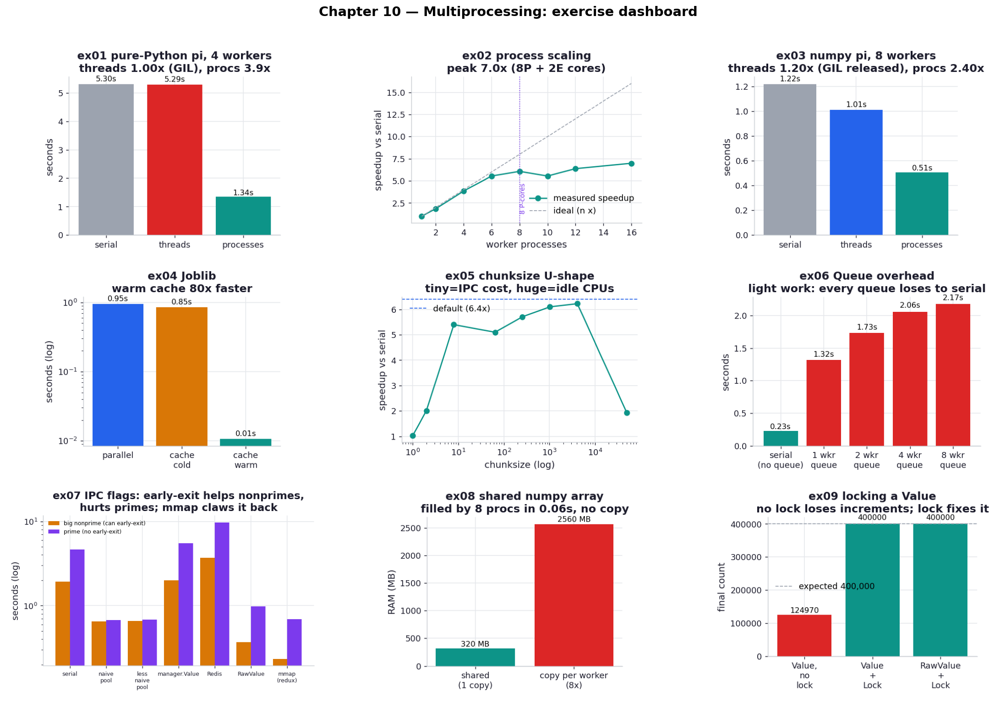
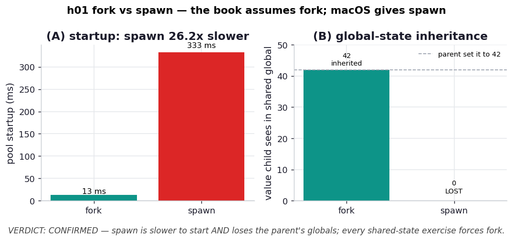

# Chapter 10 — Multiprocessing: Practice Exercises

Runnable drills for *High Performance Python (3rd ed.)*, Chapter 10 — **nine** of them, plus a
one-experiment hypothesis lab. Where Chapter 9 reclaimed time spent *waiting*, this chapter is
about the opposite bottleneck: genuine CPU-bound work that the GIL pins to a single core. The
escape is to run several Python interpreters at once — one process per core, each with its own
GIL — and the chapter is a tour of how to split work across them, when sharing state between them
helps, and the many ways it can quietly cost more than it saves.

These exercises follow the book's two running examples on the **same machine and shared workload
modules**, so the numbers line up into one story. `_pi.py` holds the Monte Carlo pi estimator (a
perfectly even, embarrassingly parallel job — the clean case); `_primes.py` holds trial-division
primality testing (an *uneven* job whose per-item cost is unpredictable — the messy case that
makes load balancing and early-exit signalling interesting). Every exercise times the identical
computation and asserts a correctness anchor, so a variant that gets "fast" by computing the wrong
thing fails loudly rather than lying in a chart.

**Core idea:** Processes, not threads, are how CPython uses multiple cores for CPU-bound work —
each forked interpreter has its own GIL and runs flat out on its own core. Speedup is bounded by
the number of cores that can genuinely run the work (Amdahl's law), and *sharing state* between
processes is where the difficulty lives: every byte shared costs communication, and the medium you
share through — a pipe, a proxy, raw shared memory — can dominate the runtime. The recurring lesson
is that the naive, share-nothing parallel solution is usually hard to beat.

Numbers below are from **CPython 3.14 on an Apple M1 Max (8 performance + 2 efficiency cores, no
hyperthreading)** — yours will differ, and in two ways that matter. First, this machine's
heterogeneous cores cap clean speedup near ~7–8x rather than the core count, where the book's
8-core-plus-hyperthreading laptop flattens for a different reason. Second, and more important,
**macOS defaults to the `spawn` start method while the book implicitly assumes Linux's `fork`** —
a difference significant enough that it is the chapter's hypothesis (h01) and the reason every
shared-state exercise here explicitly requests a fork context.

```bash
.venv/bin/python chapter_10_multiprocessing/ex01_pi_threads_vs_processes/ex01_pi_threads_vs_processes.py
```

**Verified learnings** (measured on this machine):

1. **Threads can't speed up CPU-bound Python; processes can** (ex01). The same 24M-dart pi job run
   with 4 threads is ~0.94× (slightly *slower* than serial — the GIL plus thread overhead), while
   4 processes hit **~3.9×**. This is the whole reason `multiprocessing` exists.
2. **Process speedup is near-linear, then flattens at the core ceiling** (ex02). Scaling holds
   >95% efficiency to 4 workers, peaks at **~7.2× around 10 workers**, then goes flat — and the
   ~7x (not 10x) ceiling is this chip's 8 performance + 2 efficiency cores, Amdahl's law made
   visible on even the friendliest workload.
3. **numpy flips the thread rule, but only partway** (ex03). Vectorised pi is ~23× faster per dart
   serially, and now *threads help* (~1.14×) because array math releases the GIL — though the
   GIL-bound RNG and finite memory bandwidth cap process scaling at ~2.5× on 8 cores.
4. **Joblib is the Pool with less ceremony and a disk cache** (ex04). `Parallel`/`delayed` matches
   a hand-rolled pool in one line; its `Memory` cache makes a repeat run **~75× faster** — but only
   if each call gets a unique argument, or the cache collapses every Monte Carlo sample into one.
5. **`chunksize` is a U-shaped dial, and the default sits on its floor** (ex05). Over a 100k-number
   prime sieve, `chunksize=1` manages only ~1.2× (IPC-bound) and `chunksize=50000` only ~2× (six
   idle cores); the broad sweet spot (~64–1024) reaches ~7.2×, and the library default (~6.5×)
   lands close enough that tuning rarely repays.
6. **For light work, a Queue makes parallelism *slower than serial*** (ex06). Checking 150k cheap
   candidates serially takes ~0.22 s; routing them through a `multiprocessing.Queue` takes 5–9×
   *longer*, and adding workers makes it worse — the pickling-and-locking communication *is* the
   bottleneck, not the compute.
7. **An early-exit IPC flag helps nonprimes and hurts primes — and how you share it dominates**
   (ex07). Verifying 18-digit numbers across 8 cores, a shared `mmap`/`RawValue` flag ~halves the
   nonprime time (early exit) but *adds* cost on primes (nothing to exit); a `manager.Value` proxy
   flag runs **slower than the single-core serial sweep**, and a **Redis** flag (a TCP round-trip
   per poll, run against a Docker server) is slower still — the slowest approach on the board, at
   ~2× serial on primes. The flag-free "less naive pool" stays a stubbornly good benchmark, and the
   ranking mmap < RawValue << Manager < Redis tracks exactly how far each poll's byte has to travel.
8. **A large numpy array can be shared across processes with no copy** (ex08). Allocating the bytes
   once as a `multiprocessing.Array` and wrapping numpy around them lets 8 workers fill a 305 MB
   array in ~0.07 s with the no-copy invariant verified three ways — avoiding the 8× RAM and the
   pickling a copy-per-worker scheme would cost.
9. **A shared counter without a lock silently loses ~69% of its increments** (ex09). `value += 1`
   is a non-atomic read-add-write; four unsynchronized processes counting to 400,000 finish near
   125,000. A `Lock` restores correctness, and a lock-free `RawValue` under that one lock is ~1.6×
   faster than a `Value` (which carries a redundant second lock).

| # | exercise | one-line takeaway |
| --- | --- | --- |
| ex01 | [pi: threads vs processes](ex01_pi_threads_vs_processes/) | threads ≈ 1× (GIL), processes ~3.9× — the core lesson |
| ex02 | [process scaling](ex02_process_scaling/) | near-linear, then flat at the ~7× core ceiling (8P+2E) |
| ex03 | [pi in numpy](ex03_pi_numpy/) | numpy releases the GIL, so threads help (~1.14×); ~23× faster/dart |
| ex04 | [Joblib](ex04_joblib/) | one-line parallelism + a 75× disk cache (with a unique-arg gotcha) |
| ex05 | [chunksize](ex05_chunksize/) | tiny chunks drown in IPC, huge chunks idle cores; default wins |
| ex06 | [Queue overhead](ex06_queue_overhead/) | light work: every queue loses to a serial loop |
| ex07 | [IPC early-exit flag](ex07_ipc_flag/) | a flag helps nonprimes, hurts primes; proxy flags are a trap |
| ex08 | [shared numpy array](ex08_shared_numpy/) | share a big array across processes with zero copies |
| ex09 | [locking a Value](ex09_locking/) | no lock loses ~69% of increments; lock fixes it at a cost |



## Hypothesis lab

Beyond the book: a falsifiable experiment on the start-method difference that shadows this whole
chapter on macOS.

| # | hypothesis | verdict | finding |
| --- | --- | --- | --- |
| h01 | [fork vs spawn](hypothesis/h01_fork_vs_spawn/) | **CONFIRMED** | macOS defaults to `spawn`, which is several× slower to start a pool **and** silently breaks the global-state sharing ex07/ex08 rely on — a forked child inherits the parent's mutated globals, a spawned one re-imports empty defaults |



## What's reproduced, and what isn't

The chapter's core narratives reproduce cleanly and on the book's own examples: the threads-vs-
processes GIL result (ex01), process scaling and its ceiling (ex02), the numpy thread reversal
(ex03), Joblib with its caching footgun (ex04), the full `chunksize` U-shape (ex05), the
Queue-loses-to-serial result for light work (ex06), the complete six-way IPC flag comparison on the
book's exact validation numbers (ex07), zero-copy numpy sharing (ex08), and the lost-update race
with its lock fixes (ex09).

Two honest caveats. First, this is an **M1 Max with no hyperthreading**, so the book's
"hyperthreads add little" story has nothing to reproduce; the analogous effect here is the two
efficiency cores under-pulling, which caps clean speedup near ~7–8× instead of 10×. Second, the
book's **32 GB shared array** is scaled to 305 MB in ex08 — the recipe and the no-copy proof are
identical, only the size differs, since the lesson is the technique, not the byte count.

The book's **Redis flag** *is* now reproduced, via Docker: `task ch10:redis-up` starts a
`redis:7-alpine` container (mapped to host port 6380 to avoid colliding with any Redis on the
default 6379), and ex07 auto-detects it and adds the Redis approach. It lands exactly where the
book's Figure 10-17 puts it — the slowest of all the flags, ~2× the serial sweep on primes, because
each poll is a TCP round-trip to an external server. If Docker isn't running the approach is skipped
cleanly, so the rest of the suite is unaffected.

The loudest caveat is the start method, and it is why h01 exists. The book was written on Linux
(default `fork`); this machine defaults to `spawn`. Under spawn the book's global-state sharing
tricks break silently, so every shared-state exercise here forces `mp.get_context("fork")` (see
`_mp.py`) to reproduce the book faithfully. That is a deliberate study choice, not a production
recommendation — h01 explains why spawn-safe code is usually the right call in real systems.

## 5 Whys: why sharing state is the hard part of multiprocessing

1. **Why do processes give the speedup that threads can't?** Each forked process is a separate
   interpreter with its own GIL, so several can run Python bytecode at the same time, while threads
   share one GIL and take turns.
2. **Why doesn't that make every parallel program faster?** Because work that isn't CPU-bound, or
   that requires the processes to communicate, spends its time in overhead — pickling, pipes, locks
   — that a single process never pays.
3. **Why is communication so expensive?** Processes have separate memory, so anything shared must
   be serialized and copied across a boundary (a pipe or a proxy), and that crossing can cost more
   than the computation it carries (ex06, ex07's manager flag).
4. **Why not just share memory directly to avoid the copy?** You can — `RawValue`, `mmap`, and
   `multiprocessing.Array` do exactly that (ex07, ex08) — but raw shared memory has no
   synchronization, so concurrent writes corrupt or lose data unless you add a lock (ex09), which
   reintroduces a cost.
5. **Why is the naive share-nothing solution so often the winner?** Because it pays *none* of those
   costs: if the work splits into independent pieces with no shared state, the only question is
   whether the machine has cores to run them, and that is the easy 95%-efficiency case (ex02).

**Root cause:** Multiprocessing buys parallelism by giving each worker its own memory and GIL, but
that same separation makes sharing state expensive and synchronization mandatory; the art of the
chapter is keeping work independent so you collect the speedup without paying the communication and
locking taxes.

## Running everything

```bash
# one exercise
.venv/bin/python chapter_10_multiprocessing/ex07_ipc_flag/ex07_ipc_flag.py

# regenerate every chart + the dashboard, then the hypothesis chart
.venv/bin/python chapter_10_multiprocessing/visualize_exercises.py
.venv/bin/python chapter_10_multiprocessing/hypothesis/h01_fork_vs_spawn/plot.py

# via the task runner
task ch10:run -- ex07_ipc_flag/ex07_ipc_flag.py
task ch10:viz                # all charts + dashboard + hypothesis
task ch10:smoke              # run every exercise as a fast correctness check
```

Every script is self-contained: the workload modules live at the chapter root and each exercise
adds the chapter directory to `sys.path`. The shared-state exercises force a fork context so they
behave as the book describes; ex07 is the heavyweight (~70 s, because the 18-digit primes force a
full factor sweep), so the smoke target runs it but expect it to dominate the wall clock.
