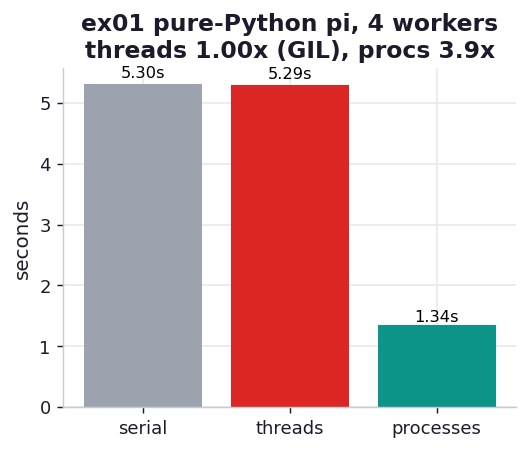

# ex01_pi_threads_vs_processes

The chapter's opening lesson, and the cleanest demonstration of the GIL there is. We estimate
pi with a Monte Carlo dart-throw — generate a random point in the unit square, count how many
land inside the quarter circle (`x*x + y*y <= 1`), and multiply the fraction by four. The
computation is perfectly even and embarrassingly parallel, which makes it the ideal lens for
watching threads and processes behave differently on identical work.

We hand the *same* 24-million-dart workload to three runners: one serial loop, a pool of four
threads (`multiprocessing.dummy` is a thin wrapper over `threading`), and a pool of four forked
processes. The only thing that changes is how the work is distributed.

## What it measures

24,000,000 darts, split evenly across 4 workers (or done in one loop for serial):

| runner | time | speedup | why |
| --- | ---: | ---: | --- |
| serial | ~5.2 s | 1.00x | one core, one loop |
| 4 threads | ~5.5 s | ~0.94x | the GIL serializes them — *slightly slower* than serial |
| 4 processes | ~1.3 s | ~3.9x | four interpreters, four GILs, four cores |

## What we found

**Threads buy nothing here, and actually cost a little.** Every dart draw is pure-Python
bytecode — `random.uniform`, a multiply, a comparison — and the Global Interpreter Lock permits
only one thread to execute Python bytecode at a time. So four threads take turns on a single
core exactly as the serial loop did, plus a small tax for lock contention and context switches.
That is why the threaded run lands a hair *above* the serial time rather than below it.

**Processes deliver the near-linear speedup we wanted.** Forking creates four independent Python
interpreters, each with its own GIL and its own private memory. They genuinely run in parallel on
four of the machine's cores, and four workers finish in roughly a quarter of the serial time. The
small shortfall from a perfect 4.0x is fork startup and the final `sum` of the four partial
counts — overhead, not contention.

This is the whole reason `multiprocessing` exists: to sidestep the GIL by using processes instead
of threads for CPU-bound work. ex03 will show the one important exception — numpy array math
releases the GIL, so threads *can* help there.

## Reading the chart



Three bars in seconds. Grey serial and red threads are nearly the same height — the visual
signature of the GIL, two very different mechanisms producing the same wall-clock time. The teal
processes bar is about a quarter as tall: real parallelism. The lesson is the contrast between
the red and teal bars, not their absolute height (which scales with the dart count and your CPU).

## Run

```bash
.venv/bin/python chapter_10_multiprocessing/ex01_pi_threads_vs_processes/ex01_pi_threads_vs_processes.py
```

(Absolute seconds depend on the dart count in `_pi.py` and on your machine; the *ratios* — threads
≈ 1x, processes ≈ Nx — are the durable lesson.)

## 5 Whys

1. **Why don't four threads speed up the pure-Python pi loop?** Because the GIL lets only one
   thread run Python bytecode at a time, so the four threads time-slice one core instead of
   using four.
2. **Why does the GIL serialize them?** CPython protects its internal state (reference counts,
   object memory) with a single global lock; holding it is required to touch any Python object,
   and every dart draw touches several.
3. **Why do processes escape the GIL when threads can't?** Each forked process is a separate
   interpreter with its *own* GIL and its own memory, so there is no shared lock to contend for —
   the processes never compete.
4. **Why is the process speedup slightly under 4x?** Forking the workers and pickling the four
   partial results back to the parent take real time, and that overhead is a fixed cost the
   serial version never pays.
5. **Why is this workload the easy case?** The darts are independent and the work splits into
   four equal pieces with no shared state, so there is nothing to synchronize — the only question
   is whether the runtime can actually use four cores, and only processes can.

**Root cause:** CPU-bound pure-Python work is gated by the GIL, which threads share and processes
do not; parallel speedup on this kind of task comes from running multiple interpreters, not
multiple threads.
