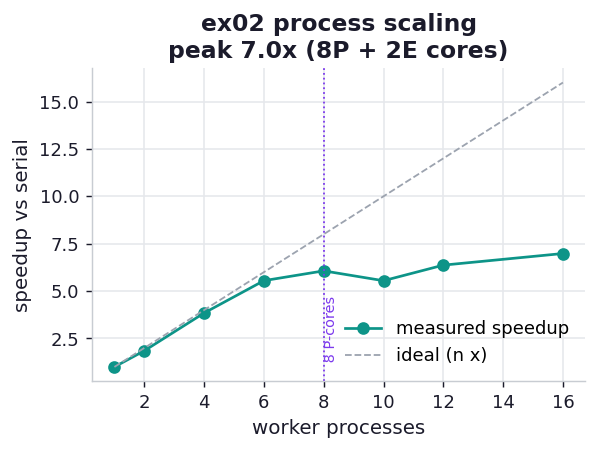

# ex02_process_scaling

ex01 showed that four processes beat one. The natural next question is *how far does that go* —
does doubling the workers keep doubling the speed, and where does it stop? Here we sweep the
worker count from 1 up past the core count on the same even Monte Carlo workload and plot the
measured speedup against the ideal "n workers, n times faster" line. Because the darts divide
into perfectly equal pieces, any shortfall from ideal is pure overhead and contention, not load
imbalance — this is the friendliest case scaling will ever get.

## What it measures

24,000,000 darts, pure-Python, split across a growing number of forked processes:

| workers | time | speedup | efficiency |
| ---: | ---: | ---: | ---: |
| 1 | ~5.2 s | 1.00x | 100% |
| 2 | ~2.7 s | 1.94x | 97% |
| 4 | ~1.4 s | 3.80x | 95% |
| 6 | ~1.0 s | 5.34x | 89% |
| 8 | ~0.83 s | 6.27x | 78% |
| 10 | ~0.72 s | 7.18x | 72% |
| 12 | ~0.74 s | 7.03x | 59% |
| 16 | ~0.75 s | 6.92x | 43% |

(Efficiency is speedup ÷ workers — what fraction of each added core actually turned into speed.)

## What we found

**Scaling is near-perfect while cores are cheap, then bends and flattens.** Up to four workers we
keep better than 95% efficiency: each new process is a new core doing real work. From there the
curve bends away from the ideal line and the peak speedup lands around **7x at ten workers**, then
goes flat — twelve and sixteen workers are no faster than ten, just more processes fighting over
the same silicon and wasting RAM.

**Why it plateaus at ~7x and not 10x is this specific chip.** This machine is an Apple M1 Max:
**8 performance cores plus 2 efficiency cores**, not ten equal cores. The eight P-cores do the
heavy lifting (so we get most of the way to 8x), while the two slower E-cores contribute only a
little extra throughput on a tight floating-point loop. The book sees the same *shape* — a hard
flattening past the core count — but for a different reason: its 8-core laptop has hyperthreading,
and the eight hyperthreads share silicon with the eight real cores. Different hardware story, same
moral: past the count of cores that can genuinely run your work, extra processes stop helping.

The honest takeaway is Amdahl's law made visible. Even on an embarrassingly parallel problem with
zero shared state, the speedup is bounded by the number of cores that can actually run flat out,
and every worker past that point is overhead.

## Reading the chart



The teal curve is measured speedup; the dashed grey line is the ideal n-times. They track each
other closely at the left, then the teal curve peels away and goes horizontal. The dotted violet
marker at 8 is where the performance cores run out — notice the curve has already started bending
before it, and is flat after it. The gap between the two lines at any x is the efficiency you are
*not* getting.

## Run

```bash
.venv/bin/python chapter_10_multiprocessing/ex02_process_scaling/ex02_process_scaling.py
```

(The plateau height tracks your core layout; on an 8P+2E M1 Max it sits near 7x.)

## 5 Whys

1. **Why does speedup stop growing past ~10 workers?** The machine has only ten cores, so an
   eleventh process has no free core to run on — it just time-slices one that is already busy.
2. **Why does the peak land near 7x rather than 10x?** Only eight of the ten cores are
   performance cores; the two efficiency cores run the same loop slower, so they add less than a
   full core of throughput each.
3. **Why does efficiency drop even before the core count, e.g. 78% at 8 workers?** The parent
   process, the OS, and background work also need cores, so eight busy workers are already
   contending with the rest of the system for the same eight P-cores.
4. **Why do 12 and 16 workers not lose much speed despite low efficiency?** The OS scheduler
   still keeps the ten cores saturated; the extra processes mostly wait their turn, adding RAM
   and scheduling cost but not changing how fast the cores churn through darts.
5. **Why can't we beat the core count no matter what?** The work is CPU-bound and already
   GIL-free per process, so the only resource that makes it faster is a core actually executing
   it — and there is a fixed number of those.

**Root cause:** Parallel speedup is capped by the number of cores that can genuinely run the work
at once; on a heterogeneous 8P+2E chip that ceiling is a soft ~7–8x, and processes beyond it are
pure overhead.
