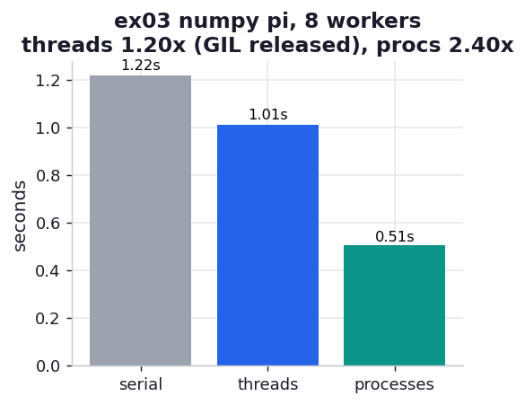

# ex03_pi_numpy

The same pi estimate, but vectorised with numpy — and now the GIL story has an exception worth
knowing. We repeat ex01's serial / threads / processes comparison with `np.random.uniform` and
array arithmetic in place of the Python loop. Two things change, and both are the point: numpy is
dramatically faster per dart, and *threads finally help*, because numpy releases the GIL while it
crunches a C array.

## What it measures

120,000,000 darts (numpy needs a bigger budget than the pure-Python loop to time cleanly),
split across 8 workers:

| runner | time | speedup | why |
| --- | ---: | ---: | --- |
| serial | ~1.2 s | 1.00x | one core, vectorised |
| 8 threads | ~1.0 s | ~1.14x | array math runs with the GIL *released* — a real, if modest, gain |
| 8 processes | ~0.46 s | ~2.5x | independent interpreters, as always |

Per dart, serial numpy is roughly **23x faster** than the pure-Python loop in ex01 — before any
parallelism at all.

## What we found

**numpy threads break the ex01 rule, but only partway.** In ex01 threads were useless because
every operation held the GIL. Here the heavy arithmetic — `xs*xs + ys*ys <= 1` over millions of
elements — happens in C with the GIL dropped, so multiple threads genuinely overlap and we get a
~1.14x speedup that pure Python could never reach. It is modest rather than dramatic because the
*random number generation* (`np.random.uniform`) is still GIL-bound: its internal state is a
Python object, so the draws serialize even as the comparison parallelizes.

**Process scaling is real but sublinear — ~2.5x on 8 workers, not ~7x.** Unlike the
compute-bound pure-Python loop in ex02, the numpy job is limited by *memory bandwidth*: each
worker streams large arrays of doubles through the CPU, and the cores quickly saturate the shared
memory bus. Adding more processes can't make the bus faster, so the curve flattens far sooner than
the pure-Python version did. This is the same lesson Chapter 6 taught about vectorised code — once
you are bandwidth-bound, more cores stop helping.

**The seed gotcha is real.** Each forked worker inherits the parent's RNG state, so
`estimate_numpy` calls `np.random.seed()` to give every process a fresh stream. Forget it and the
workers all draw the *identical* sequence — the program runs, the asserts pass, but the extra
workers add no new information and the estimate stops improving. The pure-Python version is
immune because `multiprocessing` re-seeds the stdlib `random` automatically on fork; numpy is on
you.

## Reading the chart



Three bars in seconds. Unlike ex01, the threads bar (blue) is now *shorter* than serial — small
but unmistakable, the GIL-released gain. Processes (teal) are shorter still. Compare the whole
chart's height to ex01: this entire numpy run is a fraction of a single pure-Python bar.

## Run

```bash
.venv/bin/python chapter_10_multiprocessing/ex03_pi_numpy/ex03_pi_numpy.py
```

(Ratios are the lesson; absolute times scale with the dart count in `_pi.py` and your memory
bandwidth.)

## 5 Whys

1. **Why do threads help here when they didn't in ex01?** numpy releases the GIL while it does
   array arithmetic in C, so multiple threads run that part truly in parallel.
2. **Why is the thread speedup only ~1.14x, not ~8x?** The random-number generation is still
   GIL-bound — its state is a Python object — so only the comparison parallelizes while the draws
   stay serial.
3. **Why do processes only reach ~2.5x on 8 cores?** The job is memory-bandwidth-bound: workers
   stream big double arrays through the CPU and saturate the shared memory bus, which more cores
   cannot widen.
4. **Why is numpy ~23x faster per dart serially?** It works on contiguous C arrays with one type,
   instead of creating and reference-counting millions of boxed Python float objects.
5. **Why must each numpy process re-seed its RNG?** A fork copies the parent's generator state
   verbatim, so without a fresh seed every worker would replay the same "random" sequence.

**Root cause:** numpy moves the arithmetic into C and drops the GIL, which is why threads now help
and the code is far faster — but the GIL-bound RNG and finite memory bandwidth cap how much both
threads and processes can add.
