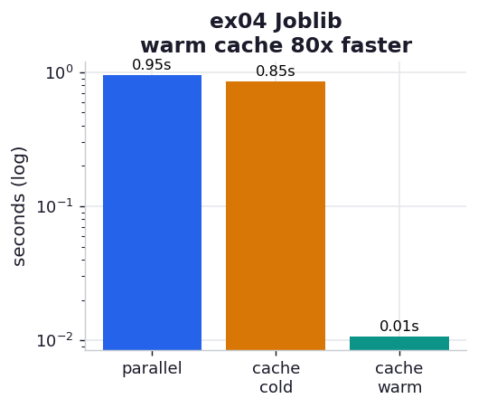

# ex04_joblib

Joblib is the ergonomic layer over `multiprocessing` that the book's author moved to and
recommends. It wraps the whole pool dance into one expression — `Parallel(n_jobs=8)(delayed(fn)(x)
for x in items)` — and throws in a transparent disk cache. This exercise shows both: that for an
embarrassingly parallel loop Joblib matches a hand-rolled `Pool`, and that its `Memory` cache is a
genuine win *with a sharp edge* you have to know about.

## What it measures

24,000,000 darts across 8 workers, plus a cold-vs-warm cache comparison:

| run | time | meaning |
| --- | ---: | --- |
| Parallel/delayed | ~0.98 s | the parallel pi, one line instead of pool setup |
| Memory cache, cold | ~0.81 s | first run: computes *and* writes results to disk |
| Memory cache, warm | ~0.011 s | second run: reads cached results, ~75x faster, identical pi |

## What we found

**Joblib is the same speed as ex01's Pool, with far less ceremony.** Under the hood it uses the
Loky backend (a hardened process pool) and cloudpickle, which also lets it pickle functions that
the raw `multiprocessing` module would choke on. For a simple parallel loop you give up nothing
and write one expression.

**The `Memory` cache turns a repeat run into a free lookup — once you give it distinct
arguments.** `Memory` caches a function's return value keyed by its arguments, persisted to disk
across Python sessions. The warm run here is ~75x faster and returns the *identical* pi, because
every per-worker count was read back from disk instead of recomputed.

**But the cache has a Monte Carlo footgun, and dodging it is the real lesson.** Every worker calls
`estimate(per_worker)` with the *same* argument. A naive cache would therefore store one result
and hand that same count back to all eight workers — collapsing eight independent samples into one
and quietly destroying the estimate. The fix (the book's) is to pass a distinct `idx` to each
call so the eight signatures differ; then the cache stores eight separate counts and the warm run
faithfully reproduces the cold run's answer. The `idx` argument is unused by the computation — it
exists *only* to make each call's cache key unique.

## Reading the chart



Three bars on a log scale (the warm bar is so short it would vanish on a linear axis). The parallel
and cold-cache bars are comparable — caching costs a little to write. The warm bar is two orders of
magnitude shorter: that is the disk cache turning a one-second computation into an instant lookup.

## Run

```bash
.venv/bin/python chapter_10_multiprocessing/ex04_joblib/ex04_joblib.py
```

The script deletes its `.joblib_cache/` before the cold measurement so the cold/warm split is
honest every time. (That folder is gitignored.)

## 5 Whys

1. **Why is the warm run ~75x faster?** Joblib reads each worker's previously computed count from
   the on-disk cache instead of recomputing it, so almost no work happens.
2. **Why does the cache need a distinct `idx` per worker?** It keys results by arguments; with
   identical arguments all eight calls collide on one cache entry and return the same count.
3. **Why would identical counts break the estimate?** Monte Carlo accuracy comes from averaging
   eight *independent* random samples; replacing them with eight copies of one sample throws away
   the independence.
4. **Why use Joblib over the raw `Pool`?** It collapses pool setup into one expression, handles
   trickier pickling via cloudpickle, and bundles the persistent cache — less code for the same
   speedup.
5. **Why does the cache persist across runs at all?** `Memory` writes results to a folder on disk,
   so a later process (even after a reboot) finds them, which is exactly what makes the warm run
   instant.

**Root cause:** Joblib trades a little setup cost for a one-line API and a persistent result cache;
the cache is keyed by arguments, so reusing it correctly for Monte Carlo means making each call's
arguments unique.
