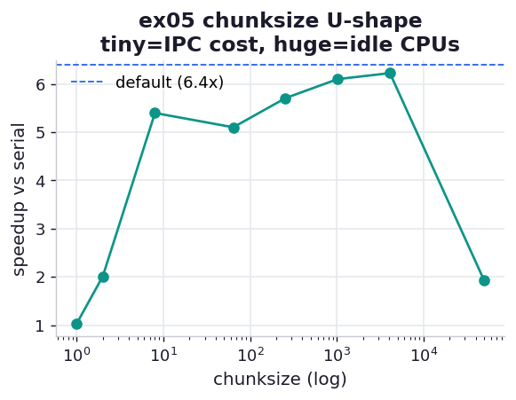

# ex05_chunksize

When `Pool.map` hands work to its workers, `chunksize` controls how many items ride through the
IPC pipe per message. It is the one knob most people reach for, and this exercise shows why the
default is usually right and what going too far in either direction costs. We test primality
across 100,000 consecutive numbers near 10^9 — each check trials odd factors up to ~31,623, so the
per-item work is real, not trivial — and sweep `chunksize` from 1 to 50,000.

## What it measures

100,000 numbers, 8 workers, serial baseline ~2.6 s:

| chunksize | chunks | speedup | what's happening |
| ---: | ---: | ---: | --- |
| 1 | 100,000 | ~1.2x | every item is its own pickled round-trip; the pipe is the bottleneck |
| 2 | 50,000 | ~2.4x | halving the messages nearly doubles the speed |
| 8 | 12,500 | ~6.3x | communication cost now small next to compute |
| 64 | 1,563 | ~7.1x | comfortably in the sweet spot |
| 256 | 391 | ~7.2x | about the best we see |
| 1,024 | 98 | ~7.1x | still fine |
| 4,096 | 25 | ~6.8x | starting to lose balance |
| 50,000 | 2 | ~2.0x | two chunks for eight cores — six sit idle |
| default | ~32 | ~6.5x | what the library picks unaided |

## What we found

**Both extremes are slow, for opposite reasons, and the default lands near the top.** With
`chunksize=1`, all 100,000 items travel the single result pipe one at a time; the workers spend
more time waiting on that pipe than checking primes, and we get a feeble ~1.2x. The very next step
is telling — `chunksize=2` roughly *doubles* the throughput, exactly because it halves the number
of pipe messages. Speed climbs to a broad plateau around `chunksize=64–1024` (~7x), then falls off
the other side: at `chunksize=50,000` the 100,000 items split into just two chunks, so only two of
the eight workers ever run and six cores sit idle the whole time.

**The shape is a U, and the bottom is wide.** Anywhere from a few dozen to a few thousand items per
chunk gives essentially the same near-peak speed, which is why the book's advice — *use the
default unless you have measured a reason not to* — holds up. The default here (~6.5x) is a hair
below the hand-tuned peak (~7.2x), close enough that tuning rarely repays the effort and the risk
of getting it wrong.

The deeper cause of the right-hand collapse is alignment: when the number of chunks is small and
not a multiple of the worker count, the final round leaves most cores idle while a few finish the
last chunks alone. Many small chunks keep every core fed right up to the end; a few big ones cannot.

## Reading the chart



Speedup against `chunksize` on a log x-axis — a clear arch. It climbs steeply out of
`chunksize=1`, sits flat across the middle, and drops at the far right where too few chunks starve
the cores. The dashed line marks the library default, sitting comfortably up on the plateau: you
have to work to beat it, and it is easy to do worse.

## Run

```bash
.venv/bin/python chapter_10_multiprocessing/ex05_chunksize/ex05_chunksize.py
```

(The peak speedup tracks your core count; the U-shape and the position of the default do not.)

## 5 Whys

1. **Why is `chunksize=1` only ~1.2x despite eight cores?** Every one of the 100,000 items is a
   separate pickled message through one pipe, so the pipe — not the CPU — sets the pace.
2. **Why does `chunksize=2` almost double it?** It halves the number of pipe messages, directly
   halving the communication overhead that was the bottleneck.
3. **Why does `chunksize=50,000` collapse back to ~2x?** It makes only two chunks, so just two of
   the eight workers get any work and the other six are idle the entire run.
4. **Why is the default so close to the hand-tuned peak?** `multiprocessing` divides the work into
   roughly four chunks per worker — many small jobs — which lands squarely on the wide flat bottom
   of the U.
5. **Why is the plateau flat across a wide range?** Once chunks are small enough that communication
   is negligible but numerous enough to keep all cores busy to the end, the exact size stops
   mattering.

**Root cause:** `chunksize` trades communication overhead against load balance; tiny chunks drown in
pipe traffic and huge chunks leave cores idle, while the library default sits on the broad sweet
spot between them.
