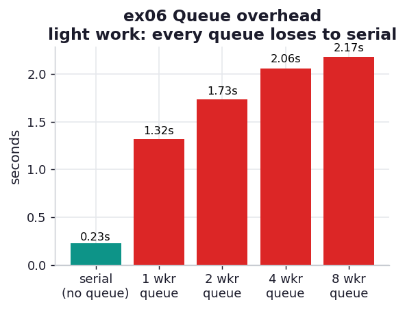

# ex06_queue_overhead

A `multiprocessing.Queue` lets producers and consumers pass arbitrary pickled objects between
processes, which is exactly the kind of flexible plumbing that looks like it should make work go
faster. This exercise is the book's deliberate counterexample: when the per-item work is tiny, the
queue's pickling and locking cost more than the computation, and adding workers makes it *worse*.
It is a cautionary tale about reaching for IPC before checking whether the work justifies it.

## What it measures

150,000 prime candidates near 10^6 (light work — most are quickly rejected). Worker processes
block on the input queue, check each number, and post confirmed primes to a results queue; the
parent feeds candidates followed by one poison pill per worker (a sentinel that tells a worker to
shut down):

| approach | time | vs serial |
| --- | ---: | ---: |
| serial, no queue | ~0.22 s | 1.00x — the one to beat |
| 1 worker + queue | ~1.2 s | ~0.18x (5x **slower**) |
| 2 workers + queue | ~1.7 s | ~0.13x |
| 4 workers + queue | ~2.0 s | ~0.11x |
| 8 workers + queue | ~2.1 s | ~0.11x |

## What we found

**Every queue configuration loses to a plain serial loop, and more workers lose harder.** A single
serial process checks all 150,000 candidates in about a fifth of a second. Route the same work
through a queue and even one worker takes five times longer — because each number must be pickled
by the parent, shipped through a locked pipe, and unpickled by the worker, and that round-trip
dwarfs the microscopic cost of a primality check that usually bails on the first even-number test.

**Adding workers makes it slower, not faster** — the exact opposite of ex01. With light per-item
work the bottleneck is the queue itself, a single synchronized channel, and more workers just mean
more processes contending for that one channel. The computation was never the constraint, so
parallelizing it cannot help; we have only added more mouths at the same narrow pipe.

This is why the book reaches for plain `Pool.map` (ex05) over hand-built queues for batch work, and
recommends external, inspectable queue systems (Redis, Celery, ZeroMQ) when you genuinely need a
queue's streaming semantics. A `multiprocessing.Queue` pays off only when each item carries enough
work — a sizable fraction of a second — that the pickling cost disappears into the noise. (A
`Manager().Queue`, which proxies every operation through a separate manager process, is slower
still — easily 10x worse than the plain queue measured here.)

## Reading the chart



The teal serial bar on the left is the shortest thing on the chart; every red queue bar towers over
it, and they get *taller* left to right as workers are added. The picture is the inverted speedup —
parallelism going backwards — because the work being parallelized was never the bottleneck.

## Run

```bash
.venv/bin/python chapter_10_multiprocessing/ex06_queue_overhead/ex06_queue_overhead.py
```

(The exact slowdown depends on pickling and scheduling costs on your machine; that the queue loses
to serial for light work is the durable result.)

## 5 Whys

1. **Why does even one queue worker take 5x longer than serial?** Each candidate is pickled,
   pushed through a locked pipe, and unpickled — a round-trip that costs far more than the
   primality check it carries.
2. **Why is the check so cheap by comparison?** Most candidates are even or have a tiny factor, so
   `check_prime` returns almost immediately; there is barely any computation to offload.
3. **Why do more workers make it slower?** They all contend for the same single queue, a
   synchronized channel, so adding workers adds lock contention without adding usable throughput.
4. **Why doesn't parallelism help at all here?** The bottleneck is communication, not computation,
   and parallelizing the computation leaves the real constraint — the queue — untouched.
5. **Why would a queue ever be worth it?** When each item carries heavy work (a sizable fraction of
   a second), the fixed pickling cost becomes negligible and the parallel compute finally wins.

**Root cause:** A Queue moves the bottleneck from computation to communication; when items are
cheap to compute, the pickling-and-locking cost dominates and every added worker only crowds the
one channel, so serial wins.
