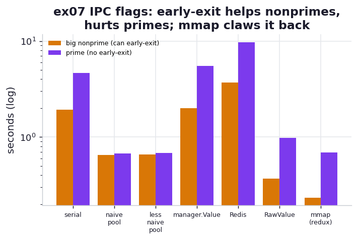

# ex07_ipc_flag

This is the chapter's deepest exercise: using all the cores on a *single* large number to decide
whether it is prime, and weighing the cost of letting the workers talk to each other. We split the
factor space `[3, sqrt(n))` across eight workers and try up to seven strategies, from a plain serial
sweep to a lock-free shared-memory flag to a flag parked in an external Redis server. The headline
finding is subtle and worth internalising: an early-exit flag *helps* when there is a factor to find
and *hurts* when there isn't — and the cheaper the flag is to poll, the smaller that penalty.

## What it measures

Seven approaches, each timed against the book's five numbers (best of 2; the 18-digit primes take
about a second each). The Redis row appears only when a server is reachable — see Run. Times in
**milliseconds**:

| approach | small nonprime | big nonprime 1 | big nonprime 2 | prime 1 | prime 2 |
| --- | ---: | ---: | ---: | ---: | ---: |
| serial | ~0 | ~1331 | ~2409 | ~4569 | ~4490 |
| naive pool | ~24 | ~698 | ~670 | ~695 | ~683 |
| less naive pool | ~0 | ~630 | ~620 | ~682 | ~656 |
| manager.Value flag | ~0 | ~2096 | ~1702 | ~5117 | ~5170 |
| Redis flag | ~0 | ~4057 | ~3204 | ~9314 | ~9210 |
| RawValue flag | ~0 | ~339 | ~295 | ~912 | ~917 |
| mmap (redux) flag | ~0 | ~256 | ~203 | ~650 | ~642 |

The columns split into two regimes: the **nonprimes**, which *have* a factor and so can exit early
if a worker can signal "found it"; and the **primes**, which have no factor, so nobody can ever
signal and every worker grinds through its whole slice.

## What we found

**The plain "less naive pool" is a stubbornly good benchmark.** It adds one cheap trick to the
naive split — a quick serial check of small factors (3..21) before launching the pool — which fixes
the naive version's only weakness: the small nonprime, where the naive pool wastes ~21 ms splitting
work to find a factor of 5 that a single line of serial code catches instantly. With that fix it
checks every test number in ~0.6 s and uses no IPC at all. The book's point lands here: *don't
overlook the dumb, good-enough solution.*

**A flag helps the nonprimes — early exit beats the polling cost.** RawValue and mmap finish the
big nonprimes in ~0.3 s, roughly twice as fast as the less-naive pool, because the moment one
worker finds a factor it sets a shared byte and the others check it every 1,000 iterations and bail
out. The savings from stopping early outweigh the cost of the periodic check.

**The same flag hurts the primes — there's nothing to exit early from.** For a prime, no worker
ever finds a factor, so the flag never gets set; all those millions of poll-checks are pure
overhead piled onto the hot loop. RawValue's prime time (~0.92 s) is meaningfully *worse* than the
flag-free less-naive pool (~0.64 s). The mmap "redux" version claws most of that back (~0.68 s) by
a neat trick: it unrolls the `CHECK_EVERY` counter into a two-level loop so the inner loop carries
no per-iteration bookkeeping at all, just trial division.

**The Manager flag is a cautionary disaster — slower than serial.** `manager.Value` is a proxy: every
read or write of the flag is a round-trip to a separate manager process. With ~158,000 checks per
prime, that proxy traffic makes it slower than even the single-core serial sweep (~5.1 s vs ~4.5 s
for a prime). It is the same idea as RawValue, made ~5x slower purely by where the byte lives.

**And Redis is slower still — the slowest approach on the board.** Park the flag in an external Redis
server and every poll becomes a full TCP round-trip to a separate process, so the prime case balloons
to ~9.2 s — *twice* the serial sweep and nearly half again the Manager proxy. This is exactly the
book's Figure 10-17, where Redis sits among the slowest options. The point of Redis is emphatically
not speed: it is that the flag now lives outside the Python world entirely, where Ruby, a C++ service,
or a human at `redis-cli` can read and write it, and where it can be shared across *machines*. That
team-visibility and language-agnosticism can be worth real latency — but you pay for it here, and the
lesson is to reach for Redis when you need its reach, not when a byte of shared memory would do.

So the ranking by *mechanism cost* is exactly the book's: mmap (anonymous shared memory, no lock) <
RawValue (ctypes byte, no lock) << Manager (proxied through another process) < Redis (TCP to an
external server). The cheaper the flag is to poll, the less it taxes the no-early-exit prime case —
and "cheaper" tracks precisely how far the byte has to travel.

## Reading the chart



Grouped bars on a log scale: amber is the mean big-nonprime time, violet the mean prime time, for
each approach. Watch three things. First, Redis and manager.Value's pairs tower over everything — the
network and proxy taxes, with Redis tallest of all. Second, for RawValue and mmap the amber
(nonprime) bar is *shorter* than the flag-free pools while the violet (prime) bar is *taller* — the
exact early-exit-helps-nonprimes, hurts-primes trade, with mmap keeping the prime penalty smallest.
Third, the left-to-right walk from mmap to Redis is a tour of "how far does the byte travel": shared
memory, ctypes, a proxy process, a TCP server — each step costs more.

## Run

```bash
# the six batteries-included approaches (Redis auto-skipped if no server)
.venv/bin/python chapter_10_multiprocessing/ex07_ipc_flag/ex07_ipc_flag.py

# to include the Redis approach, start the Docker Redis first (host port 6380)
task ch10:redis-up
.venv/bin/python chapter_10_multiprocessing/ex07_ipc_flag/ex07_ipc_flag.py
task ch10:redis-down   # tear it down when done
```

This is the heaviest exercise — ~70 s without Redis, ~120 s with it, because the 18-digit primes
force a full sweep to ~316 million and Redis adds a TCP round-trip per poll. The shared flags live as
module globals and rely on **fork** inheritance — under macOS's default spawn start method the workers
would not see them (see `_mp.py` and the `h01` hypothesis). The Redis client is the one exception: each
worker opens its *own* connection lazily, because sharing a socket across a fork would corrupt it. The
Redis approach is gated on `HPP_REDIS_URL` (default `redis://localhost:6380/0`) being reachable, so
the suite still runs cleanly with no Docker at all.

## 5 Whys

1. **Why does a shared flag speed up the big nonprimes?** One worker finds a factor and sets the
   flag; the others poll it, see it set, and abandon their slices instead of finishing them.
2. **Why does the same flag slow down the primes?** A prime has no factor, so the flag is never
   set — every poll is wasted work added to the inner loop for a signal that never comes.
3. **Why is `manager.Value` slower than a plain serial sweep?** Each flag access is an RPC to a
   separate manager process, and at ~158,000 checks per prime that proxy traffic costs more than
   the whole single-core computation.
4. **Why are RawValue and mmap so much cheaper to poll?** They are bytes in shared memory the
   workers read directly — no lock, no proxy, no inter-process message — so a check is nearly free.
5. **Why does the "less naive pool" with no flag at all remain so competitive?** Its only cost is
   splitting work once; without a flag it has nothing to poll, so it pays no per-iteration tax and
   wins outright on primes.

**Root cause:** Interprocess communication trades polling cost for the chance to stop early; it pays
off exactly when there is something to stop for (nonprimes) and becomes dead weight when there isn't
(primes), and the medium you share through — proxy, ctypes, or raw mmap — sets how heavy that weight
is.
