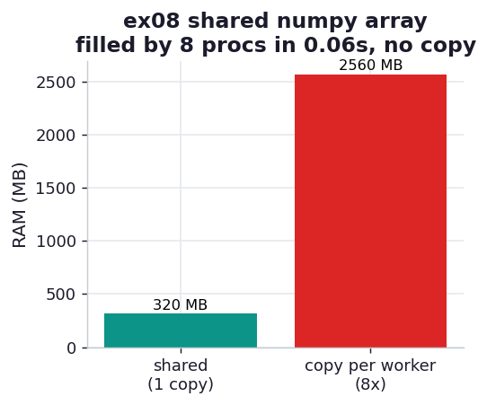

# ex08_shared_numpy

The book's most striking demo shares a 30.5 GB numpy array across eight processes without ever
copying it — letting eight workers read and write the same physical memory. This exercise does the
same thing at a laptop-friendly 305 MB and proves the no-copy claim three independent ways. The
technique matters whenever you have a large array and parallelizable work on it: copying it to each
worker would multiply your RAM and drown you in pickling, while sharing the underlying bytes costs
neither.

## What it measures

A 1000 × 40,000 array of doubles (40 million elements, 305 MB), filled in parallel by 8 processes
that each overwrite their assigned rows with their own PID:

| quantity | value | meaning |
| --- | ---: | --- |
| array size | 305 MB | one shared copy in RAM |
| parallel fill | ~0.07 s | eight workers writing rows simultaneously |
| no-copy check | passes | `arr.base.base is shared_block` |
| copy-per-worker would cost | 2.4 GB | 8 × 305 MB, plus pickling time, *avoided* |

## What we found

**One allocation, eight writers, no copies — and we can prove it.** The recipe is three steps:
allocate a `multiprocessing.Array(c_double, n, lock=False)` (a raw shared block of bytes), wrap a
numpy view around it with `np.frombuffer(...).reshape(...)`, and let the forked workers reach that
view as a module global. The no-copy claim survives three checks: `arr.base.base is shared_block`
confirms the view points back at the shared bytes; every worker asserts the cell it is about to
write *still holds the parent's fill value of 42*, which can only be true if it is looking at the
parent's memory rather than a fresh zero-filled copy; and after the run `np.unique` confirms the
array is partitioned cleanly among the eight worker PIDs with every cell accounted for.

**Sharing the bytes is what makes the big version possible at all.** At the book's scale, copying a
30.5 GB array to each of eight workers would need 244 GB of RAM — impossible on a 64 GB laptop —
and the pickling alone would dwarf the computation. Sharing the underlying buffer keeps the
footprint at one copy regardless of worker count, which is the entire point: the parallelism is
free of the usual data-movement tax. Our 2.4 GB-vs-305 MB comparison is the same arithmetic in
miniature.

**`lock=False` is deliberate, and safe only because of how we partition.** We pass `lock=False`
because each worker writes a disjoint set of rows — no two workers ever touch the same cell, so
there is nothing to synchronize. If workers shared cells we would need the lock back, and (as ex09
shows) that synchronization would cost real time. Lock-free sharing is a reward for a careful
access pattern, not a default.

## Reading the chart



Two bars of RAM. The teal bar is the single 305 MB shared array that all eight workers use; the red
bar is what a copy-per-worker scheme would have cost — 2.4 GB, eight times larger — plus the
pickling time the chart can't show. The title notes the whole thing filled in parallel in a
fraction of a second, with the no-copy invariant verified.

## Run

```bash
.venv/bin/python chapter_10_multiprocessing/ex08_shared_numpy/ex08_shared_numpy.py
```

This relies on **fork** inheritance: the workers reach `main_nparray` as a global. Under macOS's
default spawn start method the global would be re-imported empty and the demo would fail its own
`assert main_nparray[idx, 0] == DEFAULT_VALUE` — which is precisely the failure the `h01` hypothesis
investigates. We force a fork context in `_mp.py` so the book's recipe works here.

## 5 Whys

1. **Why can eight processes write the same array without copying it?** The bytes are one shared
   `multiprocessing.Array`; the numpy view in each worker points back at that same block, so writes
   land in shared memory.
2. **Why does each worker see the parent's fill value of 42?** Because it is reading the parent's
   actual memory through fork inheritance, not a private copy — which is exactly what the assert
   confirms.
3. **Why does sharing matter so much at the book's 30.5 GB scale?** Copying that array to eight
   workers would need 244 GB and a fortune in pickling; sharing keeps it at one copy, making the
   job possible at all.
4. **Why is `lock=False` safe here?** The workers write disjoint rows, so no two ever touch the same
   cell and there is no race to guard against.
5. **Why use `multiprocessing.Array` rather than a normal numpy array?** A normal array lives in one
   process's private heap; only the `Array`'s bytes are allocated in a shared segment that other
   processes can map.

**Root cause:** Process parallelism normally means copying data to each worker; allocating the array
as a shared buffer and wrapping numpy around it removes the copy entirely, so large-array work
parallelizes without multiplying RAM or paying a pickling tax — provided the access pattern needs no
lock.
