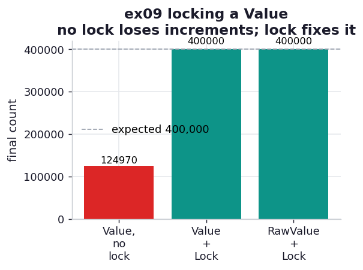

# ex09_locking

The flip side of ex08. There, workers wrote disjoint cells and needed no lock; here, four processes
all hammer the *same* shared integer, and without synchronization they corrupt the count. This is
the canonical demonstration of why `value += 1` is dangerous across processes, and what the fix
costs. We count to 400,000 (four workers, 100,000 increments each) three ways and watch the
unsynchronized version come up short.

## What it measures

4 processes, 100,000 increments each, expected final count 400,000:

| approach | final count | result | time |
| --- | ---: | --- | ---: |
| Value, no lock | ~125,000 | **LOST ~69%** | ~3.1 s |
| Value + Lock | 400,000 | correct | ~3.3 s |
| RawValue + Lock | 400,000 | correct | ~2.0 s |

(The lost fraction varies run to run — it is a race — but at this count it is always large.)

## What we found

**`value.value += 1` is not atomic, and the lost count proves it.** That one line is really three
steps: read the current value, add one, write it back. When two processes interleave those steps —
both read 50,000, both compute 50,001, both write 50,001 — one increment vanishes. With four
processes contending hard for 400,000 increments, we lose roughly **two-thirds** of them and finish
at ~125,000. The data is never corrupt (no garbage values), just silently *wrong*, which is the
insidious part: nothing crashes, the program looks like it worked.

The book notes that on a fast modern machine the race can be hard to trigger at small counts — at
4,000 it may pass by luck — but reliable at larger ones, because the bigger the count the wider the
window for a collision. Counting to 400,000 makes the loss show on every single run, which is the
honest way to demonstrate a race: at a scale where it cannot hide.

**A lock fixes it, and the kind of value you lock changes the price.** Wrapping each increment in
`with lock:` serializes the read-add-write so no two processes interleave, and the count comes out
exactly right. But a `multiprocessing.Value` carries its *own* internal lock on top of the one we
added, so every increment pays for two locks. Swapping in a `RawValue` — a bare ctypes integer with
no built-in lock — under the same external `Lock` gives the identical correct answer about **1.6x
faster**, because we are no longer paying for redundant synchronization. The `Lock` we added is the
only one doing real work; the `Value`'s built-in one was pure overhead.

The pairing with ex08 is the chapter's whole message on shared state: share it only when you must,
partition it so workers never collide if you can (ex08, no lock needed), and when they genuinely
must touch the same cell, lock it — accepting the cost — and don't pay for a lock twice.

## Reading the chart



Four bars against a dashed "expected 400,000" line. The first (no lock) falls dramatically short and
is drawn in red — increments lost to the race. The two locked bars reach the line exactly, in teal.
The chart shows correctness, not speed; the speed story (RawValue+Lock being faster) is in the
printed times.

## Run

```bash
.venv/bin/python chapter_10_multiprocessing/ex09_locking/ex09_locking.py
```

(The exact lost fraction is nondeterministic; that the no-lock version loses a large share while
both locked versions are exact is the durable result.)

## 5 Whys

1. **Why does the no-lock count finish far below 400,000?** `value += 1` is a read-add-write
   triple; when processes interleave those steps they overwrite each other's increments and some
   are lost.
2. **Why is the data wrong but never garbage?** Each write stores a valid integer — just one
   computed from a stale read — so the value stays well-formed but undercounts.
3. **Why does a `Lock` fix it?** It forces the read-add-write to happen as one indivisible unit per
   process, so no other process can read a half-updated value.
4. **Why is `RawValue + Lock` faster than `Value + Lock`?** A `Value` has its own internal lock; with
   our external lock already guarding the increment, that built-in lock is redundant work, and
   `RawValue` drops it.
5. **Why not just avoid shared mutable state entirely?** Often you can — ex08 partitions the data so
   workers never collide and needs no lock at all; locking is the price only when a true shared
   counter is unavoidable.

**Root cause:** Incrementing a shared value is a non-atomic read-add-write, so concurrent processes
lose updates unless a lock makes it atomic; the lock restores correctness at a cost, and using a
lock-free `RawValue` under one external lock avoids paying for that synchronization twice.
