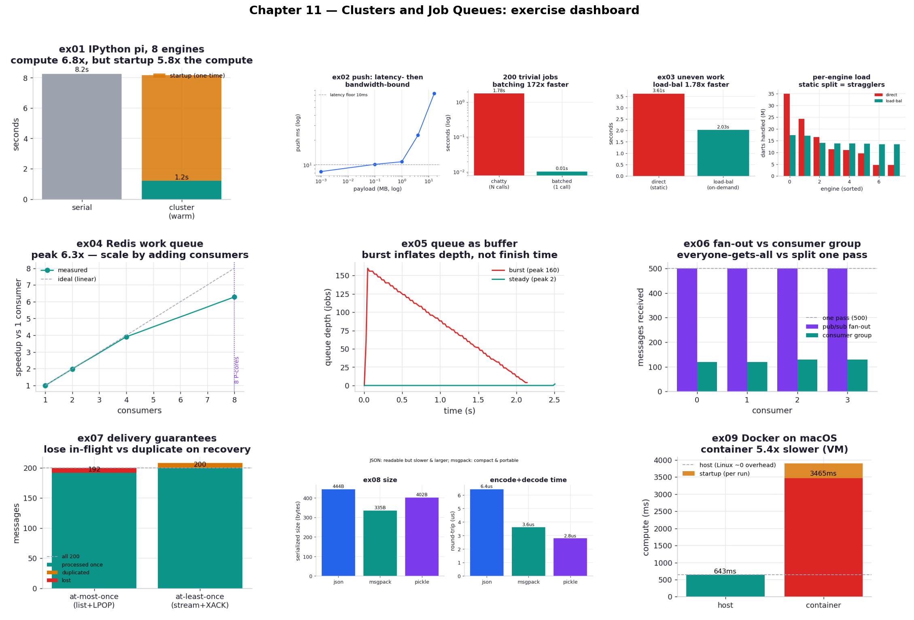
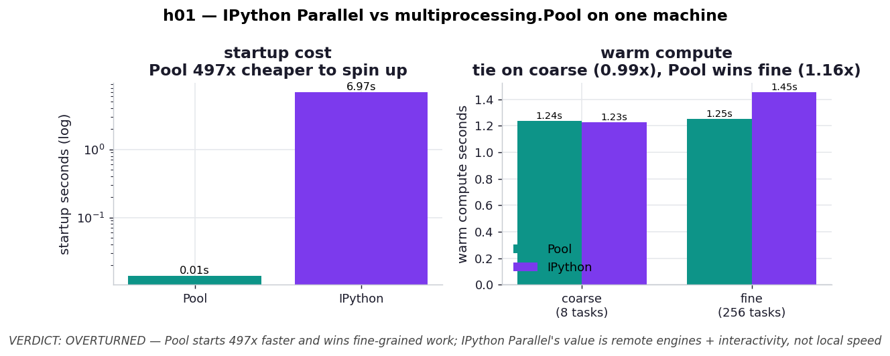

# Chapter 11 — Clusters and Job Queues: Practice Exercises

Runnable drills for *High Performance Python (3rd ed.)*, Chapter 11 — **nine** of them, plus a
one-experiment hypothesis lab. This is the book's most *operational* chapter: it is not about a
tight inner loop but about what happens when one machine is no longer enough and you spread work
across engines, queues, and message brokers. The recurring warning is that every one of those moving
parts costs you something — latency between machines, the chance that a worker dies mid-job, a
system-administration burden — so the chapter is really a catalogue of those costs and when they are
worth paying. These exercises turn that operational advice into measured numbers.

To keep the repo's promise that every figure was measured here, the abstract topology lessons are
anchored to two concrete things. A **shared CPU job** — the book's own Monte Carlo pi estimator from
Example 11-4 — is the unit of work that a cluster engine, a queue consumer, and a Docker container
all run identically, so the numbers line up across exercises. And a **real Redis server** (the same
Docker container Chapter 10 used, on host port 6380) is the message broker behind the queue and
pub/sub exercises. Every exercise asserts a correctness anchor — the pi estimate must approximate
pi, or exactly the enqueued jobs must be processed — so a distributed split that loses, duplicates,
or mangles work fails loudly instead of drawing a confident but wrong chart.

**Core idea:** Before you cluster, exhaust one machine — because a cluster trades a large fixed
startup cost and a per-message latency for *reach* (more cores, more machines) and *resilience*, not
for raw local speed. Once you do go distributed, the architecture is a set of well-understood
pieces: engines you farm work to, queues that buffer producers from consumers, pub/sub that
broadcasts or load-balances, delivery guarantees that trade loss against duplication, and
serialization and containers that move code and data around. Each piece has a cost, and using it
well means matching it to a workload whose shape justifies that cost.

Numbers below are from **CPython 3.14 on an Apple M1 Max (8 performance + 2 efficiency cores, no
hyperthreading)**, with IPython Parallel 9.2, Redis 7 in Docker, and Docker Desktop on macOS. Yours
will differ — absolute times especially — but the ratios and the directions are the lessons, and two
machine facts shape several results: the heterogeneous cores cap clean parallel speedup near ~7×
(not the core count), and **Docker on macOS runs inside a Linux VM**, which makes its overhead the
opposite of the book's Linux near-zero (ex09).

```bash
.venv/bin/python chapter_11_clusters_and_job_queues/ex01_ipython_pi/ex01_ipython_pi.py
```

**Verified learnings** (measured on this machine):

1. **A cluster's compute scales, but its startup is a tax you pay up front** (ex01). The book's pi
   example hits **~6–7×** on eight IPython engines — the same ceiling Chapter 10's `multiprocessing`
   reached — but bringing the cluster up costs ~7 s, about **5× the compute it accelerates** for this
   job. A cluster only pays off when the work dwarfs its startup.
2. **Every cluster operation is a fixed-cost round-trip** (ex02). A no-op call is ~3.8 ms to one
   engine, ~9.5 ms to all; `push` is latency-bound for small payloads and bandwidth-bound (~220 MB/s)
   for large ones; and calling the cluster once per item instead of batching is **one to two orders
   of magnitude slower**, because the cost is the *number* of round-trips, not the compute.
3. **A load-balanced view beats a direct view on uneven work** (ex03). A static split hands one
   contiguous chunk per engine and is hostage to whichever engine drew the heavy blocks (a 7.5× load
   imbalance here); a load-balanced scheduler hands work out on demand, evening the load to ~1.3× and
   finishing **~1.8× faster** — Chapter 10's `chunksize` lesson at cluster scale.
4. **A work queue scales horizontally — add consumers, drain faster** (ex04). Draining 64 heavy jobs
   off a Redis list scales **near-linearly to ~7× on eight consumers**, exactly the book's promise —
   and exactly the opposite of Chapter 10's Queue-overhead result, because here each job carries real
   work that dwarfs the sub-millisecond fetch.
5. **A queue turns a burst of arrivals into a burst of queue depth, not into dropped work** (ex05). A
   spike of 160 simultaneous jobs balloons the queue to its full backlog while a paced stream keeps
   it near empty (peak **160 vs 3**), yet both finish in about the same time — the consumers set the
   pace, the queue absorbs the spike, at the cost of the memory to hold it.
6. **Pub/sub fan-out copies every message to everyone; a consumer group splits one pass** (ex06).
   Four pub/sub subscribers each receive all 500 messages (**2000 deliveries**); four consumers in a
   Streams group split the same 500 evenly (**500 deliveries**, ~125 each) — broadcast versus work
   distribution, a 4× difference in delivery work from the topology alone.
7. **Delivery guarantees force a choice between losing and duplicating** (ex07). The same eight
   crashes (each landing after the work, before the confirm) cost the at-most-once list **8 lost
   messages** and the at-least-once stream **8 duplicate processings** — you do not get "always
   correct," you pick which way to be wrong.
8. **JSON costs speed and size to buy readability — and msgpack is the quiet middle ground** (ex08).
   JSON is ~2.3× slower to round-trip and ~1.3× larger than the binary codecs, which is exactly why
   the book recommends it: the penalty is negligible next to network and compute, and readability
   wins during an incident. msgpack is the most compact *and* portable; pickle is fastest but
   Python-only and unsafe on untrusted input.
9. **Docker on macOS is several times slower at CPU work — the book's "no overhead" is a Linux
   result** (ex09). The identical numpy diffusion runs **~5× slower** inside the container than on the
   host here, plus ~0.5 s startup per run, because macOS has no `cgroups` and Docker runs a whole
   Linux VM. Use Docker on a Mac for reproducibility; measure performance on Linux.

| # | exercise | one-line takeaway |
| --- | --- | --- |
| ex01 | [IPython Parallel pi](ex01_ipython_pi/) | ~6–7× compute, but startup is ~5× the compute — cluster only pays off on big jobs |
| ex02 | [push/pull latency](ex02_push_pull_latency/) | every call is a fixed round-trip; batch or the latency dominates |
| ex03 | [direct vs load-balanced](ex03_direct_vs_loadbalanced/) | static split waits on its straggler; load balancing is ~1.8× faster |
| ex04 | [Redis work queue](ex04_redis_work_queue/) | add consumers, throughput rises ~linearly to the core ceiling (~7×) |
| ex05 | [queue as buffer](ex05_queue_buffer/) | a burst inflates queue depth (160 vs 3), not the finish time |
| ex06 | [pub/sub vs consumer group](ex06_pubsub_vs_consumer_group/) | fan-out copies to all (2000); a group splits one pass (500) |
| ex07 | [delivery guarantees](ex07_delivery_guarantees/) | at-most-once loses 8, at-least-once duplicates 8 — pick your poison |
| ex08 | [message serialization](ex08_message_serialization/) | JSON: readable but ~2.3× slower & ~1.3× bigger; msgpack: compact & portable |
| ex09 | [Docker overhead](ex09_docker_overhead/) | on macOS the container is ~5× slower (Linux VM); near-zero only on Linux |



## Hypothesis lab

Beyond the book: a falsifiable experiment on whether IPython Parallel is worth its machinery on a
single machine.

| # | hypothesis | verdict | finding |
| --- | --- | --- | --- |
| h01 | [IPython Parallel vs `multiprocessing.Pool`](hypothesis/h01_ipython_vs_pool/) | **CONFIRMED** | A Pool starts **~590× faster** and is never slower on warm compute — it ties on coarse work (~1.09×) and pulls ahead as tasks get finer-grained (~1.23×), because each IPython task is a ZeroMQ round-trip. IPython Parallel's value is *remote* engines and *interactive* control, not local speed |



## What's reproduced, and what isn't

The chapter's two runnable code paths reproduce faithfully and on the book's own examples: the
IPython Parallel pi cluster (ex01, Examples 11-1..11-5) and the Docker diffusion benchmark (ex09,
Example 11-6). Around those, the operational concepts the book describes in prose — queue topology,
pub/sub vs consumer groups, delivery guarantees, message serialization — are made concrete and
measurable against a real Redis broker, which is the natural way to put numbers on advice the book
gives qualitatively.

Three honest caveats. First, **everything here runs on one machine.** A real cluster's point is
*multiple* machines, and the costs that dominate in production — network latency between nodes,
partial failures, version drift — cannot be reproduced on a laptop. What we *can* measure are the
mechanisms: the round-trip latency that stands in for inter-node latency (ex02), the
horizontal-scaling curve up to the core count (ex04), the crash-recovery behaviour of a broker
(ex07). The architecture is what lets these keep scaling past one box; we demonstrate the levers, not
the scale.

Second, the **ex09 Docker overhead is dramatic here (~5×) but its magnitude is configuration- and
machine-specific** — it depends on Docker Desktop's CPU allotment and virtualization backend. The
durable result is the *direction* (a macOS container is meaningfully slower than the host, the
reverse of the book's Linux near-zero), which is precisely why the book says to size clusters from
Linux numbers, never from a laptop.

Third, the book surveys many tools it does not benchmark — MPI, Celery, Airflow/Luigi, ZeroMQ
directly, ActiveMQ/RabbitMQ/Kafka, Kubernetes. We chose **Redis** as one concrete, inspectable broker
to make the queue and pub/sub ideas measurable (its Streams give us consumer groups and
acknowledgement-based delivery in one server); the *concepts* — buffering, fan-out vs load balancing,
delivery guarantees — transfer to the others, but the specific tools are documented-not-benchmarked.

## 5 Whys: why is a cluster a last resort, not a first reach?

1. **Why does the book insist on exhausting one machine before clustering?** Because a cluster adds a
   large fixed startup and a per-message latency (ex01, ex02) that buy reach and resilience, not
   local speed — on one machine a `multiprocessing.Pool` is simpler and at least as fast (h01).
2. **Why does going distributed cost so much?** Separate machines (or engines) communicate only by
   messages, and each message is a round-trip whose latency is paid per call; performance becomes a
   function of how few, how large your messages are, not just how much compute you have (ex02, ex03).
3. **Why introduce queues and brokers at all, then?** Because they buy things a single process
   cannot: a queue decouples bursty producers from steady consumers and lets you scale consumers
   horizontally (ex04, ex05), and a broker's acknowledgements let work survive a worker's death
   (ex07) — resilience and elasticity, the actual reasons to cluster.
4. **Why is every one of these a trade rather than a free win?** A queue trades memory for buffering;
   fan-out trades K× delivery work for broadcast; at-least-once trades duplicates for never losing
   work; JSON trades speed for readability; Docker trades performance (on macOS) for reproducibility.
   There is no free lunch — only costs matched to needs.
5. **Why does this matter?** The hard part of a cluster is not making it go fast; it is system
   administration, failure handling, and keeping the moving parts in sync — so you take it on only
   when one machine genuinely cannot give you the cores, the throughput, or the resilience you need.

**Root cause:** Distribution replaces shared memory with messages and one machine with many, which
buys reach and resilience at the price of latency, partial failure, and operational complexity — so
every clustering primitive is a deliberate trade, and the engineering skill is choosing the cheapest
arrangement that meets the requirement, after a single machine has been exhausted.

## Running everything

```bash
# one exercise (broker exercises start + stop their own Redis container — just needs Docker)
.venv/bin/python chapter_11_clusters_and_job_queues/ex04_redis_work_queue/ex04_redis_work_queue.py

# regenerate every chart + the dashboard, then the hypothesis chart (re-measures; ~2 min)
.venv/bin/python chapter_11_clusters_and_job_queues/visualize_exercises.py
.venv/bin/python chapter_11_clusters_and_job_queues/hypothesis/h01_ipython_vs_pool/plot.py

# via the task runner
task ch11:run -- ex06_pubsub_vs_consumer_group/ex06_pubsub_vs_consumer_group.py
task ch11:viz                # all charts + dashboard + hypothesis
task ch11:smoke              # run every exercise as a fast correctness check
```

Every script is self-contained: the shared workload (`_cluster.py`) and the IPython cluster helper
(`_ipp.py`) live at the chapter root, and each exercise adds the chapter directory to `sys.path`. The
cluster exercises start a local IPython cluster (a few seconds of startup each); the queue and
pub/sub exercises spin up their own ephemeral `redis:7-alpine` container via `ephemeral_redis()` when
they run and remove it when they finish (so the broker lives exactly as long as the test, with
nothing to start or stop by hand); and the Docker exercise builds its image on first run. All of
these need Docker running.
