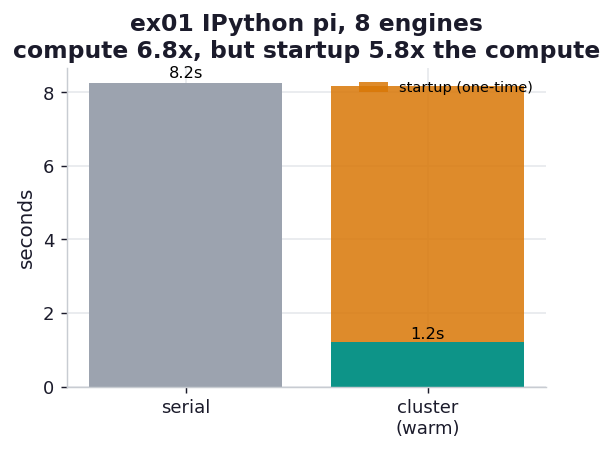

# ex01_ipython_pi

This is the book's flagship cluster example (Examples 11-1 through 11-5) run as a single
self-contained script. We start a local IPython Parallel cluster of eight engines, push a function
out to all of them, and estimate pi by Monte Carlo — the same embarrassingly parallel dart-throwing
job from Chapter 10, but now farmed out over IPython Parallel's ZeroMQ machinery instead of a
`multiprocessing.Pool`. The interesting part is not that it works — it is the relationship between
the two very different costs a cluster imposes: the one-time cost of *starting* it and the
recurring cost of *computing* on it.

## What it measures

Eighty million darts, split as ten million per engine across eight engines, timed three ways:

| measurement | what it is | typical |
| --- | --- | ---: |
| cluster startup | bring up the controller + 8 engine kernels, wait for all to connect | ~7.0 s |
| serial baseline | the whole 80M-dart budget in one process | ~8.2 s |
| cluster compute (warm) | the same 80M darts spread over 8 warm engines, best of 3 | ~1.2 s |

The serial and cluster paths run the *identical* `estimate_pi_block` function, so the speedup is
attributable to the engines and nothing else, and a correctness anchor asserts the combined
estimate lands within 0.01 of `math.pi` — a split that lost or double-counted darts would fail
loudly rather than draw a confident but wrong chart.

## What we found

**The compute scales beautifully — about 6.7× on eight engines.** Eighty million darts that take a
single process ~8.2 seconds finish in ~1.2 seconds once the cluster is warm. That 6.7× is right in
line with what Chapter 10 measured for plain multiprocessing on this same chip (eight performance
cores plus two slower efficiency cores, so the clean ceiling sits near 7×, not 8×). IPython Parallel
is not doing anything magic here; it is running eight separate Python interpreters on eight cores,
exactly as `multiprocessing` would, and getting the same answer.

**But starting the cluster costs more than the work it accelerates.** Bringing up the controller and
eight engine kernels — each a full IPython kernel that has to connect back to the controller over
ZeroMQ — takes about seven seconds on this machine. That is *5.6× the compute time it is meant to
speed up.* For this 80M-dart job, you would finish faster by not using the cluster at all and just
running the serial loop. This is the single most important and most easily forgotten fact about
clusters: the startup is a fixed tax, and a cluster only pays for itself when the job is large
enough — or repeated often enough on an already-running cluster — that the compute savings dwarf the
tax. The book sidesteps this by quietly running `ipcluster start -n 4` *before* it times anything;
this exercise puts the startup back on the clock where you can see it.

This is exactly why the book opens the chapter insisting you exhaust a single machine first. A
warm, already-running cluster turning an 8-second job into 1.2 seconds is a genuine win; paying
seven seconds of setup to save seven seconds of compute is not.

## Reading the chart



The left panel is wall-clock seconds: the tall serial bar, the short warm-cluster bar (the 6.7×
win), and — drawn in a warning colour stacked behind the cluster bar — the startup cost that towers
over the compute it buys. The right panel restates it as the speedup number against the 8P+2E core
ceiling. The visual story is that the green compute win is real but the orange startup bar is taller
than the thing it accelerates.

## Run

```bash
.venv/bin/python chapter_11_clusters_and_job_queues/ex01_ipython_pi/ex01_ipython_pi.py
```

Absolute seconds depend on your cores and how fast engine kernels boot on your machine; the durable
results are the ~7× compute speedup (capped by core count) and that startup is a fixed cost on the
order of seconds, independent of the job.

## 5 Whys

1. **Why does the warm cluster hit ~6.7× and not 8×?** This chip has eight performance and two
   efficiency cores; the efficiency cores under-pull on a tight compute loop, capping clean speedup
   near 7× — the same ceiling Chapter 10's `multiprocessing` scaling hit.
2. **Why is IPython Parallel no faster than a plain `Pool` here?** Both run eight separate
   interpreters on eight cores; for a purely local, share-nothing job there is nothing for the
   cluster layer to add — its value is *remote* engines and *interactive* control, not local speed
   (the h01 hypothesis pins this down).
3. **Why does startup cost ~7 seconds?** Each engine is a full IPython kernel process that must boot
   and establish a ZeroMQ connection back to the controller; eight of those plus the controller is
   several seconds of process spawning and handshaking.
4. **Why does that startup cost matter so much for this job?** Because the compute it accelerates is
   only ~1.2 seconds, so the fixed setup is 5.6× the recurring work — the tax is larger than the
   thing being taxed.
5. **Why does this matter?** A cluster is worth its startup only when the job is large enough, or
   repeated often enough on an already-running cluster, that the compute savings dwarf the one-time
   setup — which is exactly why the book says to exhaust a single machine before reaching for one.

**Root cause:** A cluster separates a large fixed startup cost from a per-job compute cost; the
compute parallelises cleanly (here ~6.7× on eight cores), but the startup is a flat several-second
tax that only amortises away across a big or oft-repeated workload — so the speedup is real and the
"should I cluster at all?" question is still answered by the size of the job.
