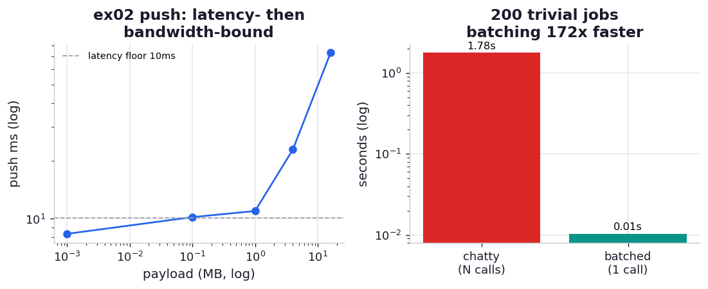

# ex02_push_pull_latency

The moment you split work across machines you inherit a cost that a single process never pays:
*latency between the parts*. Even on one laptop, every `apply`, `push`, and `pull` in IPython
Parallel is a message that travels from the driver to the controller to an engine and back, over
ZeroMQ. Each such round-trip is cheap in absolute terms — a few milliseconds — but it is a *fixed
cost per call*, and that fixed cost is what decides whether farming work out to a cluster speeds you
up or quietly slows you down. This exercise measures the round-trip latency, watches `push` cross
over from latency-bound to bandwidth-bound as the payload grows, and then shows the trap that
follows directly from the latency: calling the cluster once per item.

## What it measures

| measurement | what it is | typical |
| --- | --- | ---: |
| round-trip to one engine | a do-nothing `apply_sync(lambda: None)` to a single engine | ~3.8 ms |
| round-trip to all engines | the same no-op fanned out to all 8 engines (still one call) | ~9.5 ms |
| `push` 1 KB → 16 MB | time to send a payload to every engine, and effective MB/s | 8 ms → 71 ms |
| chatty vs batched | 200 trivial jobs as 200 separate calls vs one call carrying all 200 | ~1.8 s vs ~0.01–0.04 s |

## What we found

**A round-trip is a few milliseconds, and that is the floor under everything.** A no-op call to a
single engine takes about 3.8 ms; fanned out to all eight it is about 9.5 ms (the controller has to
reach every engine and collect every reply). Nothing you do with the cluster can be faster than
this — it is the price of saying anything to it at all.

**`push` starts latency-bound and ends bandwidth-bound.** Sending a 1 KB payload takes ~8 ms —
essentially the same as the no-op round-trip, because at that size the message *is* the latency, the
bytes are free. By 1 MB the fixed latency is amortised and the effective rate climbs to ~90 MB/s; by
16 MB it plateaus around ~220 MB/s, where the transfer is genuinely bandwidth-bound. The shape of
that curve is the classic latency-plus-bandwidth signature of any network link, visible here even
over loopback: small messages are dominated by the per-message cost, large ones by throughput.

**Calling the cluster once per item is the trap, and the numbers are brutal.** Two hundred trivial
jobs — literally incrementing a number — submitted as two hundred separate blocking calls take about
1.8 seconds. Hand the identical two hundred items to a single `map` call and it finishes in tens of
milliseconds: **one to two orders of magnitude faster** (the exact ratio swings run to run precisely
because the batched time is so small). The reason is laid bare by the latency measurement above:
1.8 s ÷ 200 ≈ 9 ms per call, which is almost exactly the measured all-engine round-trip. The chatty
version is paying the fixed latency two hundred times over; the batched version pays it once. The
compute is nil in both cases — *the entire difference is messaging overhead.*

This is the same lesson as Chapter 10's Queue-overhead exercise, transplanted to a cluster: when the
per-item work is small, the communication *is* the cost. The fix is always the same — make each
message carry more work, so the fixed round-trip is amortised against real computation rather than
paid afresh for every tiny item.

## Reading the chart



The left panel plots `push` time against payload size on log axes: flat and latency-dominated on the
left where the line sits at the round-trip floor, then bending upward into the bandwidth-bound
regime on the right. The right panel is the chatty-vs-batched bars (log scale) — the chatty bar
towering one to two orders of magnitude over the batched one — annotated with the per-call cost that
matches the measured round-trip latency.

## Run

```bash
.venv/bin/python chapter_11_clusters_and_job_queues/ex02_push_pull_latency/ex02_push_pull_latency.py
```

Your latency depends on the machine and how ZeroMQ is routed; the durable results are that a
round-trip is a fixed few-millisecond cost, that `push` crosses from latency- to bandwidth-bound as
the payload grows, and that the cost of chatty code is the round-trip latency multiplied by the
number of calls.

## 5 Whys

1. **Why does a no-op call still take ~4 ms?** It is a full round-trip — driver to controller to
   engine and back over ZeroMQ — and that messaging cost is paid even when the function does nothing.
2. **Why is the all-engine call slower than the single-engine one?** The controller has to deliver
   the message to every engine and gather every reply, so a fan-out costs more than a point-to-point
   call, though it is still a single logical operation.
3. **Why does `push` get more efficient as the payload grows?** Small payloads are dominated by the
   fixed per-message latency (the bytes are negligible); only once the payload is large does actual
   bandwidth dominate, so MB/s climbs and then plateaus.
4. **Why is the chatty loop one-to-two orders of magnitude slower than the batched call?** It makes
   one round-trip per item, paying the few-millisecond latency two hundred times; the batched call
   carries all items in one message and pays that latency once.
5. **Why does this matter?** The cost of distributed work is governed by the *number of round-trips*,
   not the amount of compute, so the way to use a cluster well is to make each message carry as much
   work as possible — batch, don't chatter.

**Root cause:** Every cluster operation is a fixed-cost round-trip; small messages and per-item calls
are dominated by that latency, so performance is decided by how few, how large your messages are —
amortise the round-trip against real work or it dominates.
