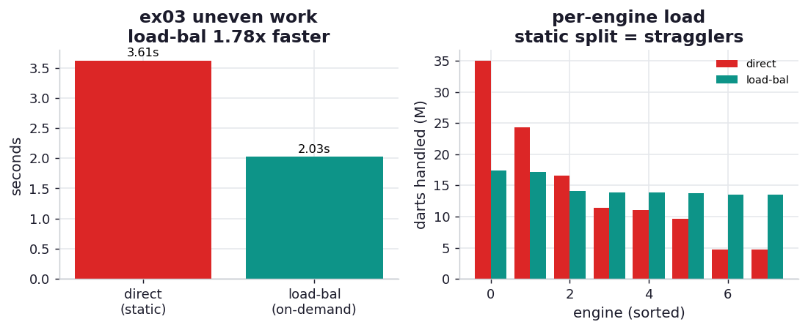

# ex03_direct_vs_loadbalanced

IPython Parallel gives you two ways to hand work to engines, and the book names both. A **direct
view** (`rc[:]`) talks to the engines directly: its `map` cuts the work into one chunk per engine
and ships each chunk in a single message — a *static* assignment decided before any work runs. A
**load-balanced view** (`rc.load_balanced_view()`) routes through a scheduler that hands out one
task at a time to whichever engine is next free — a *dynamic* assignment decided as the work
unfolds. On perfectly even work the two are indistinguishable. This exercise builds work that is
deliberately *un*even — the way real work always is — and watches the difference appear.

## What it measures

Forty-eight dart-counting blocks, most around a million darts but a random handful up to twelve
times larger, ~117M darts in total, run through both views on eight engines:

| view | how work is assigned | time | per-engine load |
| --- | --- | ---: | --- |
| direct (`rc[:]`) | static: one contiguous chunk per engine, decided up front | ~3.7 s | 5–35M darts (**7.5× imbalance**) |
| load-balanced | dynamic: one block at a time to the next free engine | ~2.0 s | 13–17M darts (1.3× imbalance) |

Both views run the identical blocks and assert the combined estimate approximates pi, so neither
can win by skipping work. Each worker also reports its process id, which lets us tally how many
darts each engine actually handled — the per-engine load column above, and the heart of the chart.

## What we found

**The load-balanced view is about 1.8× faster, and the per-engine load explains exactly why.** The
direct view splits the forty-eight blocks into eight fixed chunks before knowing how heavy any of
them are. Because the heavy blocks are scattered at random, some chunks draw two or three of them
and others draw none: one engine ends up grinding through ~35M darts while another finishes its ~5M
and goes idle — a **7.5× spread** in work. The whole `map` cannot return until that overloaded engine
finishes, so the slowest chunk sets the wall-clock time. Seven engines spend much of the run waiting
for the eighth.

The load-balanced view never commits a block to an engine until that engine is free. An engine that
draws a heavy block simply asks for its next block later than the others; an engine that draws light
ones comes back for more. The darts-per-engine spread collapses from 7.5× to **1.3×** — near-perfect
balance — and the run finishes close to the ideal of total-work-divided-by-engines. The price is a
round-trip per block instead of per chunk, which is why you would *not* use a load-balanced view for
huge numbers of trivial tasks (ex02's latency tax) — but when the per-task work is substantial and
uneven, that scheduling cost is tiny next to the idle time it eliminates.

This is Chapter 10's `chunksize` lesson one level up. There, too-large chunks left cores idle on the
final uneven round and too-small chunks drowned in IPC; here the direct view is the "one giant
chunk per worker" extreme (idle stragglers) and the load-balanced view is the "hand out small
pieces" extreme (scheduling overhead, but full utilisation). The right tool depends on whether your
bottleneck is idle workers or message latency.

## Reading the chart



The left panel is the two wall-clock bars: direct view tall, load-balanced ~1.8× shorter. The right
panel is the mechanism — per-engine darts for each strategy, eight bars apiece. Under the direct
view the bars are wildly uneven (one towering straggler, several stubs); under the load-balanced
view they are nearly flat. The flat profile is the faster one: balanced load means no engine is left
waiting on another.

## Run

```bash
.venv/bin/python chapter_11_clusters_and_job_queues/ex03_direct_vs_loadbalanced/ex03_direct_vs_loadbalanced.py
```

The exact speedup depends on how the random heavy blocks fall into chunks (the workload is seeded,
so it is identical run to run on your machine); the durable result is that a static split is hostage
to its unluckiest chunk while a load-balanced scheduler keeps every engine busy.

## 5 Whys

1. **Why is the direct view slower on uneven work?** It assigns one fixed chunk per engine before
   the run, so an engine that draws several heavy blocks becomes a straggler the whole `map` must
   wait for.
2. **Why do some chunks get so much more work?** The heavy blocks are scattered at random, so a
   contiguous static split lands two or three of them in some chunks and none in others — a 7.5×
   spread in per-engine darts here.
3. **Why does the load-balanced view avoid that?** It hands out one block at a time to whichever
   engine is free, so heavy blocks slow only the engine currently holding one, and everyone else
   keeps pulling fresh work — the load evens out to ~1.3×.
4. **Why not always use the load-balanced view, then?** It pays a round-trip per task instead of per
   chunk; for huge numbers of trivial tasks that per-task latency (ex02) would dominate and make it
   the slower choice.
5. **Why does this matter?** Choosing between static and dynamic assignment is the cluster-scale
   version of choosing a `chunksize`: match the granularity to the work, balancing idle-worker time
   against scheduling overhead.

**Root cause:** A static split fixes the work assignment before knowing the per-task cost, so uneven
work creates idle stragglers; a load-balanced scheduler assigns on demand and keeps every engine
busy, trading a little per-task latency for full utilisation — the right choice when tasks are heavy
and uneven.
