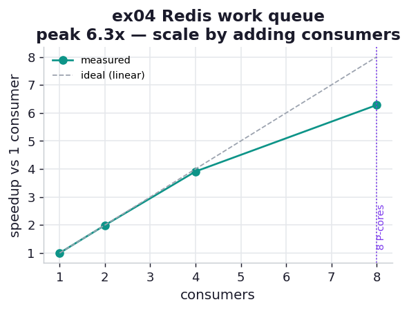

# ex04_redis_work_queue

This is the book's Queue topology (Figure 11-1) made concrete and measured. A producer drops jobs
onto a queue; a pool of consumers pulls them off and processes them. The whole appeal of the design
is the promise the book makes about it: when work piles up faster than it is being consumed, *"we
can simply scale horizontally by adding more data consumers until the message production rate and
the consumption rate are equal."* This exercise puts a number on that promise by draining a fixed
batch of jobs with one, two, four, and eight consumers and watching the throughput climb.

The queue is a Redis list. The producer `RPUSH`es sixty-four jobs — each job is a dart count, about
a tenth of a second of real pure-Python CPU work — and then one `STOP` sentinel per consumer. Each
consumer is a *separate process* that `BLPOP`s jobs off the list, computes, and counts what it did,
shutting down when it pulls a `STOP`. Because the consumers are separate processes, each with its
own GIL, this is genuine parallelism; the Redis queue is simply how they find their next piece of
work, and it would work identically if those processes lived on different machines.

## What it measures

Sixty-four jobs of one million darts each, drained by a growing pool of consumers:

| consumers | time | jobs/s | speedup |
| ---: | ---: | ---: | ---: |
| 1 | ~6.6 s | ~10 | 1.00× |
| 2 | ~3.3 s | ~20 | 2.02× |
| 4 | ~1.6 s | ~39 | 3.99× |
| 8 | ~0.9 s | ~69 | 7.05× |

A correctness anchor asserts that across all consumers exactly sixty-four jobs were processed — none
lost, none done twice — so a queue bug that drops or duplicates work would fail the run rather than
quietly distort the throughput.

## What we found

**Adding consumers scales throughput almost perfectly, right up to the core count.** Two consumers
are 2.02× one, four are 3.99×, and eight reach 7.05× — within a hair of linear, then bending toward
the now-familiar ceiling of this chip (eight performance cores plus two slower efficiency cores, so
clean speedup tops out near 7× rather than 8×). The book's claim holds exactly: when the consumers
are the bottleneck, you make the queue drain faster simply by pointing more of them at it, with no
change to the producer or the jobs.

The reason this works so cleanly is that the per-job work is substantial — a tenth of a second is an
eternity next to the sub-millisecond `BLPOP` it takes to fetch the job. That is the deliberate
contrast with Chapter 10's Queue-overhead exercise, where the per-item work was *tiny* and the
queue's own cost swamped it, making every added worker slower. The plumbing is similar; the verdict
flipped, and the reason is entirely the weight of each job. A queue earns its keep precisely when
each message carries enough work that the cost of moving it disappears into the noise.

There is a ceiling, and it is worth naming honestly: this is one machine with ten cores, so eight
consumers is near the end of the runway and a ninth or tenth would add little. The point of a *real*
queue, though, is that those consumers need not share a machine — the same Redis list can feed
processes on a dozen nodes, and that is the move the book is building toward. Here we can only
demonstrate the horizontal-scaling *mechanism* on the cores we have; the architecture is what lets
it keep going past them.

## Reading the chart



The chart plots speedup against consumer count, with the measured curve hugging the dashed
ideal-linear line up to four consumers and bending just below it at eight as the efficiency cores
under-pull. A vertical marker at eight P-cores shows where the clean scaling runs out. The shape is
the visual form of "scale horizontally until you run out of cores."

## Run

```bash
.venv/bin/python chapter_11_clusters_and_job_queues/ex04_redis_work_queue/ex04_redis_work_queue.py
```

Needs the Redis container — `task ch11:redis-up` (the exercise skips cleanly with a friendly message
if Redis is down). Your peak speedup is bounded by your core count; the durable result is the
near-linear climb of throughput with consumers while the per-job work is heavy enough to dwarf the
queue fetch.

## 5 Whys

1. **Why does throughput rise almost linearly with consumers?** Each consumer is a separate process
   with its own GIL working in parallel; while the queue has jobs, doubling the consumers roughly
   doubles the rate at which they are drained.
2. **Why does the curve flatten near eight?** This chip has eight performance and two efficiency
   cores, so beyond eight busy workers there are no more fast cores to absorb the work — the same
   ceiling Chapter 10's process scaling hit.
3. **Why does the queue help here when it hurt in Chapter 10's ex06?** There the per-item work was
   microscopic and the queue's fetch cost dominated; here each job is ~0.1 s of real compute, so the
   sub-millisecond `BLPOP` is negligible and the parallel compute wins.
4. **Why use Redis rather than a `multiprocessing.Queue`?** Because a Redis list is reachable from
   any process on any machine, the same queue can feed consumers spread across a cluster — the whole
   reason the book reaches for an external broker.
5. **Why does this matter?** Horizontal scaling by adding consumers is the core operational lever of
   a queue-based system: when consumption lags production, you add consumers until they balance,
   with no change to the rest of the pipeline.

**Root cause:** A work queue decouples producers from consumers, so when consumers are the
bottleneck you add more of them and throughput rises nearly linearly — until you exhaust the cores
(here) or, in a real cluster, the nodes; the design only pays off when each job is heavy enough that
the queue's own fetch cost is negligible.
