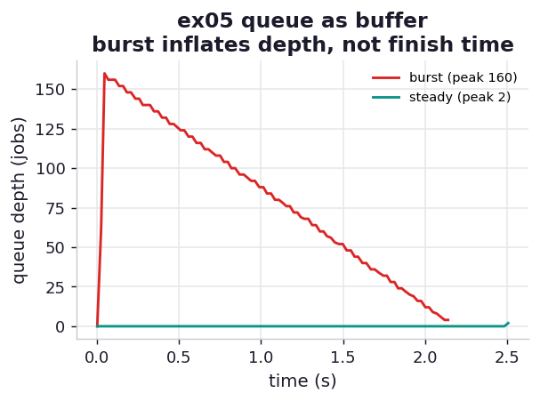

# ex05_queue_buffer

The book's motivating story for a queue is a traffic spike. When a user rates an item, the site
wants to recompute their recommendations. Without a queue, the "rate" action calls the
recommendation service *directly* — and if thousands of users rate things at once, those servers are
swamped, start timing out, and drop work. Put a queue in between and the "rate" action merely drops
a message and returns instantly; the recommendation servers pull work *when they are ready*, and the
queue swells to hold the backlog until they catch up. The producer never blocks, and nothing is
lost. This exercise makes that buffering visible by watching the queue depth over time.

## What it measures

The same one hundred and sixty jobs are sent to a Redis queue drained by four fixed consumers,
under two arrival patterns, while we sample the queue's length every twenty milliseconds:

- **burst** — all the jobs arrive essentially at once (the spike), then
- **steady** — the jobs arrive paced to match the consumers' service rate.

| arrival | finished in | peak queue depth |
| --- | ---: | ---: |
| burst | ~2.1 s | **160 jobs** (the whole backlog buffered) |
| steady | ~2.5 s | 3 jobs (queue stays near empty) |

A correctness anchor asserts all one hundred and sixty jobs were processed in both runs (counted via
an atomic Redis `INCR`, so concurrent consumers cannot lose a count), so the buffer absorbs the
spike without ever dropping a job.

## What we found

**The queue converts a spike in *arrivals* into a spike in *queue depth* — not into dropped work and
not into a longer completion time.** Under the burst, all one hundred and sixty jobs land almost
instantly and the queue balloons to its full backlog of 160 before the consumers have drained any
appreciable fraction; it then falls steadily back to zero as the four consumers chew through it.
Under the steady stream, arrivals are paced to roughly match consumption, so the queue never holds
more than a handful of jobs. Two completely different queue-depth histories — yet both runs finish
in about the same time, because in both cases the four consumers are the bottleneck and they process
at the same fixed rate regardless of how the work arrived.

There is a small, honest twist in the numbers: the **burst actually finishes slightly faster** (2.1 s
vs 2.5 s). That is not noise — under the steady arrival the consumers occasionally run dry and wait
for the next job to be pushed, whereas under the burst there is always work queued and the consumers
never idle. The buffer doesn't just protect against overload; by keeping a backlog ready it can keep
the workers more fully utilised. The cost it trades for that is memory: the burst's queue had to
hold all 160 jobs at once, which is exactly the resource the book warns you to watch ("What about
when memory starts running out?").

The contrast with a queueless, synchronous design is the whole point. Without the queue, the burst
of 160 simultaneous requests would hit the four consumers directly: 156 of them would find every
consumer busy and would have to block, retry, or fail. The queue turns "156 callers get rejected"
into "156 jobs wait their turn" — same throughput, no rejections, at the price of holding them in
memory for a couple of seconds.

## Reading the chart



The chart plots queue depth against time for both arrival patterns. The burst line shoots almost
vertically up to 160 and then slides down a clean ramp to zero as the consumers drain it — that
triangle *is* the buffer doing its job. The steady line hugs the bottom of the chart, never rising
above a few jobs. The two lines reach zero at almost the same moment, which is the result: arrival
pattern shapes the depth, not the finish time.

## Run

```bash
.venv/bin/python chapter_11_clusters_and_job_queues/ex05_queue_buffer/ex05_queue_buffer.py
```

Needs Docker running — the exercise starts its own `redis:7-alpine` container when it begins and
removes it when it finishes, so there is nothing to set up by hand. The exact peak
and timing depend on your cores and Redis latency; the durable result is that a burst inflates the
queue depth, not the completion time, and the consumers set the pace.

## 5 Whys

1. **Why does the queue depth spike under a burst but the completion time barely changes?** The
   consumers drain at a fixed rate set by their number and the per-job work; the queue simply holds
   whatever has arrived but not yet been processed, so a burst grows the backlog without speeding up
   or slowing down the draining.
2. **Why doesn't the burst overwhelm the consumers the way a direct call would?** The producer's only
   obligation is to drop a message on the queue, which is near-instant; the consumers pull when
   ready, so they are never handed more concurrent work than they can hold.
3. **Why does the burst sometimes finish *faster* than the steady stream?** With a full backlog the
   consumers always have a job waiting and never idle; under a paced stream they occasionally run dry
   between arrivals, wasting a sliver of capacity.
4. **Why is memory the cost to watch?** Buffering a spike means holding the whole backlog somewhere —
   the burst queue held all 160 jobs at once; a large enough or long enough imbalance can exhaust the
   queue's memory, which is one of the book's key questions to ask of any queue.
5. **Why does this matter?** A queue lets a system absorb uneven, bursty demand with steady
   downstream capacity, trading transient memory for the elimination of dropped work and blocked
   callers — ideal when the consumer can lag and the producer must not block.

**Root cause:** A queue decouples the arrival rate from the service rate by storing the difference
as depth; a burst therefore shows up as a temporary pile of buffered work rather than as overload or
loss, and the completion time stays governed by the consumers — at the cost of the memory to hold the
backlog.
