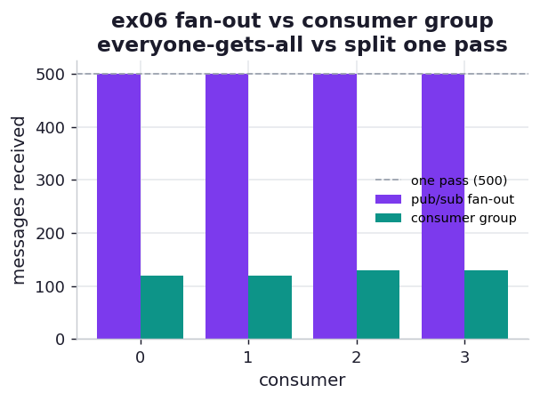

# ex06_pubsub_vs_consumer_group

The book draws a careful line between two ways messages reach consumers, and it is the single most
confused point in messaging systems. Both involve a publisher and several consumers; what differs is
*who gets each message*. Under **pub/sub fan-out**, every subscriber receives an identical copy of
every message — the book's newspaper analogy, where each edition is delivered to all subscribers.
Under **consumer-group load balancing**, the consumers within one subscription *share* the messages,
each message handled by exactly one of them — one household with a single subscription, where the
paper arrives once and whoever picks it up first reads it. This exercise sends the same messages to
the same number of consumers under each model and counts what each consumer actually received.

## What it measures

Five hundred messages, four consumers, under each delivery model:

| model | mechanism | per-consumer | total deliveries |
| --- | --- | --- | ---: |
| pub/sub fan-out | Redis `PUBLISH` / `SUBSCRIBE` | [500, 500, 500, 500] | **2000** (= 4 × 500) |
| consumer group | Redis Streams `XADD` + `XREADGROUP` | [130, 130, 120, 120] | **500** (= 500) |

Correctness anchors guard both: under fan-out every subscriber must receive all five hundred
messages, and under the consumer group the per-consumer counts must sum to exactly five hundred —
no message lost, none handled twice.

## What we found

**Fan-out delivers every message to every consumer; the consumer group partitions one pass across
them.** The numbers state it plainly. With four subscribers, pub/sub performs two thousand
deliveries — five hundred messages times four copies — and each subscriber independently sees the
entire stream. The Streams consumer group performs five hundred deliveries total, split into roughly
equal shares of about a hundred and twenty-five each, and every message is handled exactly once.
Same publisher, same four consumers, same five hundred messages, and a 4× difference in how much
delivery work the system does — entirely a consequence of which topology you chose.

That factor of four is the cost-and-purpose of fan-out. You pay it deliberately when every consumer
genuinely needs to react to every event: invalidate its own cache, update its own dashboard, append
to its own log. You would never pay it to distribute *work*, because doing the same job four times is
pointless — that is what the consumer group is for. The group's near-even split ([130, 130, 120,
120], a spread of just 1.08×) is the automatic load balancing the book describes: the broker hands
the next message to whichever consumer asks for it, so faster consumers naturally pull more and the
pool stays busy without any central scheduler.

A subtle but important property falls out of the mechanism. Under pub/sub the messages are
*fire-and-forget* — the publisher must have live subscribers at the moment it publishes, because
Redis pub/sub does not store anything (this exercise uses a barrier to make sure all four subscribers
are listening before the first `PUBLISH`). The Streams consumer group, by contrast, persists the
messages in the stream and tracks which have been acknowledged, so consumers can join late, crash,
and recover — the foundation for the delivery guarantees explored in ex07. Fan-out trades durability
for simplicity; the consumer group keeps the messages around so it can promise more.

## Reading the chart



The chart is two groups of four bars — one bar per consumer under each model. On the left, fan-out:
four equal bars all at the full 500, because everyone got everything. On the right, the consumer
group: four bars at ~125 each, because the single stream was split four ways. A dashed line at 500
marks one full pass of the messages; fan-out sits *at* it four times over, the group *sums* to it
once.

## Run

```bash
.venv/bin/python chapter_11_clusters_and_job_queues/ex06_pubsub_vs_consumer_group/ex06_pubsub_vs_consumer_group.py
```

Needs Docker running — the exercise starts its own `redis:7-alpine` container when it begins and
removes it when it finishes, so there is nothing to set up by hand. The per-consumer
split varies slightly run to run with scheduling; the durable result is fan-out delivering K copies
versus the consumer group splitting one pass.

## 5 Whys

1. **Why does fan-out do 4× the delivery work?** Pub/sub sends every published message to *every*
   subscriber, so with four subscribers each message is delivered four times — by design, so each
   consumer can react to the full stream independently.
2. **Why does the consumer group do only one pass?** A Streams consumer group treats its consumers as
   one cooperating pool and hands each message to exactly one of them, so the deliveries sum to the
   number of messages, not a multiple of it.
3. **Why is the group's split so even without a scheduler?** The broker gives the next message to
   whichever consumer next asks for one, so consumers self-balance — a faster or idler consumer
   simply pulls more, with no central coordinator.
4. **Why must pub/sub subscribers be listening *before* the publish?** Redis pub/sub stores nothing;
   it routes a message only to connections subscribed at that instant, so a late subscriber misses
   everything sent before it joined — hence the barrier in this exercise.
5. **Why does this matter?** Choosing fan-out vs a consumer group is choosing between *broadcast*
   (everyone reacts to everything) and *work distribution* (the pool shares one stream); using the
   wrong one either wastes K× the effort or fails to give every reactor the events it needs.

**Root cause:** Pub/sub and consumer groups answer different questions — "should every consumer see
every message?" versus "should the consumers share the messages?" — so fan-out multiplies delivery by
the number of subscribers while a consumer group partitions a single pass across them; pick the one
whose semantics match whether you are broadcasting events or distributing work.
