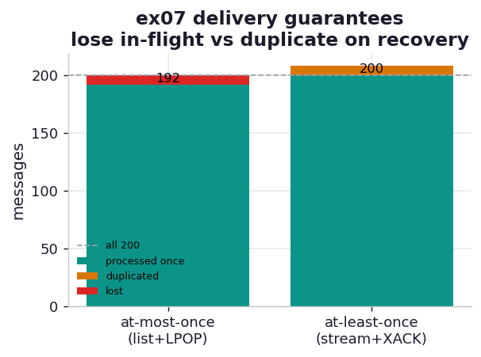

# ex07_delivery_guarantees

Two of the book's key questions to ask of any queue are about failure: *"Does a consumer have to
acknowledge that it is done processing a message? What happens if a consumer fails midway?"* and
*"are messages guaranteed to be delivered at least once? at most once?"* These are not academic —
they decide what your system does when (not if) a worker dies mid-job. And there is no free lunch:
you do not get to choose "always correct," you get to choose *which way to be wrong*. This exercise
forces that choice into the open by crashing a consumer at the worst possible moment and counting
the damage under each delivery model.

## What it measures

Two hundred messages, replayed under two delivery models with the *identical* crash schedule — the
consumer dies after every twenty-fifth message (eight crashes), each crash landing in the window
*after* the work is done but *before* completion is confirmed:

| model | mechanism | processed once | lost | duplicated |
| --- | --- | ---: | ---: | ---: |
| at-most-once | Redis list + `LPOP` | 192 / 200 | **8** | 0 |
| at-least-once | Redis Streams group + `XACK` | 200 / 200 | 0 | **8** |

The counts are asserted exactly: one loss per crash under at-most-once, zero losses and one duplicate
per crash under at-least-once. The crash always lands at the same place, so the two models face the
same adversity and differ only in how they survive it.

## What we found

**The same eight crashes cost at-most-once eight lost messages and at-least-once eight duplicate
processings — and that is the entire tradeoff.** Under the list model, `LPOP` removes a message from
the queue the instant it is read. When the consumer crashes before recording its result, that
message is already gone: no other consumer will ever see it, so the work is lost forever. Two hundred
messages in, eight crashes out, one hundred and ninety-two processed — eight simply vanished. Nothing
is ever done twice, which is the one guarantee at-most-once *does* make.

Under the Streams consumer group, `XREADGROUP` delivers a message but does not remove it; it sits in
the group's **pending list** until the consumer explicitly `XACK`s it. A crash before the ack leaves
the message pending, and a recovery consumer reclaims it with `XAUTOCLAIM` and processes it again.
All two hundred messages get processed — nothing is lost — but the eight that crashed before their
ack are processed a second time during recovery. "At least once" is precisely that promise: every
message lands *at least* once, possibly more, never zero.

Which is correct depends entirely on the work. If the message is "charge this credit card," a
duplicate is a double charge and a loss is merely an annoyed customer who retries — at-most-once (or,
better, exactly-once via idempotency) is what you want. If the message is "resize this uploaded
photo," a duplicate is a harmless wasted CPU cycle and a loss is a broken thumbnail — at-least-once
is obviously right. The book makes exactly this point with its recommendation-engine and
photo-resize examples: *a little failure is acceptable* when reprocessing is cheap and idempotent,
and the cost of the guarantee should be weighed against the cost of being wrong.

The deeper lesson is that the acknowledgement is what buys the guarantee. At-most-once doesn't ack at
all — the read *is* the removal, so there is no second chance. At-least-once separates "I received
it" from "I finished it," and that gap is what lets a crashed message be noticed and retried. The ack
costs an extra round-trip per message and the bookkeeping of a pending list, which is the price of
never losing work.

## Reading the chart



The chart is two stacked bars, one per model, each totalling the processing outcomes. The
at-most-once bar reaches only 192 with a red "lost" cap where eight messages fell off the top. The
at-least-once bar reaches the full 200 of unique work but carries an amber "duplicated" block of
eight stacked above it — work done twice. One bar is short by its losses; the other is tall by its
duplicates. Neither is the clean 200 you would get with no crashes, which is the honest point: under
failure you pick your poison.

## Run

```bash
.venv/bin/python chapter_11_clusters_and_job_queues/ex07_delivery_guarantees/ex07_delivery_guarantees.py
```

Needs Docker running — the exercise starts its own `redis:7-alpine` container when it begins and
removes it when it finishes, so there is nothing to set up by hand. The crash schedule
is deterministic, so the counts reproduce exactly: eight losses one way, eight duplicates the other.

## 5 Whys

1. **Why does at-most-once lose messages on a crash?** `LPOP` removes the message as it is read, so a
   consumer that crashes before recording its result takes the only copy of that message with it —
   there is nothing left to retry.
2. **Why does at-least-once duplicate instead of losing?** `XREADGROUP` leaves the message pending
   until it is acknowledged; a crash before the ack leaves it reclaimable, so a recovery consumer
   redoes it — guaranteeing it lands, at the cost of landing twice.
3. **Why can't a queue simply guarantee exactly-once?** The crash can fall on either side of the
   acknowledgement, and the broker cannot tell "did the work, didn't ack" from "didn't do the work" —
   so it must choose to assume one, accepting either loss or duplication.
4. **Why does the acknowledgement matter so much?** It separates "received" from "completed," giving
   the broker a way to detect unfinished work and retry it; without an ack (the list model) the read
   itself is the only signal, and it is irreversible.
5. **Why does this matter?** The right guarantee depends on whether duplicates or losses hurt more —
   a double charge versus a missed thumbnail — so you must choose the delivery model to match the
   cost of being wrong, and make consumers idempotent when you pick at-least-once.

**Root cause:** A crash can always land between doing the work and confirming it, and no broker can
distinguish that from never having done the work — so delivery semantics force a choice between
losing the in-flight message (at-most-once) and reprocessing it (at-least-once); pick the failure
mode your workload can tolerate.
