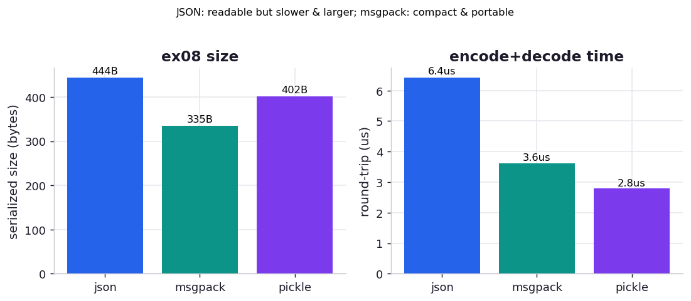

# ex08_message_serialization

Every message a cluster sends has to be turned into bytes and back, and the book has a strong,
slightly counterintuitive recommendation about how: *prefer human-readable text (JSON) over a
low-level compressed binary protocol*, even though the binary form is faster and smaller. The
reasoning is operational, not about performance — "when you're left with a partial database after a
core computer has caught fire, you'll be glad that you can read the important messages quickly as you
work to bring the system back online." This exercise puts numbers on exactly what that
recommendation costs, so you can make the trade deliberately rather than by reflex.

## What it measures

One representative message — the book's own "user rated an item" event, with nested context, a list
of recent items, and some tags — serialized three ways, timed over twenty thousand repetitions:

| codec | size | encode | decode | properties |
| --- | ---: | ---: | ---: | --- |
| JSON | 444 B | ~3.0 µs | ~3.2 µs | human-readable, any language |
| msgpack | 335 B | ~2.2 µs | ~1.2 µs | binary, any language |
| pickle | 402 B | ~1.4 µs | ~1.3 µs | binary, **Python-only, unsafe on untrusted input** |

Every codec is checked to round-trip to the identical object before timing, so none can look fast by
quietly dropping or mangling a field.

## What we found

**JSON is about 2.3× slower to round-trip and about 1.3× larger than the binary alternatives — and
the book recommends it anyway.** A full encode-and-decode of this message costs ~6.2 µs in JSON
versus ~2.7 µs in pickle; the JSON text is 444 bytes versus 335 for msgpack. Those are real,
repeatable penalties. They are also, for most systems, completely irrelevant: a few microseconds and
a hundred bytes per message vanish next to the network round-trip (ex02 measured a *millisecond* just
to deliver a message) and next to the actual work the message triggers. The book's point is that you
are trading something cheap (a little CPU and bandwidth) for something expensive to lack
(readability when everything is on fire), and that is a good trade precisely because the thing you
give up is so cheap here.

**msgpack is the quietly excellent middle ground the book underplays.** It is the *smallest* of the
three (335 bytes, beating even pickle) and among the fastest, while remaining language-agnostic —
clients exist for every major language, so it crosses service and language boundaries the way JSON
does and pickle cannot. If you have measured your serialization to actually be a bottleneck (rare,
but it happens at very high message rates), msgpack gives you most of binary's speed and size without
giving up portability. The one thing it sacrifices is human-readability: you cannot `cat` a msgpack
blob and read it, which is the exact property the book prizes.

**pickle is the fastest round-trip here, and the one you should almost never send across a
cluster.** It is Python-only, so a consumer written in any other language cannot read it — and more
seriously, unpickling untrusted data can execute arbitrary code, making it a remote-code-execution
hole the moment a message crosses a trust boundary. Its speed is real but it belongs inside a single
trusted Python application, not on a message bus between machines.

The ranking, then, is not "fastest wins." It is: use JSON by default for its readability and
universality; reach for msgpack when you have *measured* serialization to be a real cost and still
need cross-language portability; and keep pickle for trusted, in-process, Python-only paths. The
book's headline advice — favour the human-readable format — is the right default precisely because
the performance you sacrifice is, on the scale of a cluster, noise.

## Reading the chart



The chart has two panels. The left compares serialized size in bytes; JSON is the tallest bar,
msgpack the shortest. The right compares round-trip time (encode + decode) in microseconds; JSON
again the tallest, pickle and msgpack well below it. The visual story is that JSON loses both
quantitative races — and the annotation reminds you it wins the one that the book argues matters
most operationally: you can read it.

## Run

```bash
.venv/bin/python chapter_11_clusters_and_job_queues/ex08_message_serialization/ex08_message_serialization.py
```

No Redis or Docker needed — this is pure CPU serialization. Absolute microseconds depend on your
machine; the durable results are the ordering (binary smaller and faster than JSON, msgpack the most
compact) and that the gaps are small enough to be dominated by network and compute in any real
system.

## 5 Whys

1. **Why is JSON slower and larger than the binary formats?** It encodes everything as UTF-8 text —
   field names spelled out, numbers as digit strings, structural punctuation — which takes more bytes
   and more parsing work than a binary format that writes types and lengths directly.
2. **Why does the book recommend it despite that?** Because the penalty is tiny on the scale of a
   cluster (microseconds and bytes against millisecond network hops), while the benefit — being able
   to read a message by eye during an incident — is large and hard to replace.
3. **Why is msgpack smaller than pickle here?** msgpack is a tight, purpose-built binary encoding for
   simple data; pickle carries Python-specific framing and object metadata, so for plain dicts and
   lists msgpack edges it out on size.
4. **Why should pickle stay out of a cluster message bus?** It is Python-only, so non-Python
   consumers cannot read it, and unpickling untrusted bytes can execute arbitrary code — a serious
   security hole the moment messages come from anywhere you do not fully trust.
5. **Why does this matter?** The right serializer is chosen by *constraints* (readability,
   portability, safety) far more often than by raw speed, because the speed differences are
   negligible next to everything else a message does — so optimise for debuggability first and only
   switch to binary when you have measured a real need.

**Root cause:** Serialization format is an operational choice, not a performance one: the speed and
size gaps between JSON, msgpack, and pickle are small enough to be dominated by network and compute,
so the deciding factors are human-readability, cross-language portability, and safety — which is why
the book defaults to readable JSON and treats binary as the measured-need exception.
