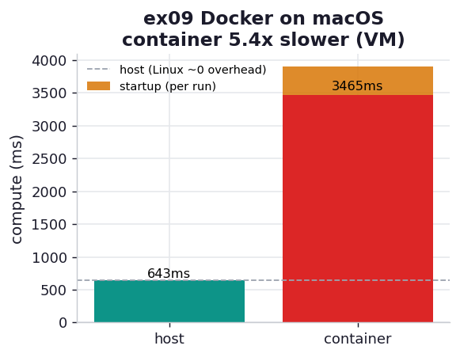

# ex09_docker_overhead

The book runs a numpy diffusion on the host and again inside a Docker container (Example 11-6) and
gets essentially identical times — about 0.86 s on the host, 0.84 s in the container — and concludes
that "Docker is not slower than running on the host machine in any meaningful way when the task
relies mainly on CPU/memory." That conclusion is correct, and the book is careful to attach the
condition that makes it correct: *on Linux*. There, Docker uses the kernel's `cgroups` and the
container shares the host kernel directly, so there is no translation layer between the code and the
hardware. On macOS there is no Linux `cgroups`; Docker has to boot an entire Linux VM under a
hypervisor and run every container inside it. The book flags this in a warning box. This exercise
measures what that warning is worth on this machine.

## What it measures

The identical `workload.py` (a 768×768 numpy diffusion, 400 iterations) run two ways, comparing the
*compute* time only — the script reports its own internal timer, so container startup is excluded —
best of three:

| where | compute time | vs host |
| --- | ---: | ---: |
| host (this project's Python) | ~650 ms | 1.0× |
| container (`python:3.12-slim` + numpy) | ~3480 ms | **~5.4× slower (+437%)** |
| container startup (VM + image launch) | ~480 ms | on top of every `docker run` |

A checksum from the workload (the diffusion conserves mass, so the grid sum is a fixed number)
confirms the host and the container computed the same thing — the container is not slower because it
did less.

## What we found

**On this macOS machine the container is several times *slower* at pure CPU/memory work — the exact
opposite of the book's near-zero Linux result.** The same diffusion that takes the host ~650 ms takes
~3.5 seconds inside the container, and that is before counting the ~480 ms it costs just to launch
the container on every run. This is not Docker being badly behaved; it is the unavoidable cost of the
macOS architecture. There is no native Linux kernel for the container to share, so Docker Desktop
runs a Linux VM under Apple's hypervisor, and every memory-touching operation in the diffusion — and
`np.roll` allocates and streams the whole grid each iteration — pays for crossing that virtualized
boundary. The book's `cgroups`-based near-zero overhead simply does not exist here, because
`cgroups` is a Linux kernel feature and this is not Linux.

**The size of the penalty is machine- and configuration-specific; the direction is the durable
lesson.** The ~5× figure depends on how many CPUs Docker Desktop is allotted, which virtualization
backend it uses, and how the guest numpy was built — change those and the number moves. What does
*not* move is the qualitative result the book is warning about: a Docker benchmark taken on a macOS
laptop bakes in hypervisor overhead that will *not* be present on the Linux server where the code
actually runs in production. The book's own fifth "why" says it plainly — *never size a cluster based
on laptop Docker numbers.* If we sized a cluster assuming each node ran at this container's ~3.5 s,
we would over-provision wildly, because a real Linux node would run it at host speed.

This is why the chapter insists on profiling Docker workloads *on the OS where they will run*. The
value of Docker on a developer's macOS laptop is reproducibility — the same image, the same
dependencies, the same code, runnable anywhere — and that value is enormous and entirely
independent of this performance penalty. You accept the slow local container for the convenience of
a portable environment, and you measure performance on Linux. Using the laptop container's timing to
reason about production throughput is the mistake; using the laptop container to guarantee the
production environment is the whole point.

## Reading the chart



The chart is the compute-time bars — a short host bar and a container bar several times taller — with
the container's startup overhead drawn as a separate stacked segment on top, since it is paid afresh
on every `docker run`. A dashed line at the host time marks the "near-zero overhead" the book
measured on Linux; on this macOS box the container towers far above it. The gap between the dashed
line and the bar is precisely the hypervisor tax the book's warning box is about.

## Run

```bash
.venv/bin/python chapter_11_clusters_and_job_queues/ex09_docker_overhead/ex09_docker_overhead.py
```

Needs Docker Desktop running; the exercise builds the image on first run (a few seconds) and skips
cleanly with a message if Docker is unavailable. Your overhead factor will differ with your Docker
CPU allocation and host — on a Linux machine it should nearly vanish, which is the comparison that
makes the point.

## 5 Whys

1. **Why is the container several times slower than the host on macOS?** macOS has no Linux
   `cgroups`, so Docker runs a Linux VM under a hypervisor and every container runs inside it;
   CPU- and memory-bound work pays for crossing that virtualized boundary.
2. **Why doesn't this happen on Linux?** There, the container shares the host kernel directly via
   `cgroups` — the code runs on the native hardware with only resource limits applied, so there is
   essentially nothing between it and the CPU.
3. **Why is the magnitude so variable?** It depends on how many CPUs Docker Desktop is given, the
   virtualization backend, and how the guest's numpy was compiled — all of which differ from machine
   to machine, so only the *direction* (slower on macOS) is portable.
4. **Why is it dangerous to benchmark Docker on a laptop?** A macOS or Windows laptop bakes in
   hypervisor overhead absent on a Linux production server, so the laptop numbers overstate
   production cost and would lead you to over-provision a cluster.
5. **Why use Docker on the laptop at all, then?** For reproducibility — the same image runs
   identically on your laptop and every cluster node — which is worth far more than local speed; you
   simply profile performance on the OS where the code will actually run.

**Root cause:** Docker's near-zero overhead is a Linux `cgroups` property; on macOS the container runs
inside a hypervisor-managed Linux VM, so CPU/memory work is measurably slower — meaning Docker on a
Mac is for environment reproducibility, not for performance measurement, and cluster sizing must be
done from Linux numbers.
