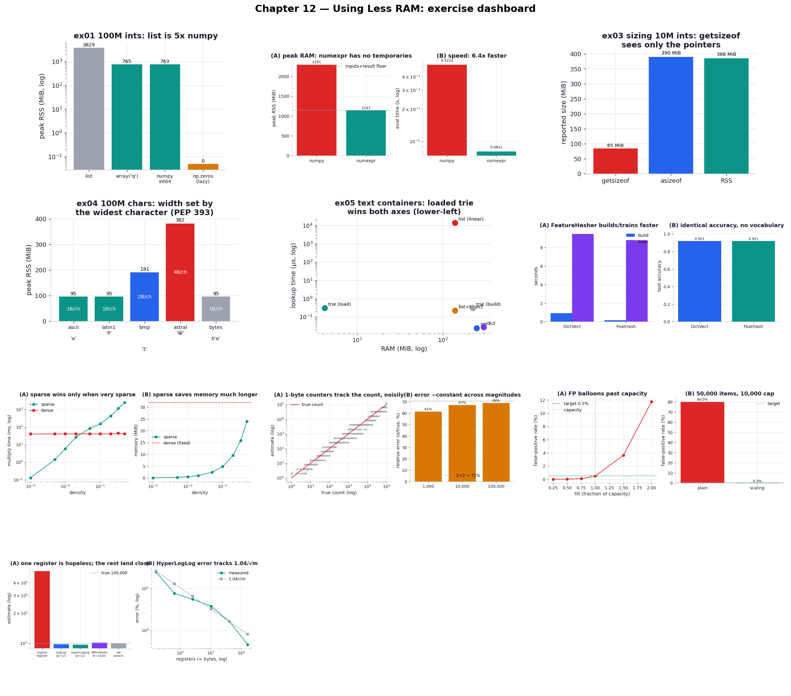
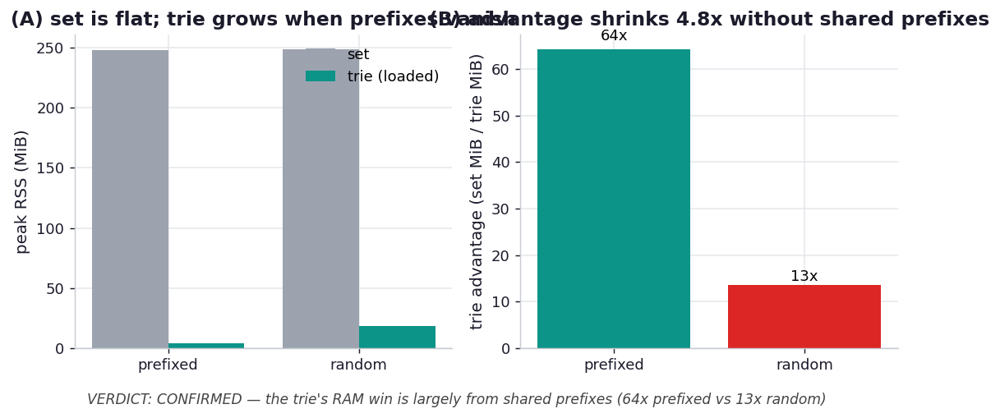

# Chapter 12 — Using Less RAM: Practice Exercises

Runnable drills for *High Performance Python (3rd ed.)*, Chapter 12 — **ten** of them, plus a
one-experiment hypothesis lab. Where most of the book chases speed, this chapter chases space: RAM
is the scarce resource that decides whether your data fits on one machine or forces you into the
engineering tax of splitting across many. The chapter is a tour of three ways to spend less of it —
store your numbers and strings in tighter representations, compress structured data with tries, and
trade a little accuracy for enormous savings with probabilistic sketches.

The defining challenge of reproducing this chapter is *honest measurement*, and it shapes everything
here. The repo's usual `tracemalloc` helper only sees the Python heap, which is exactly the wrong
lens for a chapter whose savings live in numpy buffers, trie structures, and scipy matrices — all C
allocations `tracemalloc` never counts. So Chapter 12 measures peak **resident set size** instead,
the way the book's `%memit` does, and it does it the way the book recommends: in a freshly started
interpreter. The shared `_mem.py` runs each allocation in its own `spawn`-ed child process and reads
that child's peak RSS, which is the programmatic equivalent of the book's advice to "exit and restart
the Python shell" between measurements. Every memory number below came out of that machinery.

**Core idea:** RAM is spent on representation, not just data. A Python object wraps every value in
~28 bytes of bookkeeping, so the same numbers cost 5× more in a `list` than a numpy buffer; the same
strings cost 57× more in a `set` than a loaded trie; and the same unique-count costs gigabytes in a
`set` but kilobytes in a HyperLogLog. The lever in every case is to store *only what the question
needs* — raw primitives instead of objects, shared prefixes instead of whole strings, a statistical
sketch instead of the data — and the art is knowing which representation answers your question.

```bash
.venv/bin/python chapter_12_using_less_ram/ex01_primitives_cost/ex01_primitives_cost.py
```

**Verified learnings** (measured on this machine):

1. **A Python object per value costs ~5×** (ex01). 100M distinct ints cost **3829 MiB** in a `list`
   versus **763 MiB** in a numpy `int64` array — the gap is the per-object reference count, type
   pointer, and GC overhead the list pays 100M times. `np.zeros` reports ~0 MiB because its pages are
   allocated lazily; `np.ones` pays the full 763 MiB up front.
2. **NumExpr erases NumPy's hidden temporaries** (ex02). The cross-entropy expression peaks at
   **2293 MiB** in direct NumPy (inputs + result + ~1150 MiB of intermediate arrays) but only
   **1149 MiB** with NumExpr — just the inputs and result, no temporaries — while running **6.7×**
   faster by walking the data in cache-sized chunks across cores.
3. **`getsizeof` measures the shell, not the contents** (ex03). For a 10M-int list it reports
   **85 MiB** (the pointer array) against an actual **385 MiB** — a 4.5× undercount — while
   `pympler.asizeof` walks the graph and agrees with the real RSS at ~390 MiB.
4. **A string costs by its widest character** (ex04, PEP 393). 100M characters cost 95 / 95 / 191 /
   382 MiB as the character widens from ASCII to Latin-1 to BMP to an astral emoji — 1, 1, 2, 4
   bytes each — so one emoji promotes the *entire* string to 4 bytes/char.
5. **A loaded trie holds strings 57× tighter than a set** (ex05). Two million tokens cost **249 MiB**
   in a `set` and **4.3 MiB** in a `marisa_trie` loaded from disk, both answering lookups in well
   under a microsecond — while a linear `in` scan over a list takes **~14 ms** per lookup, the trap
   the book warns about.
6. **A hashed feature matrix matches a vocabularised one** (ex06). On 20 Newsgroups, `FeatureHasher`
   and `DictVectorizer` both score **0.921**, but the hasher builds **5.5×** faster and stores no
   vocabulary at all — losing only reversibility and ~2,500 of 1.23M non-zeros to collisions.
7. **Sparse beats dense on speed only when very sparse, but on memory much longer** (ex07). Squaring
   a 2048² matrix, sparse is **312×** faster at 0.1% density but crosses over to *slower* by ~5%;
   meanwhile sparse uses 9.6 MiB at 20% density against dense's fixed 32 MiB — a 70% saving that
   holds until ~two-thirds density.
8. **A Morris counter counts to 5.8e76 in one byte** (ex08), at a price: its relative error is a
   large, magnitude-independent **~70%** (the theoretical 1/√2 spread of a single random walk), even
   though the mean over many counters is nearly unbiased.
9. **A Bloom filter trades a tunable error for size independent of item size** (ex09). 50k items at
   0.05% need exactly **791,015 bits and 11 hashes**; the measured false-positive rate is 0.47% at
   capacity but balloons to 11.75% at 2× overfill — where a **scaling** filter holds 0.28% against a
   plain filter's 80%.
10. **HyperLogLog counts uniques in kilobytes, with error you dial via RAM** (ex10). A single LogLog
    register is useless (+424%), but with 4096 registers HyperLogLog, LogLog, and KMV all land within
    ~3% of 100,000 uniques in **4 KB** against a set's **8.6 MiB** — and HyperLogLog's error tracks
    the theoretical **1.04/√m** across two orders of magnitude of register count.

| # | exercise | one-line takeaway |
| --- | --- | --- |
| ex01 | [primitives cost](ex01_primitives_cost/) | a list of 100M ints is 5× a numpy array; `np.zeros` lies (lazy) |
| ex02 | [numexpr temporaries](ex02_numexpr_temporaries/) | NumExpr halves peak RAM and runs 6.7× faster — no temporaries |
| ex03 | [getsizeof vs asizeof](ex03_getsizeof_vs_asizeof/) | `getsizeof` counts the pointers, not the objects (4.5× undercount) |
| ex04 | [bytes vs unicode](ex04_bytes_vs_unicode/) | PEP 393: a string costs 1/2/4 bytes/char by its widest character |
| ex05 | [text containers](ex05_text_containers/) | a loaded trie is 57× smaller than a set; linear list lookup is the trap |
| ex06 | [FeatureHasher](ex06_featurehasher/) | hashed features match accuracy (0.921), build 5.5× faster, no vocab |
| ex07 | [sparse matrix](ex07_sparse_matrix/) | sparse wins speed only when very sparse, memory much longer |
| ex08 | [Morris counter](ex08_morris_counter/) | count to 5.8e76 in one byte, at ~70% relative error |
| ex09 | [Bloom filter](ex09_bloom_filter/) | tunable false-positive rate, size independent of item size |
| ex10 | [HyperLogLog](ex10_hyperloglog/) | uniques in 4 KB vs 8.6 MiB; error tracks 1.04/√m |



## Hypothesis lab

Beyond the book: a falsifiable test of the trie's most-quoted caveat — that its win "depends on your
data's structure."

| # | hypothesis | verdict | finding |
| --- | --- | --- | --- |
| h01 | [trie needs shared prefixes](hypothesis/h01_trie_needs_prefixes/) | **CONFIRMED** | the trie's advantage over a set drops from **56.6×** on prefix-rich tokens to **13.1×** on high-entropy random ones — a 4.3× shrink — so prefix folding drives most of the win, though the trie still beats a set 13× by storing bytes instead of `str` objects |



## What's reproduced, and what isn't

The chapter's core results reproduce cleanly and on the book's own examples: the list-vs-array-vs-numpy
gap and the `np.zeros` lazy-allocation trap (ex01), the NumExpr temporaries result (ex02), the
`getsizeof` shell-only undercount against `asizeof` and RSS (ex03), PEP 393's per-character widths
(ex04), the full container comparison behind Figure 12-2 including the trie's build-vs-load split
(ex05), the `DictVectorizer`/`FeatureHasher` accuracy parity (ex06), the sparse-vs-dense speed and
memory crossovers of Figures 12-5 and 12-6 (ex07), and the three probabilistic structures — Morris,
Bloom, and the LogLog family — with their error behaviour (ex08–ex10). Several land right on the
book's exact numbers (the Bloom filter's 791,015 bits and 11 hashes; the 70% memory saving at 20%
sparse density).

The honest caveats. **Scale:** the headline examples are scaled down to keep the suite fast — ex02
uses 50M elements rather than the book's 200M, ex05 uses 2M tokens rather than 12.5M, and ex06 uses 5
categories with bigrams rather than the full 20-way trigram problem whose classifier alone runs
500–880 s. In every case the *ratios* — the actual lessons — are what's reported, and they hold; only
the absolute gigabytes and seconds differ. **Reference implementations:** the probabilistic structures
use the book's own simple listings, with two documented corrections in `_pds.py` so the algorithms
represent themselves fairly — the HyperLogLog register stores the position of the first set bit
(1-indexed), not the 0-indexed trailing-zero count the printed listing shows (the off-by-one halves
every estimate), and classic LogLog uses its own ~0.397 bias constant rather than reusing
HyperLogLog's 0.7213 (which overestimates by ~1.8×). **Measurement:** absolute RSS figures depend on
this machine (CPython 3.14, Apple Silicon, macOS); the ratios are the durable result.

## 5 Whys: why representation, not data, decides your RAM bill

1. **Why does the same data cost wildly different amounts of RAM?** Because RAM is spent on how the
   data is *represented* — a value wrapped in a Python object, a string stored whole, a count kept
   exactly — not on the information content itself.
2. **Why is the Python-object representation so expensive?** Every object carries a reference count, a
   type pointer, and GC bookkeeping (~28 bytes for a small int), and containers store *pointers* to
   these objects, so you pay the overhead once per element plus a pointer each.
3. **Why do tighter representations help so much?** A numpy buffer drops the objects and the pointers
   for raw primitives; a trie drops repeated prefixes for shared branches; a sparse matrix drops the
   zeros — each stores only what distinguishes one datum from another.
4. **Why can probabilistic structures go even further, down to kilobytes?** Because they stop storing
   the data at all and keep a statistical *sketch* that answers one narrow question (a count, a
   membership test, a cardinality) within a known error bound — lossy compression tuned to the
   question.
5. **Why does choosing the representation require knowing the question first?** Because each tighter
   representation gives up something — random access, reversibility, exactness — so the right choice
   depends entirely on which operations you need; a structure that's perfect for "how many uniques?"
   can't tell you "have I seen *this* one?"

**Root cause:** Memory is the cost of representation, and every representation trades capability for
compactness; using less RAM is the discipline of picking the *least* capable structure that still
answers your actual question — raw primitives over objects, shared structure over whole copies, a
sketch over the data — and measuring the real process to confirm the saving.

## Running everything

```bash
# one exercise
.venv/bin/python chapter_12_using_less_ram/ex05_text_containers/ex05_text_containers.py

# regenerate every chart + the dashboard, then the hypothesis chart (re-measures RSS, ~2-3 min)
.venv/bin/python chapter_12_using_less_ram/visualize_exercises.py
.venv/bin/python chapter_12_using_less_ram/hypothesis/h01_trie_needs_prefixes/plot.py

# via the task runner
task ch12:run -- ex07_sparse_matrix/ex07_sparse_matrix.py
task ch12:viz                # all charts + dashboard + hypothesis
task ch12:smoke              # run every exercise as a fast correctness check
```

Every script is self-contained: the shared helpers (`_mem.py` for RSS measurement, `_tokens.py` for
the string datasets, `_pds.py` for the probabilistic structures) live at the chapter root and each
exercise adds the chapter directory to `sys.path`. ex01 and ex02 allocate gigabytes transiently in
their measurement subprocesses, so the smoke run touches real memory; ex06 downloads the 20
Newsgroups corpus on first use and caches it.
