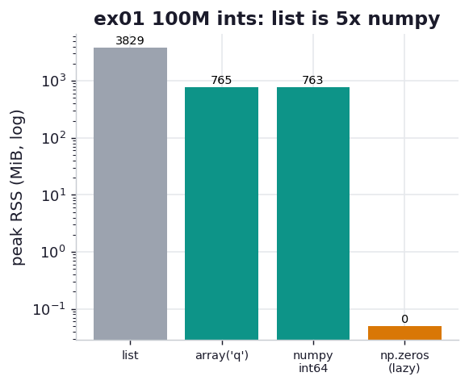

# ex01_primitives_cost

The chapter opens with a deceptively simple question: how much RAM does it take to hold a
hundred million integers? The answer depends entirely on *how* you hold them. A Python `list`
stores a hundred million pointers, each aimed at a separately heap-allocated `int` object that
carries a reference count, a type pointer, and garbage-collection bookkeeping — roughly 28 bytes
of overhead wrapped around every single value. An `array.array` or a `numpy` array throws all of
that away and packs the raw 8-byte primitives into one contiguous block of memory.

This exercise builds the same 100,000,000 integers four ways and weighs each one's peak resident
memory. The measurement matters as much as the result here: we run every construction in a
freshly started child process and read its peak RSS from the operating system (see `_mem.py`),
because the repo's usual `tracemalloc` helper only sees the Python heap and would miss the
`array`/`numpy` C buffers entirely — which is exactly the data we care about.

## What it measures

Peak RSS increment to hold 100,000,000 integers, each in a fresh process:

| construction | peak RSS | bytes/int | why |
| --- | ---: | ---: | --- |
| `list` of distinct ints | ~3829 MiB | ~40 | a pointer *plus* a full `int` object each |
| `array.array('q')` | ~765 MiB | 8 | raw signed 64-bit ints, one buffer |
| `numpy` int64 | ~763 MiB | 8 | raw int64 primitives, one buffer |
| `np.zeros(int64)` | ~0 MiB | — | lazily allocated — misreports until written |

## What we found

**The list costs almost exactly 5x what the primitive buffers do** — 3829 MiB against 763 MiB.
That gap is the price of treating each number as a first-class Python object: the list holds
100M 8-byte pointers (~760 MiB on its own, which is why the `array` and the list of *identical*
objects cost the same), and then on top of that every distinct integer is its own heap object
with ~28 bytes of reference-count, type, and GC overhead. Multiply that overhead across 100
million objects and you have gigabytes of pure bookkeeping. The book reports ~3.8 GB versus
~760 MB for this exact comparison, and the measurement here lands right on top of it.

**The `array` module and `numpy` are indistinguishable on memory**, both at ~764 MiB, which is
simply `100M × 8 bytes`. They differ in what they let you *do* — `numpy` brings a huge library of
fast vectorised operations and richer dtypes, while `array` is a dependency-free primitive store —
but for raw storage they are the same contiguous-buffer idea. The catch the book is careful to
flag: the moment you index into one of these and pull a value back into Python, a fresh `int`
object is constructed, so if your hot loop touches elements one at a time in pure Python you give
back the savings. These buffers shine when you compute on them in bulk or hand them to another
process.

**`np.zeros` is a profiling trap that this measurement catches red-handed.** It reports ~0 MiB
because the operating system hands `numpy` zero-initialised pages lazily — they don't actually
consume physical RAM until something writes to them. `np.ones` or `np.arange`, which fill the
buffer immediately, pay the full ~763 MiB up front. If you size your memory budget from a
`np.zeros` allocation you will be badly surprised later, which is why the book insists you measure
real usage with `%memit` rather than trusting `nbytes`.

## Reading the chart



Four bars of peak RSS in MiB on a log scale, because a linear axis would crush the 8-byte buffers
into invisible slivers next to the towering list. The grey list bar stands roughly five times
above the teal `array`/`numpy` bars — that ratio is the whole lesson. The `np.zeros` bar is
effectively absent, the visual signature of lazy allocation. Absolute heights scale with the
integer count and your platform's pointer and `int` sizes; the ~5x list-to-buffer ratio is the
durable takeaway.

## Run

```bash
.venv/bin/python chapter_12_using_less_ram/ex01_primitives_cost/ex01_primitives_cost.py
```

Each of the four constructions is built and weighed in its own spawned subprocess, so the peak-RSS
baselines never contaminate one another (the programmatic version of the book's "restart the shell
between `%memit` calls"). Expect a few seconds, dominated by building the billion-plus-byte list.

## 5 Whys

1. **Why does a `list` of 100M distinct ints cost ~5x what a numpy array does?** Because the list
   stores a pointer to a separate `int` object for every element, and each of those objects carries
   ~28 bytes of Python overhead on top of its value, while numpy stores just the 8-byte values.
2. **Why does each `int` object carry 28 bytes of overhead?** Every CPython object embeds a
   reference count, a pointer to its type, and (for variable-width ints) length bookkeeping — the
   machinery that makes it a garbage-collected, dynamically typed Python object.
3. **Why can't a `list` pack values tightly like an `array` does?** A `list` is designed to hold
   arbitrary heterogeneous objects, so it can only store *references*; it cannot assume every
   element is a fixed-width 8-byte integer the way a typed `array`/`numpy` buffer can.
4. **Why doesn't `np.zeros` show any memory cost?** The OS maps zero pages lazily and only commits
   physical RAM when a page is first written, so an all-zeros array that is never touched occupies
   address space but not resident memory — `np.ones`/`np.arange` write every element and pay in full.
5. **Why does any of this matter if you're computing on the numbers anyway?** Because the savings
   are real precisely when you *don't* unwrap each element in Python — bulk numpy operations, or
   shipping the contiguous buffer to another process or a C extension, keep the values as primitives
   and never pay the per-object tax.

**Root cause:** Python integers are full objects with per-instance overhead, and a `list` stores
them by reference; the ~5x RAM win of `array`/`numpy` comes from discarding both the wrapper objects
and the pointers in favour of one contiguous block of raw primitives.
