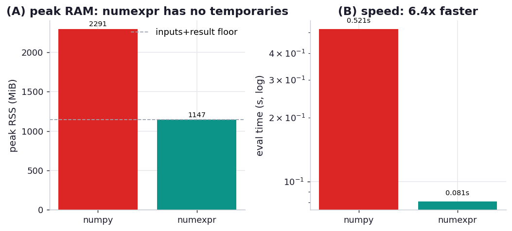

# ex02_numexpr_temporaries

A vectorised NumPy expression hides a memory cost that never appears in the source. Write the
cross-entropy (log-loss) formula in the obvious way —

```python
answer = -(yt * np.log(yp) + ((1 - yt) * (np.log(1 - yp))))
```

— and NumPy evaluates it strictly left to right, allocating a brand-new full-size array for every
intermediate result along the way: `np.log(yp)`, `1 - yt`, `1 - yp`, `np.log(1 - yp)`, the two
products, the sum, the negation. With large inputs those temporaries are each as big as the inputs,
so the peak memory during the calculation can be several times the size of the answer you keep. On
an 8 GB machine this is exactly the kind of expression that dies with a `MemoryError` even though
the final result would have fit comfortably.

NumExpr takes the same expression as a *string*, compiles it once, and then evaluates it over the
arrays in small cache-sized chunks — so only one chunk's worth of intermediates is ever alive, and
it threads the work across cores for free. This exercise measures both the peak resident memory of
the whole routine and the wall-clock of just the evaluation step, for the NumPy and NumExpr paths,
on identical inputs (with an `np.allclose` correctness anchor so a wrong-but-fast answer can't slip
through).

## What it measures

Cross-entropy over 50,000,000 float64 elements (one input array ≈ 381 MiB):

| path | peak RSS | eval time | what the peak contains |
| --- | ---: | ---: | --- |
| NumPy direct | ~2293 MiB | ~0.56 s | inputs + result + ~3 full-size temporaries |
| NumExpr | ~1149 MiB | ~0.08 s | inputs + result, essentially no temporaries |

## What we found

**NumExpr's peak is almost exactly the inputs plus the result, and nothing more.** Two input
arrays at ~381 MiB each plus a ~381 MiB answer come to ~1144 MiB, and NumExpr peaks at 1149 MiB —
the chunked evaluation genuinely never materialises a large intermediate. NumPy, computing the same
formula, peaks at 2293 MiB: that extra ~1150 MiB is the temporary arrays NumPy builds and discards
for each sub-expression. The book's headline version of this (200M elements) peaks at over 9 GB for
NumPy versus zero extra for NumExpr; we scaled the array 4x smaller so the suite runs in seconds,
but the shape is identical — NumExpr roughly *halves* the peak here by eliminating the temporaries.

**It is also dramatically faster — 6.7x on this machine.** NumPy's 0.56 s is single-threaded and
keeps walking out to main memory because each 381 MiB temporary blows past the CPU cache; NumExpr's
0.08 s comes from keeping each chunk resident in cache *and* spreading the chunks across cores. The
book sees ~17x on the larger arrays; our smaller arrays and different CPU give a smaller but
unmistakable multiple. Both effects — the RAM saving and the speedup — come from the same idea:
process the data in cache-friendly pieces instead of sweeping the whole vector once per operation.

The practical upshot the book stresses: if you use Pandas `df.eval()` or `pd.eval()`, NumExpr is an
*optional* dependency, and Pandas will silently fall back to slow pure-Python evaluation if it isn't
installed — without warning you. For any heavy vectorised arithmetic it is worth installing and
confirming it is actually being used.

## Reading the chart



Two panels sharing the story. On the left, peak RSS: the tall NumPy bar versus the much shorter
NumExpr bar, with a dashed line marking the "inputs + result" floor that NumExpr sits right on top
of — everything above that line on the NumPy bar is temporaries. On the right, evaluation time on a
log scale, where NumExpr is most of an order of magnitude faster. The absolute MiB and seconds scale
with the array size and your CPU; the lessons are that NumExpr's bar hugs the no-temporaries floor
and that its time bar is a fraction of NumPy's.

## Run

```bash
.venv/bin/python chapter_12_using_less_ram/ex02_numexpr_temporaries/ex02_numexpr_temporaries.py
```

The two peak-RSS figures are each measured in a fresh subprocess; the two timings are best-of-three
on preallocated inputs in this process. Expect a few seconds.

## 5 Whys

1. **Why does the direct NumPy expression peak at ~2x the memory NumExpr needs?** Because NumPy
   evaluates the expression one operation at a time, and each operation allocates a full-size
   temporary array for its result before the next operation consumes it.
2. **Why does NumExpr avoid those temporaries?** It parses the whole expression up front and
   evaluates it over small chunks of the arrays, so the intermediate values for a chunk live only
   briefly in cache and no full-size temporary is ever allocated.
3. **Why is NumExpr also several times faster, not just leaner?** Keeping each chunk inside the CPU
   cache avoids repeated round-trips to main memory, and NumExpr evaluates independent chunks on
   multiple threads — NumPy's per-operation sweep is single-threaded and cache-unfriendly.
4. **Why does cache friendliness matter so much here?** A 381 MiB array is far larger than the few
   MB of CPU cache, so a whole-array operation streams the entire array from RAM every time;
   chunked evaluation reuses cache-resident data across all the operations in the expression.
5. **Why might you be paying this cost without knowing?** Pandas' `eval`/`query` use NumExpr when it
   is installed but fall back to plain Python silently when it isn't, so the same code can be fast
   and lean on one machine and slow and memory-hungry on another.

**Root cause:** NumPy materialises a full-size temporary for every sub-expression, so peak memory
and runtime scale with the number of operations in the formula; NumExpr restructures the same
computation into cache-sized chunks evaluated in parallel, erasing the temporaries and the
memory-bandwidth bottleneck at once.
