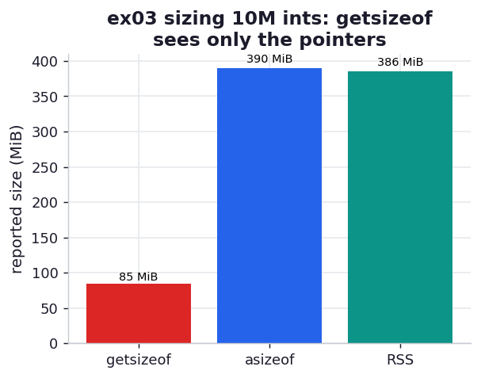

# ex03_getsizeof_vs_asizeof

When you want to know how much memory an object uses, the obvious first reach is
`sys.getsizeof`. It is also the easiest tool to be misled by. For a container, `getsizeof`
reports only the cost of the container *shell* — not the objects it holds. An empty list is 56
bytes, each element adds exactly 8 more (one pointer), and that 8 is the same whether the element
is the integer `1` or a hundred-character byte string. So `getsizeof` of a list tells you how many
pointers it holds, never how big the pointed-at objects are.

This exercise lines up three different answers to "how big is this list of 10 million integers?":
`sys.getsizeof` (the shell), `pympler.asizeof` (a deep walk of the whole object graph), and the
real process RSS (what the OS actually committed, via `_mem.py`). The first sees only the pointer
array; the other two see the pointer array *and* the 10 million integer objects behind it.

## What it measures

First, `getsizeof` on small probe objects, to expose the shell-only behaviour:

| object | getsizeof | note |
| --- | ---: | --- |
| `int 0` | 28 bytes | base integer object overhead |
| `int 2**30` | 32 bytes | wider value needs another 4-byte limb |
| `bytes b''` | 33 bytes | empty byte-string shell |
| `bytes b'abc'` | 36 bytes | +1 byte per character |
| `list []` | 56 bytes | empty list shell |
| `list [1, 2]` | 72 bytes | +8 bytes per element (a pointer) |
| `list [b'x'*99]` | 64 bytes | still only +8 — the 99-byte element is *not* counted |

Then three sizes for a list of 10,000,000 ints:

| measurement | result | what it sees |
| --- | ---: | --- |
| `getsizeof` (shell) | ~85 MiB | the 10M pointers only |
| `asizeof` (deep) | ~390 MiB | pointers + the 10M int objects |
| RSS (truth) | ~385 MiB | what the OS actually handed out |

## What we found

**`getsizeof` undercounts the real footprint by ~4.5x here**, and the probe table shows exactly
why. The `[b'x'*99]` row is the smoking gun: a list holding one 99-byte byte string reports 64
bytes — the 56-byte empty-list shell plus a single 8-byte pointer — and the 99 bytes of actual
data are nowhere in that number. Scale that up and `getsizeof` of the 10M-int list reports 85 MiB
(roughly `56 + 8 × 10M`), counting every pointer but none of the ~28-byte integer objects they
reference.

**`asizeof` and the real RSS agree closely** — 390 MiB versus 385 MiB — because `asizeof` walks
the graph and adds in those 10 million integer objects, which is where the memory actually lives.
The book's matching figures are an `asizeof` of ~401 MB against a `%memit` of ~400 MB, and we land
right alongside. The two methods come at the truth from opposite directions: `asizeof` *infers* the
size by interrogating each object, while RSS *observes* what the process grew to. They will not
always match — `asizeof` can't see memory a C library allocates behind the interpreter's back, and
RSS includes interpreter overhead — but for a plain list of ints they converge, which is what makes
this a good calibration.

The practical rule the book draws, and that this confirms: use `getsizeof` only for flat objects
where the shell *is* the object; for anything with contents, trust `%memit`/RSS for the real
process cost and reach for `asizeof` when you specifically want a deep per-object breakdown and can
afford its slowness.

## Reading the chart



Three bars for the 10M-int list. The short `getsizeof` bar sits far below the other two — the
visual of counting pointers but not contents — while the `asizeof` and RSS bars stand together near
390 MiB, the two honest estimates agreeing. The lesson is the gap between the first bar and the
other two: that gap *is* the 10 million integer objects `getsizeof` forgot.

## Run

```bash
.venv/bin/python chapter_12_using_less_ram/ex03_getsizeof_vs_asizeof/ex03_getsizeof_vs_asizeof.py
```

`asizeof` has to walk all 10 million objects, so it is the slow step (several seconds); the RSS
figure is measured in a separate fresh process.

## 5 Whys

1. **Why does `getsizeof` report only ~85 MiB for a 385 MiB list?** Because for a container it
   measures only the shell — the array of 8-byte pointers — and never follows those pointers to add
   up the objects they reference.
2. **Why is `getsizeof` designed that way?** Following references would mean walking an arbitrary
   object graph (with cycles and shared objects), which is expensive and ambiguous; `getsizeof` is a
   cheap, local query, so it answers only about the object itself.
3. **Why does `asizeof` get a number close to the real RSS?** It does walk the graph, visiting each
   of the 10 million int objects and summing their sizes, so it captures the contents that
   `getsizeof` omits — landing near the OS's view.
4. **Why don't `asizeof` and RSS match exactly?** `asizeof` infers sizes by asking objects, which
   misses memory allocated inside C libraries and ignores allocator padding and interpreter
   overhead that RSS includes; they are an inference and an observation of slightly different things.
5. **Why prefer RSS / `%memit` for real applications?** Because it measures what the process
   actually took from the operating system — the number that decides whether you run out of memory —
   rather than a best-guess sum that can silently miss whole categories of allocation.

**Root cause:** `getsizeof` is a shallow, shell-only query by design, so for any container it
undercounts by exactly the cost of the contents; `asizeof` recovers that by walking the graph, and
RSS sidesteps the question by measuring the real process — and for a list of ints the latter two
agree because the contents *are* the footprint.
