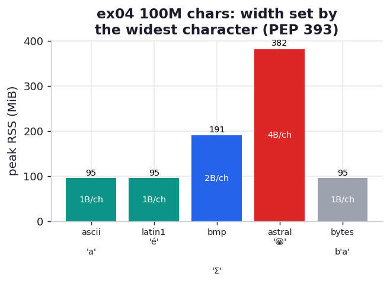

# ex04_bytes_vs_unicode

Python 3 strings are Unicode, but that does not mean they are expensive. Since PEP 393 (Python
3.3), CPython stores a `str` using a *flexible* internal width: it looks at the widest character
in the string and picks the smallest representation that can hold it. If every character is
Latin-1, each costs 1 byte — exactly as cheap as a `bytes` object. If the widest character is in
the Basic Multilingual Plane, every character costs 2 bytes. If there is a single astral-plane
character anywhere (an emoji, say), every character in the whole string costs 4 bytes.

The crucial and slightly surprising part is that last clause: the width is chosen for the *whole
string* by its single widest character. One emoji in a million-character string quadruples the
memory cost of the entire thing. This exercise builds a 100-million-character sequence out of four
different single characters and weighs each, so the per-character cost steps cleanly through PEP
393's storage classes.

## What it measures

`getsizeof` on tiny strings first, to see the empty shell and the width steps:

| string | getsizeof | storage class |
| --- | ---: | --- |
| `''` | 41 bytes | empty `str` shell |
| `'a'` | 42 bytes | Latin-1, +1 byte |
| `'Σ'` | 60 bytes | UCS-2, wider shell + 2 bytes |
| `'😀'` | 64 bytes | UCS-4, widest shell + 4 bytes |

Then peak RSS to build a 100,000,000-character sequence of each:

| sequence | peak RSS | bytes/char |
| --- | ---: | ---: |
| ASCII `'a'` | ~95 MiB | 1.0 |
| Latin-1 `'é'` | ~95 MiB | 1.0 |
| BMP `'Σ'` | ~191 MiB | 2.0 |
| astral `'😀'` | ~382 MiB | 4.0 |
| `bytes b'a'` | ~95 MiB | 1.0 |

## What we found

**The per-character cost steps 1 → 1 → 2 → 4 bytes exactly as PEP 393 predicts.** ASCII and Latin-1
characters both land at 1.0 byte each, indistinguishable from the raw `bytes` baseline — so for
text that stays within Latin-1, Python 3's Unicode strings carry no memory penalty over bytes at
all. The Greek sigma, a BMP character, doubles the cost to 2.0 bytes each, and the emoji, an astral
character, doubles it again to 4.0 bytes each. The same 100 million characters cost anywhere from
95 MiB to 382 MiB depending solely on the single widest character present.

**This is why "stick to `str`, not `bytes`" is the book's advice and costs you nothing for ordinary
text.** The fear that Unicode is inherently bloated is a Python 2 holdover; PEP 393 made the common
case (ASCII / Latin-1) free. The thing to actually watch is the all-or-nothing width promotion: if
you mix a handful of emoji or rare-script characters into otherwise-ASCII data, you don't pay 4
bytes for *those* characters, you pay 4 bytes for *every* character in each affected string. When
memory matters and your data is mostly ASCII with rare wide characters, it can be worth keeping the
wide outliers in separate strings so they don't promote the width of everything around them.

## Reading the chart



Five bars of peak RSS for the 100M-character builds. The two Latin-1 bars and the `bytes` baseline
are the same short height; the BMP bar is twice as tall; the astral bar is twice as tall again — a
clean 1×, 2×, 4× staircase. The shape is the lesson: cost is set by character width, in discrete
doublings, not by some smooth average.

## Run

```bash
.venv/bin/python chapter_12_using_less_ram/ex04_bytes_vs_unicode/ex04_bytes_vs_unicode.py
```

Each 100M-character sequence is built and weighed in its own fresh subprocess.

## 5 Whys

1. **Why do ASCII strings cost the same as bytes in Python 3?** Because PEP 393 stores a string
   whose widest character is Latin-1 at 1 byte per character — the same density as a `bytes` object.
2. **Why does the Greek sigma double the per-character cost?** It lives in the Basic Multilingual
   Plane, above Latin-1, so the string can no longer use the 1-byte representation and switches to
   2 bytes for *every* character.
3. **Why does one emoji cost 4 bytes for every character, not just itself?** A string has a single
   internal width chosen by its widest character; an astral-plane emoji forces the 4-byte (UCS-4)
   representation, and that width applies uniformly to the whole string.
4. **Why does CPython use one width for the whole string instead of per-character?** A fixed width
   makes indexing O(1) — `s[i]` is a simple offset multiply — which would be impossible if
   characters had variable widths within the same string.
5. **Why does this matter for memory planning?** Because a small amount of wide-character data can
   silently multiply the footprint of large amounts of neighbouring text, so where it counts you may
   want to isolate wide characters rather than let them promote everything.

**Root cause:** PEP 393 makes `str` storage as cheap as bytes for Latin-1 text but selects a single
1-, 2-, or 4-byte width per string based on its widest character — so memory cost is governed by the
widest character present, applied to every character, in discrete doublings.
