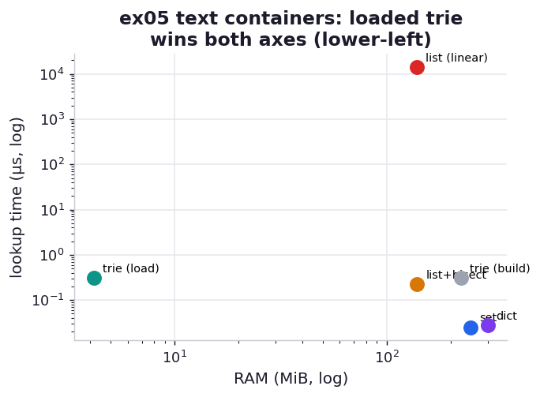

# ex05_text_containers

This is the chapter's set-piece, the experiment behind its Figure 12-2. We hold two million
unique tokens in five different containers and ask each the same two questions: how much RAM does
it cost, and how quickly can it tell us whether a known token is present? The contenders span the
obvious and the clever — a plain list scanned linearly, the same list sorted and queried with
binary search, a `set`, a `dict`, and a `marisa_trie` that compresses shared prefixes and can be
saved to disk and reloaded.

The tokens are generated to look like natural-language vocabulary: every one begins with one of a
small pool of shared prefixes (`inter`, `under`, `trans`, …), which is exactly the structure a
trie exists to exploit. RAM is measured as peak RSS in a freshly started process (building each
container straight from a streaming generator, so we weigh the container and its strings and
nothing else), and lookups are timed in-process on a prebuilt container. The trie is measured
twice, and the difference between those two measurements is the whole point.

## What it measures

2,000,000 unique prefixed tokens (the book uses 12.5M Wikipedia tokens; the ratios carry):

| container | RAM | build | lookup | notes |
| --- | ---: | ---: | ---: | --- |
| list (linear `in`) | ~140 MiB | ~0.5 s | **~14 ms** | O(n) scan — catastrophic at scale |
| list + `bisect` | ~140 MiB | ~0.7 s | ~0.23 µs | same RAM, sort once, O(log n) |
| `set` | ~249 MiB | ~0.8 s | ~0.026 µs | fastest lookup, heavy RAM |
| `dict` (token→index) | ~300 MiB | ~1.0 s | ~0.028 µs | set + a value per key |
| trie (just built) | ~226 MiB | ~1.5 s | ~0.32 µs | transiently holds source strings |
| **trie (loaded from disk)** | **~4.3 MiB** | ~0 s | ~0.32 µs | the real footprint — **57x** under the set |

## What we found

**The linear-scan list is the trap the book warns about, and the numbers make it visceral.** A
single `token in list` lookup takes ~14 ms because it walks two million strings; the book estimates
that 100,000 such lookups against its larger dataset would run for over three hours, and our
per-lookup cost extrapolates the same way. Sorting the list once (a fraction of a second) and
switching to `bisect` collapses that to ~0.23 µs — a roughly sixty-thousand-fold speedup at *zero*
extra RAM, since `sort` rearranges the existing pointers in place. The sorted-list-plus-bisect
result is the fair baseline every fancier structure must beat: ~140 MiB and sub-microsecond lookups.

**The `set` and `dict` buy the fastest lookups but cost the most RAM**, and they line up in the
book's order: the set (249 MiB) is *larger* than the list (140 MiB) because a hash table keeps load
factor headroom and stores each string separately, and the dict (300 MiB) is larger still because
it carries an index value alongside every key. Their lookups are the quickest on the board
(~0.026 µs) since both share the same hashed-probe machinery. If RAM is not the constraint, the set
is the sensible default.

**The trie's two measurements tell the build-once / load-many story.** Built fresh, the trie reports
~226 MiB — surprisingly large, because constructing it transiently holds the source strings and
intermediate state (the book sees the same inflated build-time figure). But save it to disk and load
it back into a clean process and it occupies just **4.3 MiB** — 57x smaller than the set — while
still answering lookups in ~0.32 µs. That is the trie's real proposition: you pay a heavy one-time
build, persist the compact result, and thereafter load a tiny read-only structure near-instantly,
which is precisely the geocoding-service pattern the book quotes from DabApps. Our 57x even tops the
book's ~33x, because our tokens share prefixes more aggressively than real Wikipedia text — and that
dependence on shared structure is exactly what the chapter's hypothesis interrogates.

## Reading the chart



A scatter in the spirit of the book's Figure 12-2: RAM on the x-axis, lookup time on the y-axis
(log scale, because the linear list is orders of magnitude slower than everything else), and each
point labelled. The linear-list point sits alone in the slow upper region; the set and dict sit
fast but far to the right (RAM-hungry); the loaded trie sits in the lower-left sweet spot — cheap on
both axes — which is the visual argument for it. The build-time trie point shows how much of its
apparent cost is transient.

## Run

```bash
.venv/bin/python chapter_12_using_less_ram/ex05_text_containers/ex05_text_containers.py
```

Each RAM figure is measured in its own spawned process; the script also writes `tokens.marisa` to
disk for the load measurement (gitignored). Expect ~20 s, most of it the repeated container builds.

## 5 Whys

1. **Why is a linear `in` scan over a list so catastrophically slow?** Each lookup compares the
   target against every element until it finds a match — O(n) — so two million strings means up to
   two million comparisons per query, ~14 ms each.
2. **Why does sorting plus `bisect` fix the speed without using more RAM?** A sorted list lets binary
   search halve the range each step (O(log n), ~21 comparisons), and `sort` reorders the existing
   pointer array in place, so no new memory is allocated.
3. **Why does the `set` use more RAM than the list it came from?** A hash table keeps spare slots to
   stay below its load factor and stores each string as a separate object with its hash; that
   headroom and per-element overhead exceed a tight pointer array.
4. **Why is the freshly built trie large but the loaded trie tiny?** Building the trie transiently
   holds the source strings and construction scaffolding (counted in peak RSS), whereas the saved
   form is a compact LOUDS-compressed index with all of that discarded — so loading it costs only
   the compressed bytes.
5. **Why does the trie compress so well on this data?** The tokens share leading prefixes, and a trie
   stores each shared prefix once as a single branch instead of repeating it in every string — turning
   millions of near-identical fronts into a handful of tree edges.

**Root cause:** Each container trades RAM against lookup speed and build cost differently — the
hashed set/dict spend memory to buy the fastest lookups, while a trie spends a costly build to buy a
tiny, fast, read-only footprint *when the strings share structure*; the loaded trie wins this dataset
because its prefixes fold away, and the linear list loses outright because O(n) lookups don't scale.
