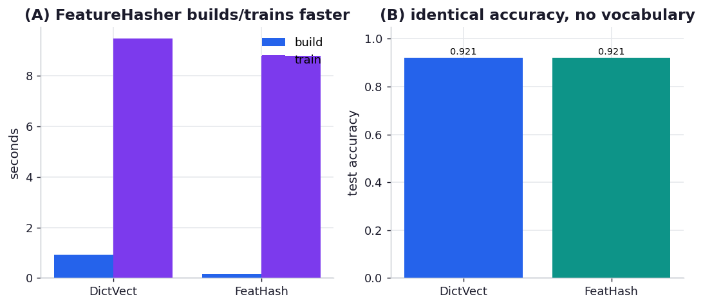

# ex06_featurehasher

Text classification represents each document as a sparse vector over a vocabulary of n-grams,
and that vocabulary explodes fast: once you include bigrams and trigrams, a modest corpus has
millions of distinct tokens. scikit-learn gives you two ways to turn token-frequency dictionaries
into a feature matrix, and they make opposite trade-offs.

`DictVectorizer` is lossless. It makes one pass to learn the entire vocabulary (a `token → column`
map) and a second pass to fill the matrix, so the matrix is exactly as wide as the vocabulary, you
can invert it back to tokens for debugging, and you pay for storing that vocabulary and for two
passes. `FeatureHasher` is lossy. It hashes each token directly to one of a *fixed* number of
columns with MurmurHash3 — no vocabulary, a single pass, and trivially parallelisable — at the cost
that two different tokens can collide into the same column and the mapping can't be reversed.

The book's striking claim is that the lossy, collision-prone hashed representation classifies *just
as accurately* as the lossless one. This exercise reproduces that on the 20 Newsgroups corpus:
identical documents and n-grams fed through both vectorizers, then a `LogisticRegression` trained on
each, comparing matrix width, build time, and test accuracy.

## What it measures

20 Newsgroups, 5 categories (`sci.med`, `comp.graphics`, `rec.sport.hockey`,
`talk.politics.guns`, `soc.religion.christian`), unigrams + bigrams, 2923 train / 1946 test docs:

| | matrix width | non-zeros | vocabulary | build | train | accuracy |
| --- | ---: | ---: | --- | ---: | ---: | ---: |
| DictVectorizer | 355,085 | 1,228,942 | 355,085 stored | 0.94 s | 9.3 s | **0.921** |
| FeatureHasher | 262,144 (fixed) | 1,226,409 | none | 0.17 s | 7.0 s | **0.921** |

## What we found

**Identical accuracy — 0.921 either way.** That is the headline, and it is exactly the book's
result (it reports 0.89 = 0.89 on the full 20-way trigram problem). Hashing tokens into a fixed
number of columns, accepting that some collide, throws away the exact token→column identity, and yet
the classifier scores the same. The reason is that a linear model learns a weight per *column*, not
per token; as long as the term-frequency signal is spread across the columns without systematic
bias, collisions between rare tokens cost essentially nothing, and rare tokens are where almost all
the vocabulary lives.

**FeatureHasher builds ~5.5x faster and stores no vocabulary.** Its 0.17 s against
DictVectorizer's 0.94 s is the single-pass, no-vocabulary win: it never builds the
`token → column` dictionary, so there is no first pass and nothing to keep in memory. On the full
problem the book frames this as the difference between holding a 4.3-million-entry vocabulary and
holding nothing at all. The collision cost shows up only in the non-zero counts: the hashed matrix
has 1,226,409 non-zeros against the vocabularised 1,228,942 — about 2,500 fewer, the handful of
distinct tokens that hashed into the same column and merged. That is the same "~10,000 fewer items
because of collisions" footnote the book reports, scaled to our smaller corpus.

**The trade you make is interpretability.** The hashed matrix can't be inverted, so you can't ask
"which token drove this column's weight?" For a production classifier that's often fine; for a model
you need to explain or debug, the lossless vocabulary may be worth its cost. The book trains on the
full 20-way, trigram problem where the classifier alone runs 500-880 s; we scaled to 5 categories
and bigrams so the whole exercise finishes in ~20 s, but the parity in accuracy and the asymmetry in
build cost — the actual lessons — reproduce cleanly.

## Reading the chart



Two panels. The left pairs the two as grouped bars on build time and train time — FeatureHasher
visibly shorter on both. The right shows the test accuracy of the two side by side at effectively
the same height, with the matrix widths annotated: the narrower fixed-width hashed matrix matching
the wider vocabularised one. The story is that the left panel differs and the right panel doesn't —
you pay less and lose nothing measurable.

## Run

```bash
.venv/bin/python chapter_12_using_less_ram/ex06_featurehasher/ex06_featurehasher.py
```

First run downloads the 20 Newsgroups data (~14 MB) into scikit-learn's cache; later runs reuse it.
Expect ~20 s, dominated by the two `LogisticRegression` fits.

## 5 Whys

1. **Why does FeatureHasher match DictVectorizer's accuracy despite collisions?** Because the
   classifier learns weights per column, and the term-frequency signal survives being scattered
   across a fixed set of columns — collisions mostly affect rare tokens that carry little signal.
2. **Why do collisions cost so little?** With ~350k distinct tokens mapped into 262k columns, most
   collisions involve rare n-grams whose frequency contribution is negligible; the frequent,
   informative tokens rarely collide and keep their own columns.
3. **Why is FeatureHasher faster to build?** It hashes each token straight to a column in one pass
   and never constructs or stores a vocabulary, whereas DictVectorizer must first scan the whole
   corpus to assign every token a column.
4. **Why does the hashed matrix train faster too?** It is narrower (a fixed 262k columns vs 355k
   here, and 1M vs 4.3M in the book), and a linear model's cost scales with the number of features,
   so fewer columns means a quicker fit.
5. **Why would anyone still use DictVectorizer?** Because it is reversible — you can map a column back
   to its token — which matters when you need to inspect, debug, or explain *why* the model made a
   decision, something the one-way hash discards.

**Root cause:** A linear classifier cares about per-column frequency signal, not token identity, so
FeatureHasher's irreversible hash-into-fixed-width trades away interpretability and a tiny amount of
signal (lost to collisions) in exchange for a one-pass, vocabulary-free, narrower representation that
trains just as accurately and builds far faster.
