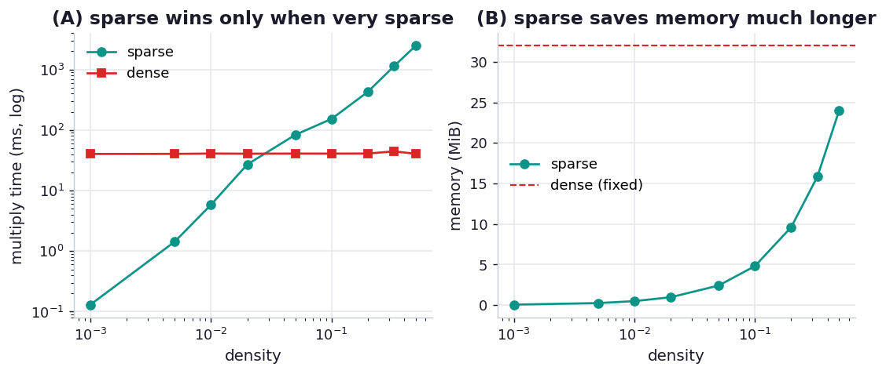

# ex07_sparse_matrix

A sparse matrix is one whose entries are overwhelmingly zero, and SciPy's sparse formats exploit
that by storing only the non-zero values plus the indices that locate them — every other cell is an
implicit zero that costs nothing. At low density this is a double win: less memory, because the
zeros aren't stored, and less compute, because a multiplication only has to touch the non-zeros. But
the indices are not free. CSR (Compressed Sparse Row) keeps a value *and* a column index for each
non-zero, so as the matrix fills, that per-element bookkeeping eventually outweighs simply storing
every value in a flat dense array — and dense NumPy, backed by cache-friendly, SIMD-vectorised BLAS,
takes over.

This exercise fixes the matrix at 2048×2048 and sweeps the density from 0.1% up toward 50%,
measuring at each point both the time to square the matrix (sparse CSR versus dense NumPy) and the
memory each representation occupies. It reproduces the book's Figure 12-5 (speed) and Figure 12-6
(footprint), crossover and all.

## What it measures

A 2048×2048 matrix squared (`A @ A`); the dense form is always 32.0 MiB regardless of density:

| density | sparse multiply | dense multiply | speedup | sparse memory | winner |
| ---: | ---: | ---: | ---: | ---: | --- |
| 0.1% | 0.13 ms | 40 ms | 312x | 0.1 MiB | sparse |
| 1% | 5.9 ms | 41 ms | 6.9x | 0.5 MiB | sparse |
| 2% | 27 ms | 41 ms | 1.5x | 1.0 MiB | sparse |
| 5% | 83 ms | 39 ms | 0.47x | 2.4 MiB | dense |
| 20% | 426 ms | 41 ms | 0.10x | 9.6 MiB | dense (speed) |
| 50% | 2335 ms | 41 ms | 0.02x | 24.0 MiB | dense (speed) |

## What we found

**At low density sparse multiplication is dramatically faster — 312x at 0.1%.** Squaring the matrix
costs roughly O(nnz) for the sparse format against O(n³) for dense, so when only one cell in a
thousand is non-zero, the sparse multiply does almost no work while the dense BLAS call grinds
through all 2048³ multiply-adds regardless. The dense time is essentially flat across the whole sweep
(~40 ms) precisely because it always does the full cubic work; only the sparse time moves.

**The speed crossover sits near 5% density on this machine.** Below it the sparse format's "skip the
zeros" advantage dominates; above it the picture inverts and dense wins decisively (at 50% density
sparse is ~50x *slower*). The reason dense pulls ahead so hard is that its contiguous memory layout
lets BLAS stream cache lines and issue vectorised SIMD instructions, whereas the sparse format
chases indices around memory. The book's crossover is at a similar low density; our absolute dense
times are much faster than the book's (Apple's Accelerate BLAS versus their setup), so the ratios
shift but the shape — sparse wins only when very sparse — is identical.

**Memory tells a gentler, more forgiving story.** The dense matrix is a flat 32.0 MiB no matter what.
The sparse form stays well under that across the entire sweep: at 20% density it is 9.6 MiB, a 70%
saving — which is *exactly* the book's Figure 12-6 result (it cites 10 MB at 20% density, a 70%
saving). CSR stores 12 bytes per non-zero (an 8-byte value plus a 4-byte column index), so it breaks
even with dense's 8 bytes/cell only around two-thirds density — meaning sparse saves memory long
after it has stopped saving time. That asymmetry is the practical subtlety: a 30%-dense matrix is a
poor choice for sparse *multiplication* but still a real memory win for sparse *storage*.

The caveat the book is careful to add, and worth repeating: SciPy's sparse support is specialised.
Many NumPy operations require dense arrays, several sparse formats exist with different strengths
(COO for construction, CSR/CSC for compute), and choosing among them takes some expertise. Sparse
matrices are an invaluable tool exactly when your data is genuinely sparse and your operations are
supported — and an awkward one otherwise.

## Reading the chart



Two panels. The left plots multiply time against density on a log-y axis: the dense line is roughly
flat while the sparse line climbs steeply, and the point where they cross is the speed crossover. The
right plots memory against density: the dense line is a flat ceiling at 32 MiB while the sparse line
rises gradually from near zero, staying below the ceiling across the whole range shown. Together they
make the key point — sparse stops winning on *speed* much sooner than it stops winning on *memory*.

## Run

```bash
.venv/bin/python chapter_12_using_less_ram/ex07_sparse_matrix/ex07_sparse_matrix.py
```

The dense multiply at every density and the sparse multiply at high density dominate the runtime;
expect several seconds. A correctness anchor asserts the sparse and dense products agree at the
lowest density before timing.

## 5 Whys

1. **Why is sparse multiplication so much faster at low density?** Because its cost scales with the
   number of non-zeros, not the matrix dimensions — at 0.1% density there are a thousand times fewer
   multiply-adds to perform than the dense O(n³) sweep.
2. **Why does dense multiplication take the same time regardless of density?** A dense `A @ A` always
   multiplies and adds every pair of entries; it has no notion that a cell is zero, so its work is
   fixed by the matrix size alone.
3. **Why does dense overtake sparse as density rises?** The sparse format must chase value/index
   pairs through memory, while dense BLAS streams contiguous cache lines and uses SIMD; once there
   are enough non-zeros, that hardware efficiency beats skipping the shrinking pool of zeros.
4. **Why does sparse keep saving memory well past where it stops saving time?** Storing a non-zero
   costs 12 bytes (value + column index) versus 8 bytes/cell dense, so sparse storage only breaks even
   around two-thirds density — far above the few-percent density where its multiply stops being
   faster.
5. **Why isn't sparse just the default for everything?** Because most NumPy routines need dense arrays
   and the several sparse formats each have narrow strengths; outside genuinely sparse data and
   supported operations you hit a wall of missing functionality.

**Root cause:** Sparse formats trade per-element index overhead for skipping the zeros, which wins on
both speed and memory only while the matrix is genuinely sparse — and because compute cost (O(nnz))
crosses over much earlier than storage cost (12 vs 8 bytes/entry), sparse stops being faster long
before it stops being smaller.
