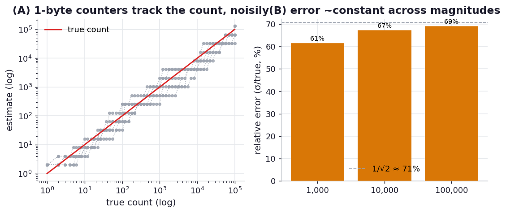

# ex08_morris_counter

The Morris counter is the gentlest introduction to probabilistic data structures, and a startling
idea in its own right: count to astronomical numbers in a single byte by giving up exactness. Robert
Morris's trick is to store not the count but an *exponent*, and to treat the count as `2**exponent`.
Incrementing is probabilistic — when the counter currently represents `2**k`, an increment bumps the
exponent only with probability `1/2**k`. Early on (small `k`) almost every increment fires; as the
value grows, increments fire ever more rarely, so the exponent climbs roughly as the logarithm of the
true count. One unsigned byte holds an exponent up to 255, which represents a count of `2**255`, about
`5.8e76` — versus the `~9.2e18` ceiling of a full 8-byte integer.

This exercise reproduces the increment-probability table, watches several independent counters track a
true count as it grows, and — most importantly — measures the *spread* of the estimate over many
trials, because a single Morris counter is a single random walk and its accuracy is best understood
statistically.

## What it measures

The increment probabilities (the book's Table 12-1) and an error sweep over many independent counters:

| exponent | represents | P(increment) |
| ---: | ---: | ---: |
| 0 | 1 | 1.000 |
| 1 | 2 | 0.500 |
| 2 | 4 | 0.250 |
| 3 | 8 | 0.125 |
| 4 | 16 | 0.0625 |

| true count | mean estimate (200 counters) | relative error (σ/true) | bias |
| ---: | ---: | ---: | ---: |
| 1,000 | ~1,014 | ~61% | +1.4% |
| 10,000 | ~10,097 | ~67% | +1.0% |
| 100,000 | ~107,807 | ~69% | +7.8% |

## What we found

**On average the counter is nearly unbiased — the mean of 200 independent counters lands within a
few percent of the truth at every magnitude** (1,014 for 1,000; 10,097 for 10,000). That is the good
news, and it is why the book can quote a Morris-counter error of a few percent on its single Wikipedia
run: *one* counter can easily land close by luck.

**But the spread is enormous — the relative standard error is ~65-70%, and it stays roughly constant
as the count grows.** This is the honest and slightly sobering finding. A single Morris counter is one
random walk, and the standard deviation of its estimate is about `count/√2`, so any individual reading
can be off by a large fraction in either direction. The ~70% we measure is exactly that `1/√2`
theoretical spread for the basic counter — *not* the few-percent figure a single lucky sample might
suggest. The constancy of the relative error across 1,000, 10,000, and 100,000 is the structure's
defining property: it trades a *fixed percentage* of accuracy for the ability to count in one byte.

The takeaways the chapter draws follow directly. The Morris counter is for order-of-magnitude
estimates where a single byte per counter is the binding constraint — embedded sensors, millions of
independent stream counters, AI feature buckets — and where you either tolerate the wide spread or
average many counters to tighten it (the spread shrinks as `1/√(number of counters)`). It keeps *no*
information about *which* items it saw, so it cannot deduplicate; that is what the LogLog and KMV
structures in ex10 add.

## Reading the chart



Two panels. On the left, the book's Figure 12-7: several independent 1-byte counters (dotted) climbing
in discrete doublings against the smooth true-count line (on log-log axes), so you can see both that
they track the trend and that they scatter widely and jump in 2x steps. On the right, the relative
error across the three magnitudes as roughly flat bars near ~65-70%, with the theoretical `1/√2` line
overlaid — the visual statement that the error is large but magnitude-independent.

## Run

```bash
.venv/bin/python chapter_12_using_less_ram/ex08_morris_counter/ex08_morris_counter.py
```

The error sweep runs 200 counters to each of three counts, so it does a few million probabilistic
increments; expect a few seconds.

## 5 Whys

1. **Why can a Morris counter count to 5.8e76 in one byte?** It stores an exponent, not the count, and
   represents the count as `2**exponent`; an 8-bit exponent reaches 255, so the represented count
   reaches `2**255`.
2. **Why does incrementing probabilistically still track the count?** When the value is `2**k` the
   increment fires with probability `1/2**k`, so on average `2**k` increment requests arrive before the
   exponent ticks up — making the exponent follow `log2(count)`.
3. **Why is the relative error so large (~70%) and not the few percent a single run suggests?** The
   estimate is one random walk with standard deviation ≈ `count/√2`; a single reading can land close by
   luck, but the *spread* of readings is inherently ~`1/√2` of the count.
4. **Why does the relative error stay constant as the count grows?** Both the estimate and its standard
   deviation scale with the count, so their ratio — the relative error — is independent of magnitude;
   you get the same percentage accuracy whether counting thousands or millions.
5. **Why use it despite that wide spread?** Because some problems only need an order of magnitude and
   cannot spare more than a byte per counter, and the spread can be tightened by averaging many
   independent counters when you can afford a few more bytes.

**Root cause:** Storing a logarithm (the exponent) instead of the count is what compresses billions
into a byte, and the probabilistic increment is what keeps that logarithm tracking the true count —
but a single random walk carries a large, magnitude-independent variance, so the Morris counter buys
its extreme compactness with a fixed ~percentage uncertainty.
