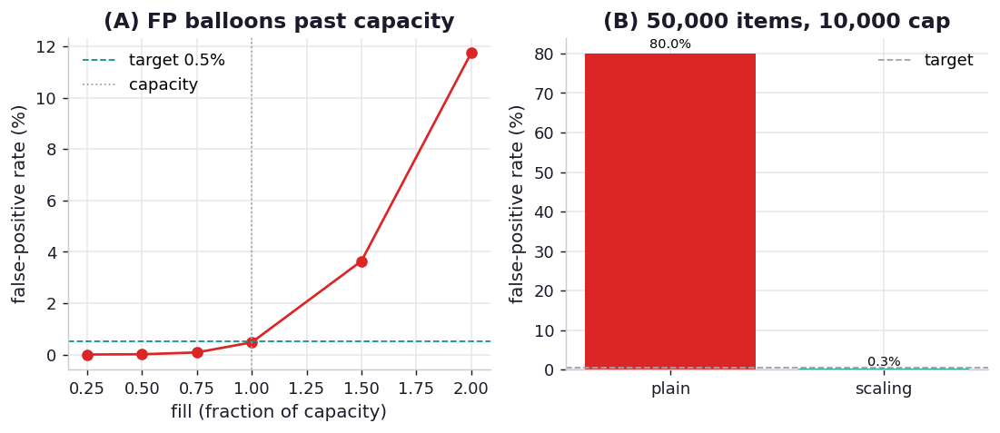

# ex09_bloom_filter

A Bloom filter answers one question — "have I seen this item before?" — using a fixed array of bits
and nothing else. To add an item, it hashes the item `k` different ways and sets those `k` bits. To
test an item, it hashes the same `k` ways and checks whether *all* those bits are set. The result is
a one-sided guarantee that is the whole point of the structure: if even one of the bits is unset, the
item is *definitely* new (there are no false negatives); but if all `k` bits happen to be set, the
item is *probably* seen — it might be a false positive, because other items could have set those same
bits. You choose the bit-array size and `k` from the capacity and the false-positive rate you can
tolerate, so the error is a dial, not a surprise.

This exercise reproduces the book's sizing formula, confirms the no-false-negatives guarantee
empirically, measures the actual false-positive rate against the configured target as the filter
fills, and demonstrates the failure mode the book warns about — overfilling — along with the scaling
Bloom filter that fixes it.

## What it measures

Sizing (the book's example, reproduced exactly):

| capacity | target error | bits needed | bytes | hash functions |
| ---: | ---: | ---: | ---: | ---: |
| 50,000 | 0.05% | 791,015 | 98,877 | 11 |

Empirical behaviour of a 50,000-capacity filter (target 0.5% error):

| fill | items added | false-positive rate | |
| ---: | ---: | ---: | --- |
| 0.25 | 12,500 | 0.00% | |
| 0.50 | 25,000 | 0.01% | |
| 0.75 | 37,500 | 0.08% | |
| 1.00 | 50,000 | **0.47%** | ≈ target |
| 1.50 | 75,000 | 3.64% | overfilled |
| 2.00 | 100,000 | 11.75% | overfilled |

Plus: 100% of added members are found (no false negatives), and overfilling a 10,000-capacity filter
with 50,000 items gives 80% false positives for a plain filter versus 0.28% for a scaling one.

## What we found

**The sizing formula reproduces the book to the bit.** Asking for 50,000 items at a 0.05% error rate
yields 791,015 bits and 11 hash functions — exactly the figures the book quotes. The lovely property
hiding in that number is that it depends only on the *count* of items and the error rate, never on how
big the items are: a Bloom filter for fifty thousand 4-byte integers and one for fifty thousand
multi-kilobyte documents are the same ~99 KB. You are paying for membership, not for storage.

**The no-false-negatives guarantee holds absolutely** — every one of the 50,000 added members tests
present, 100% — and the empirical false-positive rate matches the configured target right up to
capacity: at a full 50,000 items the measured rate is 0.47% against a 0.5% target. That is the
contract working as designed.

**Overfilling is the trap, and the numbers show it biting hard.** Push 50% past capacity and the false
positive rate jumps to 3.64%; double the capacity and it hits 11.75% — because every extra item sets
more bits, and once too many bits are on, too many never-seen items find all their bits already set.
A Bloom filter is sized for a capacity and degrades ungracefully beyond it, which is genuinely
awkward when the data size is unknown (a stream, say). The scaling Bloom filter answers this by
chaining sub-filters with geometrically tightening error rates: overfilling a 10,000-capacity filter
with 50,000 items leaves a *plain* filter at a useless 80% false-positive rate (essentially
saturated — every bit is on), while the *scaling* filter holds 0.28%, comfortably under target, by
spending more memory to add capacity on demand.

## Reading the chart



Two panels. The left plots the false-positive rate against fill fraction, with a horizontal line at
the 0.5% target and a vertical line at capacity (fill = 1.0): the measured curve hugs zero, crosses
the target right at capacity, and then shoots upward in the overfilled region — the visual of
graceful-until-it-isn't. The right panel contrasts the plain and scaling filters when overfilled: a
tall plain-filter bar near 80% beside a tiny scaling-filter bar near the target, annotated with their
byte costs, so the memory-for-robustness trade is explicit.

## Run

```bash
.venv/bin/python chapter_12_using_less_ram/ex09_bloom_filter/ex09_bloom_filter.py
```

The fill sweep builds several filters and runs tens of thousands of membership queries each; expect a
few seconds.

## 5 Whys

1. **Why does a Bloom filter never produce a false negative?** Adding an item sets all `k` of its
   bits, so when you later test that item every one of its bits is guaranteed on; an unset bit can
   only mean the item was never added.
2. **Why does it produce false positives at all?** Different items share the same bit array, so an
   item never added can find all `k` of its bits already turned on by *other* items — a collision in
   the bit pattern, not the item.
3. **Why does the false-positive rate explode past capacity?** Each added item sets more bits; beyond
   the design capacity so many bits are on that most random `k`-bit patterns are fully covered, so
   nearly every query falsely matches.
4. **Why is the size independent of item size?** Only the item's hash values matter — they index into
   a fixed bit array — so a giant document and a tiny integer each set the same `k` bits and cost the
   filter nothing extra.
5. **Why does a scaling Bloom filter keep its error bound when overfilled?** It adds new sub-filters
   with tightening error rates as it fills, so total capacity grows on demand and no single filter is
   pushed past the point where its bit array saturates.

**Root cause:** A Bloom filter encodes membership as overlapping bit patterns in a fixed array, which
gives perfect recall (no false negatives) and a tunable, capacity-dependent false-positive rate — but
that rate is only honoured up to the capacity it was sized for, so unbounded streams need a scaling
variant that grows rather than saturates.
