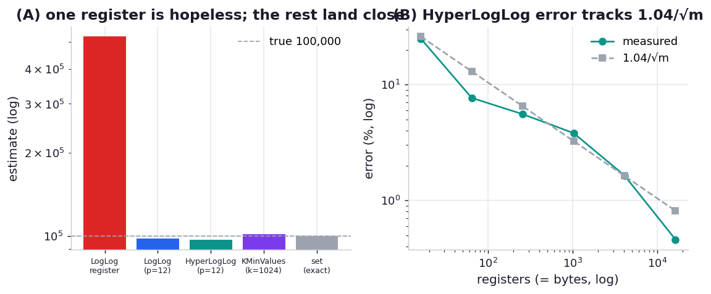

# ex10_hyperloglog

This exercise is about *cardinality* — answering "how many distinct items did this stream contain?"
without keeping the items. An exact answer needs a `set`, whose memory grows with the number of
uniques; the LogLog family and K-Minimum-Values answer the same question in a few kilobytes,
regardless of how many billions of items go by.

The LogLog insight is a coin-flip argument. Hash each item to a uniform bit string and look at the run
of leading zeros: a run of `k` zeros occurs about once per `2**k` items, so the longest run you've seen
estimates how many distinct hashes passed. A single such register is hopelessly noisy — one unlucky
hash ruins it — so the family splits the hash space across many registers ("coin flippers") and
combines them. Classic **LogLog** takes an arithmetic-mean estimate; **HyperLogLog** uses a harmonic
mean with small- and large-range corrections, which tames the outlier registers and reaches an error
of about `1.04/√m` for `m` registers. **K-Minimum-Values** comes at it differently: keep the `k`
smallest unique hashes and read the count off how tightly they cluster.

We run a known number of unique items through each structure and compare estimate, error, and memory
against an exact `set`, then sweep HyperLogLog's register count to watch its error follow the
`1.04/√m` law.

## What it measures

Estimating 100,000 unique items:

| structure | estimate | error | memory |
| --- | ---: | ---: | ---: |
| single LogLog register | 524,288 | +424% | 4 B |
| LogLog (p=12, 4096 registers) | ~98,000 | ~−2% | 4,096 B |
| HyperLogLog (p=12, 4096 registers) | ~97,300 | ~−3% | 4,096 B |
| KMinValues (k=1024) | ~101,500 | +1.5% | 4,096 B |
| set (exact) | 100,000 | 0% | **8.6 MiB** |

HyperLogLog error against the theoretical `1.04/√m`, averaged over 5 trials:

| p | registers | bytes | measured error | 1.04/√m |
| ---: | ---: | ---: | ---: | ---: |
| 4 | 16 | 16 | 24.9% | 26.0% |
| 6 | 64 | 64 | 7.7% | 13.0% |
| 8 | 256 | 256 | 5.6% | 6.5% |
| 10 | 1,024 | 1,024 | 3.8% | 3.25% |
| 12 | 4,096 | 4,096 | 1.6% | 1.62% |
| 14 | 16,384 | 16,384 | 0.5% | 0.81% |

## What we found

**A single LogLog register is useless on its own — here it overestimates 100,000 by 424%.** That is
the whole motivation for the family: one register is one coin-flip experiment, and a single anomalous
hash (an early long zero-run) blows the estimate sky-high. The book's Table 12-3 reports a single
register at 78% error on its data; our single sample lands even further off, which is exactly the
point — its variance is enormous and you cannot trust one register.

**Spreading the work across thousands of registers fixes it, and HyperLogLog's averaging is the
best.** With 4,096 registers, classic LogLog, HyperLogLog, and KMinValues all land within ~3% of the
true 100,000 — while occupying ~4 KB against the exact set's 8.6 MiB, a roughly **2,000x** memory
reduction for this many items, and the gap only widens as the item count grows (the sketches stay 4 KB;
the set grows without bound). The single-byte-per-register structures answer "how many uniques?" for
the price of a small fixed table.

**HyperLogLog's error tracks the `1.04/√m` law cleanly across two orders of magnitude of register
count.** At p=12 the measured 1.6% sits right on the theoretical 1.62%; at p=10 it's 3.8% against
3.25%; the small-`m` rows are noisier (few registers, few trials) but the trend is unmistakable. This
is the structure's defining trade: error shrinks as the square root of the registers you allocate, so
*doubling the memory does not double the capacity — it lowers the error*, and the count capacity is
effectively unbounded regardless. That inverted relationship (RAM buys precision, not range) is what
makes HyperLogLog the standard choice for counting uniques at scale, from databases to analytics
pipelines.

One implementation note in the spirit of this repo's honesty: the book's printed listings contain two
simplifications that the shared `_pds.py` corrects so the algorithms represent themselves fairly. The
register stores the position of the first set bit (1-indexed), not the 0-indexed trailing-zero count
the listing shows — the off-by-one otherwise halves every HyperLogLog estimate. And classic LogLog
needs its own bias constant (~0.397) rather than reusing HyperLogLog's 0.7213, which otherwise
overestimates LogLog by ~1.8x. Both fixes are documented at the point of change.

## Reading the chart



Two panels. The left compares the estimates of each structure against the true count (a dashed line),
with the single LogLog register towering off the top to show its instability and the multi-register
sketches clustered on the line. The right plots HyperLogLog's measured error against register count on
log-log axes, with the `1.04/√m` theory line overlaid — the measured points falling along it is the
visual proof of the law, and the x-axis doubling as a memory axis (one byte per register) makes the
RAM-buys-precision trade legible.

## Run

```bash
.venv/bin/python chapter_12_using_less_ram/ex10_hyperloglog/ex10_hyperloglog.py
```

The sweep runs HyperLogLog over 100,000 items at six register counts, five trials each; expect several
seconds.

## 5 Whys

1. **Why can these structures count billions of uniques in kilobytes?** They never store the items —
   only a small sketch (a handful of registers, or the k smallest hashes) whose size is fixed by the
   target error, not by the number of items seen.
2. **Why does the longest run of leading zeros estimate the count?** For uniform hashes, a run of `k`
   zeros appears with probability `2**-k`, so seeing a longest run of `k` implies roughly `2**k`
   distinct hashes went by — the count is read from the rarity of the rarest hash.
3. **Why is a single register unusable?** It is one random experiment, so a single unlucky hash with a
   long zero-run inflates the estimate enormously; with no averaging, its variance is far too large.
4. **Why is HyperLogLog more accurate than classic LogLog at the same memory?** It combines the
   registers with a harmonic mean and edge-case corrections that suppress outlier registers, where the
   arithmetic mean lets a few spikes pull the estimate around.
5. **Why does more memory lower the error instead of raising the capacity?** Each register can already
   represent astronomically large counts, so adding registers doesn't extend range — it adds
   independent estimates to average, and averaging `m` of them shrinks the error as `1/√m`.

**Root cause:** Cardinality lives in the statistics of the hashes, not in the items themselves, so a
fixed-size sketch of those statistics answers "how many uniques?" in kilobytes — and because the
registers each have effectively unbounded range, allocating more of them buys lower error (`~1.04/√m`)
rather than more capacity.
