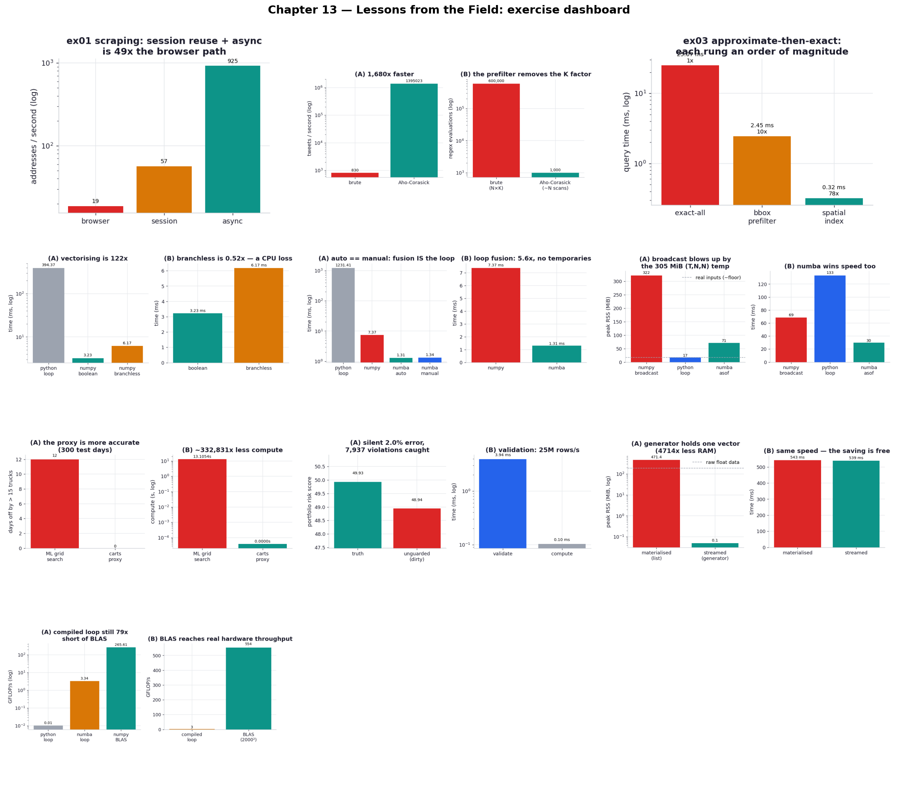
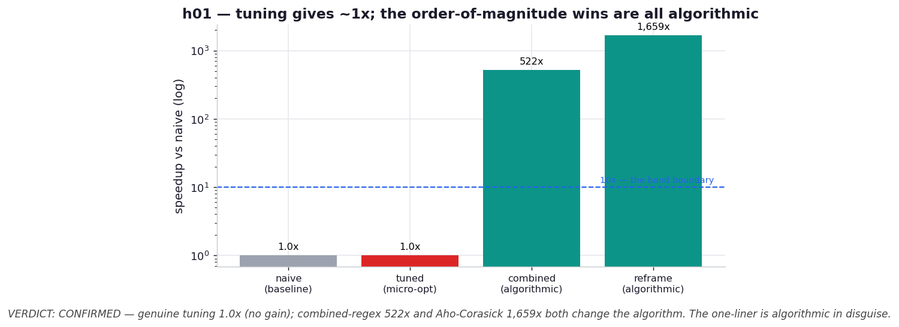

# Chapter 13 — Lessons from the Field: Practice Exercises

Runnable drills for *High Performance Python (3rd ed.)*, Chapter 13 — **ten** of them, plus a
one-experiment hypothesis lab. This is the book's unusual chapter: not a tour of one technique but a
collection of war stories from a dozen practitioners — a data-extraction CEO, an investigative
journalist, a reinsurance data scientist, a quant developer, the maintainers of Numba and
Feature-engine — each sharing the hard-won lesson that moved the needle on a real system. Most of the
chapter is prose, so the work here was to mine it for the lessons that are genuinely *runnable and
measurable*, and to build each one into a benchmark that puts a number on the story.

That mining is itself the defining challenge of reproducing this chapter. A lesson like "eyeball your
training data" or "communicate with the client" can't be benchmarked; a lesson like "an Aho-Corasick
prefilter beat tuning the regexes" or "the naive NumPy broadcast blows up to T×N×N" absolutely can.
So each exercise isolates one operational claim, builds the smallest honest workload that exercises
it, and reports what this machine actually does — including when the result *overturns* the tidy
version of the lesson (the branchless-mask trick is a CPU loss; genuine implementation tuning of an
already-compiled loop buys nothing). The contributors span wildly different domains, but their lessons
rhyme, and the rhyme is the chapter: **the biggest wins come from changing the problem, not from
speeding up the work.**

**Core idea:** performance in the field is dominated by *what you choose to compute*, not how fast you
compute it. Reframing a browser-scrape as an API call, a regex sweep as an automaton, an exact
geometry test as an indexed approximation, or a forecasting model as a database lookup each delivers
orders of magnitude — while the line-level tuning people reach for first delivers single digits, or
nothing. The supporting cast of lessons — guard against bad data, stream instead of loading, hand
linear algebra to BLAS, separate a JIT's cold compile from its warm speed — are the disciplines that
keep a fast system honest.

```bash
.venv/bin/python chapter_13_lessons_from_the_field/ex07_wrong_problem_proxy/ex07_wrong_problem_proxy.py
```

**Verified learnings** (measured on this machine; absolute numbers are machine-dependent, the ratios
are the lesson):

1. **Session reuse then async scraping compounds into ~60x** (ex01, Leon Yin). Replaying a site's
   internal JSON API with a `requests.Session` instead of downloading full pages is ~3x on its own
   (no rendering, reused cookie + connection); fanning the calls out with `aiohttp` brings ~60x over
   the browser-style baseline — the layered structure behind the book's 1000x.
2. **An Aho-Corasick prefilter makes per-tweet cost independent of keyword count** (ex02, Smesh).
   Running all 600 regexes against every tweet manages ~800 tweets/s; scanning once with an automaton
   and confirming only the flagged keywords runs ~1.4M/s — ~1700x, because the K factor drops out of
   the per-tweet work.
3. **Approximate-then-exact climbs an order of magnitude per rung** (ex03, Rawlinson). A
   bounding-box prefilter is ~10x over exact-all geometry tests; a precomputed STRtree spatial index
   is ~80x — the win is in shrinking the candidate set, with the exact test still deciding every
   answer.
4. **Vectorising is the win; the branchless-mask trick is a CPU loss** (ex04, Rawlinson). Replacing a
   Python loop with NumPy is ~129x, but rewriting boolean masks as float arithmetic (`AND=×`, `OR=max`,
   `NOT=1−x`) is *0.5x* — NumPy's booleans are already branchless, so the trick only adds array passes.
   It pays off on GPU/tensor frameworks, not here — which is why you measure.
5. **Numba's loop fusion equals the hand-written loop** (ex05, Haenel). The array expression compiled
   with `@njit` is ~5.3x faster than NumPy (no temporaries) and runs at *exactly* the speed of the
   explicit fused loop — so there's no reason to write the loop yourself.
6. **The naive PSP′ broadcast blows ~17 MiB of inputs up to ~324 MiB** (ex06, Timonin). Gathering the
   risk matrix to a full `(T, N, N)` temporary is the memory trap; a Numba as-of loop keeps an O(N²)
   working set and is ~2.3x faster too — fast *and* lean.
7. **A one-line proxy beat a tuned ML model at ~400,000x less compute** (ex07, Warmerdam). When a
   leading indicator exists (carts rented predict trucks), projecting it scores **0** bad days against
   the grid-searched model's **12**, in microseconds — "this wasn't a machine learning problem; it was
   a SQL problem."
8. **A Pandera schema turns a silent 2% error into a loud, itemised failure** (ex08, Poynter). Dirty
   data slips a confident wrong number (no exception) through the pipeline; validating first catches
   ~7,900 violations at ~31M rows/s — cheap insurance against acting on corrupted output.
9. **A streaming generator holds one item where a list holds them all** (ex09, Řehůřek). Computing a
   mean over 500k vectors peaks at ~470 MiB materialised versus ~0 streamed (~4700x less), at the same
   speed — and the list is bigger than its raw data from per-object overhead.
10. **Compiling a loop isn't enough — BLAS is ~78x beyond it** (ex10, Řehůřek). A Numba-compiled matmul
    reaches ~3.3 GFLOP/s; `A @ B` dispatches to BLAS and sustains ~546 GFLOP/s — cache blocking, SIMD,
    and threading that a naive compiled loop can't reproduce.

| # | exercise | one-line takeaway |
| --- | --- | --- |
| ex01 | [session vs browser](ex01_session_vs_browser/) | API + session + async beats browser scraping ~60x, in layers |
| ex02 | [Aho-Corasick prefilter](ex02_aho_corasick_prefilter/) | scan once for all literals; per-tweet cost stops scaling with keywords |
| ex03 | [spatial index prefilter](ex03_spatial_index_prefilter/) | approximate-then-exact: bbox ~10x, STRtree ~80x |
| ex04 | [branchless masks](ex04_branchless_masks/) | vectorising is 129x; the branchless trick is a 0.5x CPU loss |
| ex05 | [Numba loop fusion](ex05_numba_loop_fusion/) | fused expression == hand-written loop; ~5.3x, no temporaries |
| ex06 | [as-of matmul (PSP′)](ex06_asof_matmul/) | the broadcast temporary is the memory trap; Numba is fast + lean |
| ex07 | [wrong problem proxy](ex07_wrong_problem_proxy/) | a leading-indicator lookup beats a tuned model at ~0 compute |
| ex08 | [defensive Pandera](ex08_defensive_pandera/) | schema validation catches the silent bad data; ~31M rows/s |
| ex09 | [streaming generators](ex09_streaming_generators/) | stream, don't materialise — ~4700x less peak RAM, same speed |
| ex10 | [know your BLAS](ex10_know_your_blas/) | `@` dispatches to vendor BLAS; ~78x beyond a compiled loop |



## Hypothesis lab

Beyond the book: a falsifiable test of the chapter's most-quoted cross-cutting claim — Rawlinson's
"optimization gives 2–10x, new approaches give 10–100x."

| # | hypothesis | verdict | finding |
| --- | --- | --- | --- |
| h01 | [reframe vs micro-optimization](hypothesis/h01_reframe_vs_microopt/) | **CONFIRMED** | on the keyword-matching task, genuine line-level tuning gave **1.0x** (the loop already runs in compiled C), while both order-of-magnitude wins — a combined regex (**~513x**) and Aho-Corasick (**~1675x**) — came from changing the algorithm. The twist: the combined-regex "tweak" is one line yet algorithmic under the hood, so the band boundary is about *what changes algorithmically*, not how many lines you touch |



## What's reproduced, and what isn't

The runnable lessons reproduce cleanly and in the right direction: the layered scraping speedup
(ex01), the Aho-Corasick and spatial-index prefilters (ex02, ex03), Numba's loop fusion equalling the
manual loop (ex05), the `(T, N, N)` memory blowup (ex06), the wrong-problem proxy collapsing the
compute to nothing (ex07), Pandera catching silent corruption (ex08), the streaming-vs-materialised
memory gap (ex09), and BLAS towering over a compiled loop (ex10). Two results land as honest
*negatives*, which is the point of measuring: the branchless-mask trick is slower than plain boolean
masks on this CPU (ex04), and genuine implementation tuning of an already-compiled loop bought nothing
in h01.

The honest caveats. **These are stand-ins, not the originals.** ex01 hits a local `aiohttp` server
modelling a browser's full-page cost versus an API's tiny JSON, not a real ISP behind a real WAN, so
it shows ~60x rather than the book's 1000x (which also rode wide-area latency and rotating IPs); the
*layered structure* is what reproduces. ex07's demand/carts/trucks series is synthetic and constructed
so the leading indicator is real — it demonstrates the *shape* of Warmerdam's realisation, not his
data. **Scale is tuned for a fast suite:** ex02/h01 use 600 keywords and 1,000 tweets, ex06 uses
100k ticks, ex09 uses 500k vectors — large enough to expose the effect, small enough to run in
seconds, and in every case the ratio is the reported result. **Magnitudes are machine-specific:**
GFLOP/s, MiB, and the exact speedups depend on this box (CPython 3.14, Apple Silicon, macOS) and its
BLAS build; run them on your own and the numbers move but the orderings hold. Several lessons in the
chapter are deliberately *not* operationalised because they're cultural rather than computational —
eyeballing training data, hypothesis-driven research, MLOps platforms, building Streamlit tools for
analysts, growing an open-source community — and those are left to the prose where they belong.

## 5 Whys: why the field's biggest wins come from changing the problem

1. **Why do the largest speedups in these stories come from reframing, not tuning?** Because reframing
   changes *how much work exists* — fewer matches, fewer geometry tests, a lookup instead of a model —
   while tuning only changes how fast a fixed amount of work runs.
2. **Why does tuning hit a low ceiling?** Once the hot work is in compiled code (a regex engine, NumPy,
   BLAS), there's little interpreter overhead left to remove, so constant-factor tuning returns single
   digits — or, as h01 shows, nothing.
3. **Why is changing the problem so much more powerful?** It can drop a whole factor from the
   complexity (the keyword count, the shape count, the model entirely), turning an O(N·K) or O(N²) cost
   into something near O(N) or O(1) — a different growth rate, not a smaller constant.
4. **Why does finding those reframes depend on understanding the domain and the data?** The reframe is
   usually invisible from inside the code: it takes a conversation (the carts table), a network-panel
   inspection (the internal API), or knowing a property of the data (shapes are small, prefixes are
   shared) to see that the expensive computation was never necessary.
5. **Why measure everything rather than trust the lessons?** Because the same transformation can be a
   win in one context and a loss in another — branchless masks help on GPUs and hurt on CPU NumPy — so
   only running it on your real data and hardware tells you which world you're in.

**Root cause:** computational performance in real systems is set by the problem you choose to solve.
The practitioners in this chapter won by deleting work — replaying an API instead of a browser, scanning
once instead of K times, indexing instead of testing exhaustively, looking up instead of predicting —
and the wins were orders of magnitude precisely because they changed the amount of work rather than its
speed. Tuning, defensive data checks, streaming, and BLAS are the supporting disciplines; understanding
the problem deeply enough to reframe it is the lever that dominates them all.

## Running everything

```bash
# one exercise
.venv/bin/python chapter_13_lessons_from_the_field/ex02_aho_corasick_prefilter/ex02_aho_corasick_prefilter.py

# regenerate every chart + the dashboard, then the hypothesis chart (~1 min; ex07 grid-searches,
# ex06/ex09 spawn a process per RSS reading)
.venv/bin/python chapter_13_lessons_from_the_field/visualize_exercises.py
.venv/bin/python chapter_13_lessons_from_the_field/hypothesis/h01_reframe_vs_microopt/plot.py

# via the task runner
task ch13:run -- ex03_spatial_index_prefilter/ex03_spatial_index_prefilter.py
task ch13:viz                # all charts + dashboard + hypothesis
task ch13:smoke              # run every exercise as a fast correctness check
```

Every script is self-contained: the shared helpers (`_scrape.py` for ex01's local server, `_rss.py`
for the peak-RSS measurements in ex06 and ex09) live at the chapter root and each exercise adds the
chapter directory to `sys.path`. Dependencies added for this chapter via `uv add`: **pyahocorasick**
(ex02, h01), **shapely** (ex03), and **pandera** (ex08); numpy, numba, scikit-learn, pandas, aiohttp,
and requests were already present.
