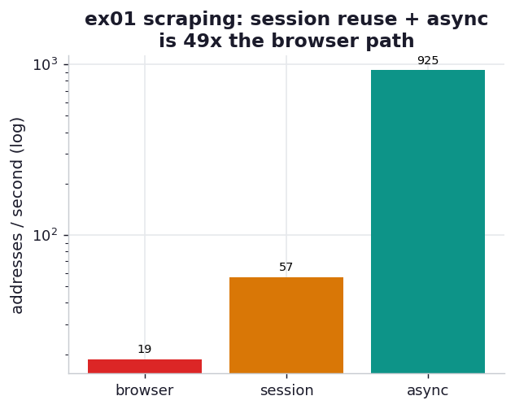

# ex01_session_vs_browser

Leon Yin's investigation for *The Markup* scraped advertised internet-plan prices for more than a
million addresses to expose digital redlining. His first scraper drove a real browser with Selenium
and managed about **300 addresses a day**. By replaying the site's own undocumented internal JSON
API with a `requests.Session` — and then fanning those calls out asynchronously — he reached about
**300,000 a day**, a roughly **1000x** jump that turned an impossible 15-year project into a one-week
one. This drill reproduces the *shape* of that result against a local server (`_scrape.py`) that
recreates the two cost structures the story hinges on, so we can watch the speedup assemble itself
one layer at a time.

The server offers the same address lookup two ways. The **browser path** serves a heavy HTML page
(a few hundred KB of markup with the plan data buried inside) and blocks on a modelled cascade of
sub-resource round-trips, the way a browser stalls loading CSS, fonts, scripts, and images before it
can render — and the scraper opens a fresh connection for every address and parses the data back out
of the markup. The **API path** is the site's own three-step internal flow: `authenticate` (which
sets a session cookie), `autocomplete` (which needs that cookie and returns an address id), and
`plans` (which POSTs the id and returns a few hundred bytes of JSON). We scrape it three ways and
require all three to return the *same* plans (the correctness anchor), so nothing wins by cutting a
corner that changes the answer.

## What it measures

Scraping 60 addresses, reporting addresses per second (best of a single run; absolute rates are
machine- and loopback-dependent, the *ratios* are the lesson):

| approach | what it pays | rate | speedup |
| --- | --- | ---: | ---: |
| browser (serial, full page, new connection each) | ~250 KB + sub-resource cascade per address | ~19 addr/s | 1.0x |
| session API (serial) | 3 tiny JSON calls, cookie + TCP connection reused | ~60 addr/s | ~3.1x |
| async API (concurrent) | same 3 calls per address, all addresses overlapped | ~1200 addr/s | ~60x |

## What we found

**Switching from "download the whole page" to "call the API the page calls" is worth ~3x on its
own, before any concurrency.** The serial session scraper does no rendering and moves a few hundred
bytes per address instead of a few hundred kilobytes, and it reuses one authenticated connection
across every call rather than paying a fresh setup each time. That alone takes the rate from ~19 to
~60 addresses a second. This is the part of the story Yin describes as the real unlock — finding the
undocumented API in the browser's network panel and discovering that a `Session` object transparently
carries the auth cookie the multi-step flow requires.

**Going async on top of that is where the order-of-magnitude lives.** The serial session scraper
still spends almost all of its time *waiting* — the CPU is idle while each request flies to the
server and back. An `aiohttp` session fans all 60 addresses out at once so those waits overlap, and
the rate jumps to ~1200 addresses a second, about **60x** the browser baseline on this machine. The
book's 1000x is this same effect plus a real wide-area network (where each round-trip is tens of
milliseconds, not microseconds of loopback) and routing across many rotating IPs; our single local
server can't reproduce the absolute multiple, but the layered structure — payload, then connection
reuse, then concurrency — is exactly the one that produced it.

The quieter lesson, and a real bug this exercise hit while being written: `aiohttp`'s default cookie
jar **silently refuses to store cookies set by a bare IP address** (you must pass
`CookieJar(unsafe=True)`), so the async scraper's `autocomplete` call kept coming back "no session"
until the jar was fixed. Session state is the load-bearing detail in this whole approach, and it is
exactly the kind of thing that fails quietly — which is why the correctness anchor that checks every
path returns identical plans is not optional.

## Reading the chart



A single bar chart of addresses per second on a log scale, one bar per approach. The browser bar is
the short one; the session bar is a few times taller; the async bar towers over both by more than an
order of magnitude. The log scale is deliberate — on a linear axis the browser and session bars would
both vanish next to async, which is itself the point: each layer (drop the rendering, reuse the
session, overlap the waits) multiplies the one before it.

## Run

```bash
.venv/bin/python chapter_13_lessons_from_the_field/ex01_session_vs_browser/ex01_session_vs_browser.py
```

Starts a local `aiohttp` server in a background thread on an ephemeral port, runs all three scrapers
against it, and asserts they agree. Takes a few seconds.

## 5 Whys

1. **Why was the browser scraper ~50x slower than the async API one?** Because it paid three costs
   the API scraper avoids: it downloaded and parsed a few hundred KB of page markup per address
   instead of a few hundred bytes of JSON, it opened a fresh connection every time, and it ran one
   address at a time.
2. **Why does a browser move so much more data and block so long?** A browser renders the whole page —
   it fetches and processes the CSS, JavaScript bundles, fonts, and images the page references,
   serialising on that cascade, even though the scraper only wants two numbers buried in the markup.
3. **Why does replaying the internal API avoid all of that?** The data the page displays comes from a
   small JSON endpoint the page's own JavaScript calls; hitting that endpoint directly skips the
   rendering entirely and transfers only the bytes that carry the answer.
4. **Why does a `Session` matter beyond saving keystrokes?** The flow is multi-step and stateful —
   `authenticate` sets a cookie the later calls require — and a session stores that cookie and reuses
   the underlying TCP connection automatically, so you don't re-handshake or re-authenticate per call.
5. **Why does async multiply the win instead of just adding to it?** The serial scraper spends almost
   all its wall-clock idle, waiting on the network; firing every request concurrently overlaps those
   idle stretches, so total time collapses toward the slowest single round-trip rather than their sum.

**Root cause:** the browser optimises for *rendering a page for a human*, paying for markup,
sub-resources, and per-page connections that a data scraper doesn't need. Replaying the page's own
internal API strips the work down to the bytes that carry the answer, a session reuses the
authentication and connection that flow requires, and async overlaps the network waits — three
independent multipliers that compound into the order-of-magnitude jump.
