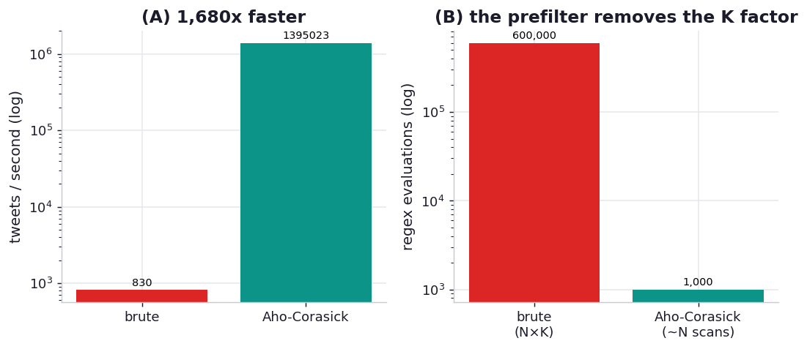

# ex02_aho_corasick_prefilter

Smesh consumed the Twitter streaming firehose and matched every incoming tweet against a set of
tracked keywords — hundreds of tweets a second against hundreds-to-thousands of keywords. The match
wasn't a plain substring test: they needed word boundaries and optional `#`/`@` prefixes, so each
keyword was a regular expression. Running thousands of regexes against every tweet was the
bottleneck, and the things you reach for first — simplifying the patterns, making sure they're
compiled and cached, adding worker processes, even swapping CPython for PyPy — each bought only a
fraction. As Alex Kelly puts it, "we were looking for an order of magnitude speedup, not a fractional
improvement."

The order of magnitude came from changing the question. Instead of speeding up each match, they
*reduced the number of matches* with the Aho-Corasick string-matching algorithm. Aho-Corasick builds
one automaton from all the keyword literals and, in a single pass over a tweet, reports every keyword
that appears as a substring. Crucially it's a **sound prefilter**: a keyword's regex can only match
if its literal is present in the text, so the automaton never misses a real hit — it can only
over-suggest (it flags `python` inside `pythonic`, and the regex then rejects it on the word
boundary). So rather than run all K regexes per tweet, you run the automaton once and then confirm
only the handful of keywords it flagged.

## What it measures

1,000 synthetic tweets against 600 keyword regexes (each enforcing word boundaries and an optional
`#`/`@` prefix), with ~15% of tweets actually carrying a tracked keyword. Both paths are asserted to
return the identical set of matches per tweet:

| approach | work per tweet | time | rate |
| --- | --- | ---: | ---: |
| brute force | run all 600 compiled regexes | ~1.2 s | ~820 tweets/s |
| Aho-Corasick prefilter | one automaton scan, then confirm only flagged keywords | ~0.001 s | ~1,400,000 tweets/s |

**Speedup: ~1700x** on this machine.

## What we found

**The prefilter is roughly three orders of magnitude faster — far more than the book's "10 to
100x".** That gap is itself the most honest thing this exercise teaches. The book's 10-100x was
measured against a baseline that had *already* been tuned (compiled and cached regexes spread across
worker processes); our brute-force baseline has no prefilter at all and dutifully evaluates all 600
regexes against every one of the 1,000 tweets, including the ~85% that contain no keyword whatsoever.
When the baseline does that much pointless work, removing it produces a spectacular ratio. The
durable lesson is the *direction*, not the multiple: the win came from not doing the work, and the
size of the win is set by how much pointless work the old approach was doing.

**Aho-Corasick wins because its cost barely depends on the number of keywords.** Brute force is
O(N×K): every additional keyword adds another regex to run against every tweet. The automaton is
O(N×tweet length) to scan plus a tiny confirmation step, essentially independent of K — going from
600 keywords to 6,000 would roughly sextuple the brute-force time while leaving the prefilter almost
unchanged. That's why it scales to the firehose: the keyword set can grow without the per-tweet cost
growing with it. (The companion hypothesis, `h01`, takes the same matching problem and pits a fair
*micro-optimisation* — collapsing all the patterns into one big alternation regex — against this
algorithmic reframe, to test Rawlinson's claim that reframes beat tuning by an order of magnitude.)

## Reading the chart



Two panels. On the left, tweets per second on a log scale: the brute-force bar near ~800 and the
Aho-Corasick bar more than three orders of magnitude higher — they don't fit on the same linear axis,
which is the visual point. On the right, a sketch of *why*: brute force does N×K = 600,000 regex
evaluations while the prefilter does 1,000 automaton scans plus a few hundred confirmations. The
absolute rates depend on the machine and the keyword count; the lesson is that one bar's height grows
with the keyword set and the other's does not.

## Run

```bash
.venv/bin/python chapter_13_lessons_from_the_field/ex02_aho_corasick_prefilter/ex02_aho_corasick_prefilter.py
```

Builds the data, the regexes, and the automaton; matches both ways; asserts they agree; then times
each. About a second and a half (almost all of it the brute-force baseline).

## 5 Whys

1. **Why was running all the regexes per tweet the bottleneck?** Because the cost is O(N×K) — every
   tweet is tested against every keyword pattern — so with thousands of keywords each tweet triggers
   thousands of regex evaluations, the vast majority of which can't possibly match.
2. **Why couldn't tuning the regexes fix it?** Compiling, caching, simplifying, and parallelising
   each shave a constant factor off each match, but the match *count* is unchanged; a fractional
   discount on a fundamentally O(N×K) workload is still O(N×K).
3. **Why does an Aho-Corasick prefilter change the complexity, not just the constant?** It scans each
   tweet once for *all* keyword literals simultaneously, so its cost is set by the text length, not
   the keyword count — the K factor drops out of the per-tweet work almost entirely.
4. **Why is it safe to use as a prefilter — won't it miss matches?** A keyword's regex requires that
   keyword's literal to be present, so if the literal isn't in the text the regex can't match either;
   the automaton therefore never produces a false negative, only occasional false positives the regex
   then discards.
5. **Why is the measured speedup so much larger than the book's 10-100x?** Because our baseline is
   pure brute force with no prefilter at all, whereas the book's was already compiled, cached, and
   parallelised; the more pointless work the baseline does, the larger the ratio when you remove it.

**Root cause:** the bottleneck was algorithmic — testing every tweet against every pattern is O(N×K),
and no amount of per-match tuning escapes that class. Aho-Corasick reduces the problem space before
the expensive step runs, scanning once for all literals so the per-tweet cost stops scaling with the
keyword set; the win is in the work *not done*, which is why it dwarfs any constant-factor optimisation.
