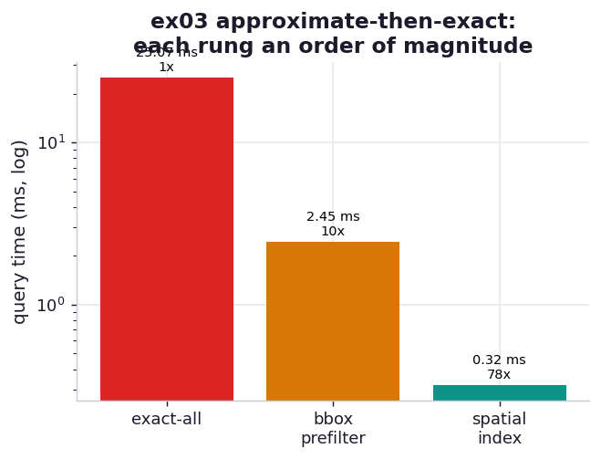

# ex03_spatial_index_prefilter

David Rawlinson describes needing to intersect individual dwelling geometries against query
regions — flood zones, land-use overlays — across a whole nation, fast enough to answer a synchronous
web request. Doing the exact polygon-against-polygon test for every combination is hopeless: it's
billions of expensive geometry operations. His recipe is the one that recurs throughout the chapter:
*redefine the expensive problem into a cheap approximate one plus a small exact one.* Build a fast
approximate filter that has a **false-positive bias** — it may hand you too many candidate shapes but
it must never miss a true one — run the exact test only on the survivors, and precompute a spatial
index so even the approximate filter doesn't have to look at everything.

This drill walks the three rungs of that ladder against 20,000 small dwelling polygons and 50 query
regions. The exact-all baseline runs the true polygon intersection test against every dwelling. The
bounding-box prefilter first does a cheap rectangle-overlap test (pure arithmetic on the precomputed
bounds, the false-positive-biased approximation) and runs the exact test only where the rectangles
overlap. The spatial-index version builds an STRtree over the dwellings once and queries it per
region, so it never even examines the shapes that are nowhere near the query. All three are asserted
to return the identical set of intersecting dwellings — the approximations only ever *add* candidates
that the exact test then removes.

## What it measures

50 query regions against 20,000 dwelling polygons (~32 vertices each), 1,053 true intersections total:

| approach | what it does per query | time | speedup |
| --- | --- | ---: | ---: |
| exact-all | exact intersection test on all 20,000 dwellings | ~25 ms | 1.0x |
| bbox prefilter | numpy rectangle-overlap filter, then exact on survivors | ~2.6 ms | ~10x |
| spatial index (STRtree) | tree query for nearby candidates, then exact confirm | ~0.3 ms | ~80x |

## What we found

**Each rung of the ladder buys roughly another order of magnitude, and they stack.** The
bounding-box prefilter alone is ~10x faster than testing everything exactly: a rectangle-overlap
check is a handful of comparisons on four numbers, while the exact intersection has to reason about
32-vertex polygon edges, so replacing the expensive test with the cheap one *for the shapes that
can't possibly match* removes almost all the work. The spatial index then removes most of even the
cheap work — instead of bbox-testing all 20,000 shapes per query, the STRtree's hierarchy of bounding
boxes lets a query descend straight to the few dozen dwellings near the region, giving ~80x over the
exact baseline. The exact test still runs and still decides every final answer; it just runs on a
tiny, pre-narrowed candidate set.

**The false-positive bias is what makes it correct, and it's the subtle part.** The approximations
are allowed to be sloppy in exactly one direction: a bounding box is always at least as large as the
shape it encloses, so if two shapes truly intersect their bounding boxes must overlap — the filter
can never reject a real match. It *can* admit false candidates (two boxes overlap while the rounded
polygons inside them don't quite touch), but those are harmless because the exact test catches them.
The assertion that all three paths agree is the guard that this bias really is one-directional; an
approximation that could miss a true intersection would silently return wrong answers and look fast
doing it. This is precisely "trade precomputed storage for query-time performance" — the index costs
memory and a one-time build, and repays it on every query.

## Reading the chart



Two panels. On the left, query time per approach on a log scale, descending in three clear steps:
exact-all at the top, the bbox prefilter an order of magnitude below, the spatial index another order
below that. On the right, the same story as a funnel — how many dwellings each approach actually runs
the *exact* test on per query: all 20,000 for exact-all, a few hundred after the bbox filter, a few
dozen after the index. The absolute milliseconds depend on the machine and on shapely's vectorised C
internals; the lesson is the staircase, and that it comes from shrinking the candidate set, not from
a faster intersection test.

## Run

```bash
.venv/bin/python chapter_13_lessons_from_the_field/ex03_spatial_index_prefilter/ex03_spatial_index_prefilter.py
```

Generates the polygons, builds the bounds array and the STRtree once, checks all three paths agree,
then times each. Well under a second.

## 5 Whys

1. **Why is exact-all intersection too slow at scale?** It runs the expensive polygon-against-polygon
   test for every shape on every query — O(N) costly geometry operations per query — even though only
   a tiny fraction of shapes are anywhere near the query region.
2. **Why does a bounding-box prefilter help so much?** A bounding-box overlap is a few comparisons on
   four numbers, far cheaper than an exact polygon test, so replacing the exact test with the cheap
   one for all the shapes that can't match removes nearly all the expensive work.
3. **Why is it safe to filter on bounding boxes — won't it drop real matches?** A box always encloses
   its shape, so two intersecting shapes must have overlapping boxes; the filter has a false-positive
   bias only — it can admit extra candidates but never reject a true one, and the exact test prunes
   the extras.
4. **Why does a spatial index beat even the cheap prefilter?** The bbox prefilter still touches all N
   shapes to test each box; an STRtree organises the boxes into a hierarchy so a query descends to the
   relevant region in roughly logarithmic steps, never examining the far-away shapes at all.
5. **Why is precomputing the index worth it?** The tree is built once and reused for every query, so
   its cost amortises away across many lookups — you've exchanged a one-time build and some memory for
   a sub-linear cost on every subsequent query, exactly what a synchronous web request needs.

**Root cause:** the exact geometry test is expensive and most shape pairs are nowhere near each
other, so the way to go fast is to *avoid running the exact test*, not to speed it up. A
false-positive-biased approximation (bounding boxes) plus a precomputed spatial index shrinks the
candidate set to the few shapes that might actually intersect, and the exact test — now running on a
tiny set — still guarantees the answer is correct.
