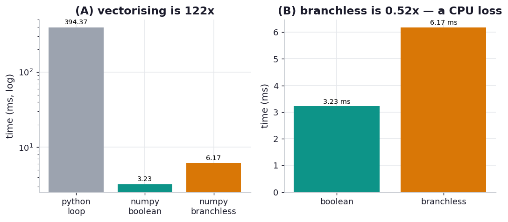

# ex04_branchless_masks

In his "maintain flexibility" essay, David Rawlinson gives a concrete example of an optimisation that
trades readability for speed: you can implement a *non-forking* logical AND with element-wise
multiplication, a logical OR with `max(a, b)`, and a NOT with `1 - x`. "This is less readable but
much faster on floating-point vector or tensor data using many modern libraries." The idea behind it
is *forking*: a per-element `if` is a branch, and branches stall vectorised hardware — SIMD lanes and
GPU warps want to do the same arithmetic to every element without diverging.

This drill tests that claim honestly on a CPU with NumPy. We evaluate a compound predicate —
`result = a where (a > 0.5 AND b < 0.5) OR (c > 0.8) else 0` — three ways: a readable Python loop with
an explicit `if` (the forking baseline), the idiomatic NumPy version using boolean masks combined with
`&`/`|`/`~`, and the branchless version that turns the masks into floats and combines them with `*`,
`np.maximum`, and `1 -`. All three are asserted to produce the identical array. The comparison has two
layers, and they tell different stories.

## What it measures

The compound predicate over 2,000,000 floats:

| approach | time | note |
| --- | ---: | --- |
| python_loop | ~405 ms | one Python-level branch per element |
| numpy_boolean | ~3.2 ms | boolean masks + `np.where` — the idiomatic form |
| numpy_branchless | ~6.3 ms | float masks combined with `*`, `max`, `1 -` |

Vectorising the loop into NumPy: **~129x**. Branchless arithmetic vs boolean masks: **0.50x** — the
"optimisation" is *twice as slow* here.

## What we found

**The order-of-magnitude win is vectorisation, full stop — and it's the part with no readability
cost.** Replacing the Python loop with either NumPy version is ~129x faster, because the loop pays
CPython's per-element interpreter overhead (and per-element branch) two million times, while NumPy
does the whole comparison in one pass of compiled C. That's the lever that actually matters, and it
doesn't require the unreadable trick at all.

**The branchless arithmetic trick is a measurable *loss* on this CPU — about 2x slower than plain
boolean masks.** This is the honest result, and it's worth understanding why it doesn't contradict
Rawlinson. NumPy's boolean operations are *already* branchless: `a > 0.5` compiles to a vectorised C
comparison that writes a 0/1 byte per element with no data-dependent jump, and `np.where` is a
branchless select. So on a CPU the boolean form is the non-forking version. The arithmetic
reformulation, meanwhile, does strictly *more* work — three `astype` conversions to float64, a
multiply, a `maximum`, and a final multiply, each allocating and sweeping a full-size temporary array
— so it loses on memory bandwidth without buying any branch elimination that wasn't already there.

**The trick is real, but its home is tensor/GPU frameworks, not CPU NumPy.** Where Rawlinson's advice
pays off is on hardware that genuinely forks on boolean selection — GPU kernels where a `where` makes
warp lanes diverge, or autodiff frameworks where `a * mask` is differentiable and a Python `if` is
not. There, expressing logic as smooth arithmetic keeps every lane doing identical work and keeps the
graph differentiable. The lesson this exercise actually delivers is the one the chapter is built
around: **don't take an optimisation on faith — profile it on your real data and hardware.** A trick
that's a clear win on a GPU is a clear loss in this CPU NumPy code, and only measurement tells you which
world you're in.

## Reading the chart



Two panels. The left panel puts all three times on a log scale, where the Python loop towers two
orders of magnitude above both NumPy bars — the vectorisation win that dwarfs everything else. The
right panel zooms into just the two NumPy bars on a linear scale, where the supposedly-clever
branchless bar is visibly *taller* (slower) than the plain boolean one. The absolute milliseconds are
machine-specific; the durable points are that vectorisation is the giant win and that the branchless
arithmetic does not help on this CPU.

## Run

```bash
.venv/bin/python chapter_13_lessons_from_the_field/ex04_branchless_masks/ex04_branchless_masks.py
```

Builds three random arrays, checks all three paths agree, then times the Python loop once and the two
NumPy paths best-of-five. Under a second (the Python loop dominates).

## 5 Whys

1. **Why is the Python loop ~129x slower than NumPy?** Because it executes a Python-level comparison
   and branch for each of two million elements, paying interpreter overhead per element, while NumPy
   evaluates the whole predicate in one pass of compiled, vectorised C.
2. **Why doesn't the branchless arithmetic version beat the boolean one on this CPU?** Because NumPy's
   boolean operations are *already* branchless — `>` is a vectorised C comparison and `np.where` is a
   branchless select — so there's no fork left for the arithmetic trick to eliminate.
3. **Why is the arithmetic version actually slower, then?** It does more work: it converts three masks
   to float64, then multiplies, takes a maximum, and multiplies again, each step allocating and
   streaming a full-size temporary array through memory, so it loses on bandwidth.
4. **Why does Rawlinson recommend the trick at all?** Because on tensor and GPU libraries a per-element
   `if` (or even a `where`) really does fork — GPU warp lanes diverge, and autodiff can't
   differentiate through a branch — so expressing logic as smooth arithmetic keeps the hardware busy
   and the computation differentiable.
5. **Why does the right answer depend on where the code runs?** Because the cost being optimised —
   branch divergence — exists on SIMD/GPU hardware but is already absent from vectorised CPU NumPy, so
   the same source transformation is a win in one execution model and a waste in another.

**Root cause:** the big, free speedup is vectorising away the Python-level per-element branch; the
branchless-arithmetic rewrite targets *hardware* branch divergence, which NumPy's boolean ops have
already eliminated on the CPU, so it only adds extra array passes here. Whether an optimisation helps
is a property of the hardware and library you actually run on — which is why the chapter insists you
measure rather than assume.
