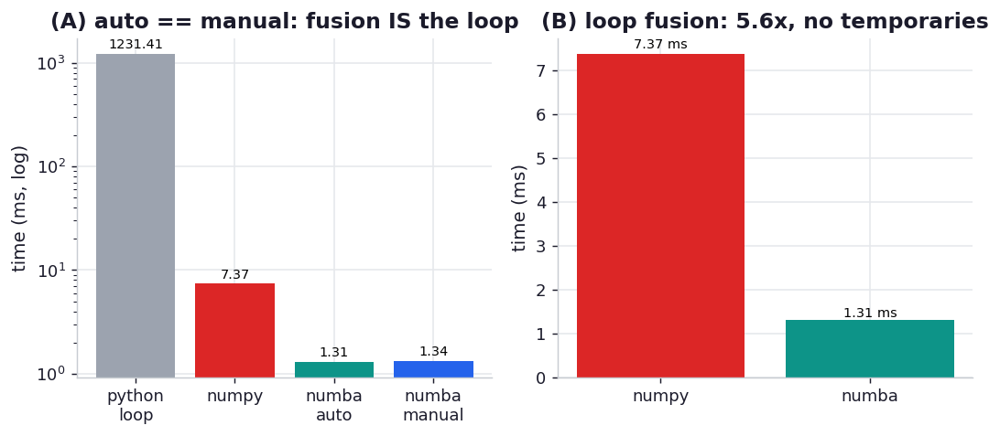

# ex05_numba_loop_fusion

Valentin Haenel's Numba chapter pushes back on a common instinct. People are told Python `for` loops
are slow and NumPy array expressions are fast, so when they reach for Numba they often start rewriting
their array expressions as explicit loops. Haenel's advice: don't — Numba is perfectly happy with
NumPy array expressions, and it has a trick that plain NumPy doesn't, called **loop fusion**.

The cost a NumPy array expression hides is temporaries. Write `a * b - 4.1 * a > 2.5 * b` and NumPy
evaluates it one operation at a time, sweeping the whole array for each and allocating a full-size
temporary to hold every sub-result: `a*b`, then `4.1*a`, then their difference, then `2.5*b`, then the
comparison. Every one of those is read from and written to main memory. Numba compiles the same
expression and *fuses* all those per-operation loops into a single pass that computes each output
element straight from the inputs — no temporaries, and the input arrays are read once instead of
several times. This drill measures that, and confirms what fusion is doing by checking that the fused
expression runs at exactly the speed of the equivalent hand-written loop.

## What it measures

Evaluating `a * b - 4.1 * a > 2.5 * b` over 5,000,000 floats, all paths anchored to be element-equal:

| approach | time | vs NumPy |
| --- | ---: | ---: |
| python_loop | ~1310 ms | 0.005x |
| numpy (array expression) | ~6.9 ms | 1.0x |
| numba_auto (same expression, `@njit`) | ~1.3 ms | **~5.3x** |
| numba_manual (hand-written `@njit` loop) | ~1.3 ms | ~5.3x |

Numba cold compile (one-time): ~400 ms for the array-expression form, ~60 ms for the explicit loop.

## What we found

**Numba's fused expression is ~5.3x faster than NumPy, and it is byte-for-byte as fast as the
hand-written loop.** That second fact is the proof of what's happening: `numba_auto` (the array
expression compiled by Numba) and `numba_manual` (an explicit `for` loop I wrote computing the same
thing element by element) come in at 1.304 ms and 1.305 ms — indistinguishable. Loop fusion has
literally turned the array expression *into* the manual loop, which is why there's no reason to write
the loop yourself: you get the readable expression and the fused-loop performance at once. The book
reports ~8x for this comparison; we see ~5.3x, the usual machine-and-CPU difference, but the shape is
identical.

**The speedup comes from memory traffic, not arithmetic.** The arithmetic in both versions is the
same handful of multiplies and a compare; what differs is how many times the data crosses the memory
bus. NumPy streams five-million-element arrays through cache once per operation and writes out four
intermediate arrays along the way; the fused version touches each input element once and writes one
output. On data far larger than the CPU cache, that reduction in passes is the whole win — the same
mechanism behind NumExpr in Chapter 12, arrived at by a different route.

**And the pure-Python loop is a different universe — ~190x slower than NumPy, ~1000x slower than
Numba.** That's the number that makes Haenel's point about Python `for` loops being slow *in the
interpreter*: the loop itself isn't the problem, the per-iteration interpreter overhead is. Compile
the identical loop with Numba and it's the fastest option on the board. The cold-compile cost (~400 ms
the first time) is paid once and amortises away over repeated calls, which is why a JIT must always be
timed warm — and why the cold figure is reported separately rather than hidden in the average.

## Reading the chart



Two panels. The left panel shows all four times on a log scale: the Python loop at the top, NumPy a
couple of orders below, and the two Numba bars at the bottom — and the two Numba bars are the same
height, which is the visual proof that fusion equals the manual loop. The right panel isolates the
NumPy-vs-Numba comparison on a linear scale to show the ~5x gap clearly, with the one-time cold-compile
cost marked so it's not mistaken for steady-state. Absolute milliseconds are machine-specific; the
durable results are the ~5x fusion win and the auto-equals-manual equality.

## Run

```bash
.venv/bin/python chapter_13_lessons_from_the_field/ex05_numba_loop_fusion/ex05_numba_loop_fusion.py
```

First call to each `@njit` function compiles (timed separately as cold); steady-state timings are
best-of-five. A second or two, plus the one-time compile.

## 5 Whys

1. **Why is the NumPy array expression slower than the Numba version?** Because NumPy evaluates the
   expression one operation at a time, allocating a full-size temporary array for each sub-result and
   sweeping the arrays through memory once per operation.
2. **Why does Numba avoid those temporaries?** Loop fusion collapses the per-operation loops into a
   single pass that computes each output element directly from the input elements, so no intermediate
   array is ever materialised and each input is read once.
3. **Why is the fused expression exactly as fast as the hand-written loop?** Because fusion *produces*
   that loop — the compiled array expression and the explicit `for` loop become the same machine code,
   so writing the loop by hand buys nothing.
4. **Why is the pure-Python loop ~1000x slower than the compiled one?** The loop body is identical; the
   difference is per-iteration interpreter overhead — boxed objects, dynamic dispatch, bounds checks —
   which Numba compiles away, so "Python loops are slow" is really "the interpreter is slow".
5. **Why must the JIT be timed warm, with cold reported separately?** The first call compiles the
   function (hundreds of milliseconds here), a one-time cost; folding it into the average would slander
   the steady-state speed that every subsequent call actually sees.

**Root cause:** a NumPy array expression's cost is dominated by memory traffic — one full array pass
and one temporary per operation — not by the arithmetic. Numba's loop fusion rewrites the whole
expression into a single element-wise pass with no temporaries, which is identical to the
hand-written loop and reads the data once; the readable expression and the fast loop turn out to be
the same thing once compiled.
