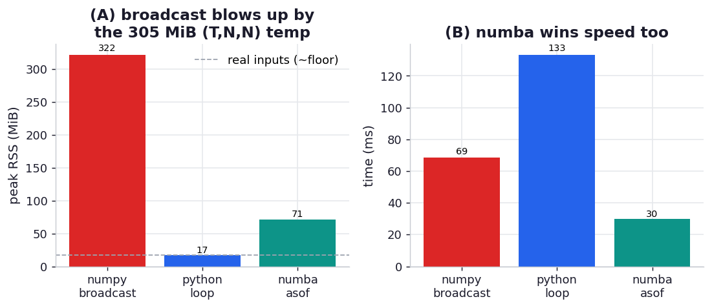

# ex06_asof_matmul

Mikhail Timonin's quant-finance section gives a precise, memory-shaped example. You hold a matrix of
portfolio positions `P` with shape `(T, N)` — `N` assets sampled at every one of `T` ticks — and a
risk matrix `S` with shape `(t, N, N)`, where `t` is much smaller than `T` because risk is recomputed
only daily while positions move every tick. For each tick you want the portfolio risk `pᵀ·S·p` using
the *as-of* risk matrix: the most recent daily `S` at or before that tick. The natural NumPy reflex —
gather `S` up to a full `(T, N, N)` array so you can do it in one vectorised `einsum` — is exactly the
trap. As Timonin warns, "doing it in a naive way with NumPy will first blow up `S` to `T×N×N`, and you
might well be out of memory by then." A Numba loop instead "hops through timestamps in `T`, picking up
the appropriate positions (exact) and risk (as-of) slices, and does the job in no time," with a
working set of only one `N×N` matrix at a time.

This drill builds that exact computation (`T=100,000` ticks, `N=20` assets, `250` daily risk
matrices) and runs it three ways, all anchored to the same per-tick risk vector: the NumPy broadcast
that gathers the giant `(T, N, N)` temporary, a plain Python loop that hops through ticks doing
`p @ S_asof @ p`, and the same hop compiled with `@njit`. It reports both wall-clock time and peak
resident memory (each measured in a fresh process via `_rss.py`).

## What it measures

`pᵀ·S·p` per tick. The `(T, N, N)` gather alone is **305 MiB**; the real inputs (`P` is 16 MiB, `S` is
under 1 MiB) total only ~17 MiB:

| approach | time | peak RSS | what dominates the memory |
| --- | ---: | ---: | --- |
| numpy_broadcast | ~69 ms | ~324 MiB | the 305 MiB `(T, N, N)` temporary |
| python_loop | ~136 ms | ~18 MiB | just the real inputs `P` + `S` |
| numba_asof | ~30 ms | ~76 MiB | the one-time JIT compile, *not* data |

## What we found

**The naive broadcast really does inflate ~17 MiB of inputs into ~324 MiB of process memory — a ~19x
blowup — exactly Timonin's warning.** That extra 305 MiB is the gathered `(T, N, N)` array, and it
scales with `T`: push the tick count to a few million, as a real backtest would, and the temporary
crosses into the gigabytes and the program dies with a `MemoryError`, even though the inputs and the
answer are both tiny. The arithmetic isn't the problem — the broadcast is even reasonably fast at 69
ms because `einsum` is efficient — the problem is that it materialises a result-shaped intermediate it
never needed.

**The compiled as-of loop wins on *both* axes: ~2.3x faster than the broadcast and with a data
footprint of essentially nothing.** Numba hops tick by tick, touching one `20×20` risk slice at a
time, so its working set is a few hundred bytes of live matrix rather than 305 MiB. There is an honest
asterisk on its memory number: the ~76 MiB it reports is almost entirely the one-time LLVM
compilation that happens when the `@njit` function is first called inside the fresh measurement
process — *not* the data. The truest picture of the lean working set is the **Python loop's 18 MiB**,
which is just `P` and `S` themselves; Numba's data footprint is the same, hidden under the compiler's
own memory.

**The Python loop is the leanest but the slowest — and that's instructive.** At 136 ms it's about 2x
*slower* than the broadcast, because with `N=20` each `p @ S @ p` is a tiny BLAS call whose dispatch
overhead, paid 100,000 times, swamps the actual multiply. This is the gap Numba closes: it keeps the
loop's tiny memory footprint but compiles away the per-iteration overhead, fusing the whole hop into
one tight machine-code loop. So the three points map cleanly onto the chapter's trade-off space —
the broadcast trades memory for code simplicity, the Python loop trades speed for memory, and the
Numba loop refuses the trade and takes both.

## Reading the chart



Two panels. The left panel is peak RSS: the towering NumPy broadcast bar against the two short bars,
with a dashed line at the ~17 MiB real-input footprint so you can see the broadcast's bar is almost
entirely temporary while the Python loop sits right on the floor (and a note that the Numba bar is
inflated by the JIT, not data). The right panel is wall-clock time, where Numba is the shortest bar,
the broadcast is in the middle, and the dispatch-bound Python loop is the tallest. Absolute MiB and ms
are machine-specific and scale with `T`; the lessons are the broadcast's memory tower and that the
compiled hop wins both speed and space.

## Run

```bash
.venv/bin/python chapter_13_lessons_from_the_field/ex06_asof_matmul/ex06_asof_matmul.py
```

Each memory figure is measured in its own spawned process; timings are in-process (Numba timed warm,
after a cold compile). A few seconds, including the transient 305 MiB allocation in the broadcast's
measurement child.

## 5 Whys

1. **Why does the naive NumPy version use ~19x the memory of the inputs?** Because to vectorise the
   per-tick `pᵀ·S·p` in one `einsum`, it first gathers the daily risk matrix for *every* tick into a
   full `(T, N, N)` array — a result-shaped temporary that dwarfs the actual inputs.
2. **Why is that temporary so dangerous in practice?** Its size scales with the tick count `T`, so a
   computation that fits comfortably at 100k ticks crosses into gigabytes at a few million and runs
   the machine out of memory — the failure mode Timonin describes.
3. **Why does the Numba loop avoid it?** It processes one tick at a time, indexing the single `N×N`
   as-of risk slice it needs and accumulating that tick's scalar, so only one small matrix is ever
   live — the working set is independent of `T`.
4. **Why is Numba's measured memory still ~76 MiB, then?** Because the figure is captured in a fresh
   process where the first `@njit` call compiles the function via LLVM, and that one-time compilation
   allocates the bulk of the RSS; the *data* footprint is the same ~17 MiB the Python loop shows.
5. **Why is the Python loop slower than the broadcast despite using the least memory?** With only 20
   assets, each `p @ S @ p` is a tiny BLAS call dominated by Python and dispatch overhead, paid
   100,000 times; Numba keeps the loop's small footprint but compiles that overhead away.

**Root cause:** vectorising an as-of, path-dependent computation by broadcasting forces a
`T×N×N` temporary that scales with the number of timestamps and exhausts memory, while contributing
nothing the answer needs. Iterating tick by tick keeps the working set at one `N×N` slice; doing that
iteration in pure Python is dispatch-bound, so compiling the hop with Numba recovers the speed and
keeps the tiny footprint — fast and lean at once.
