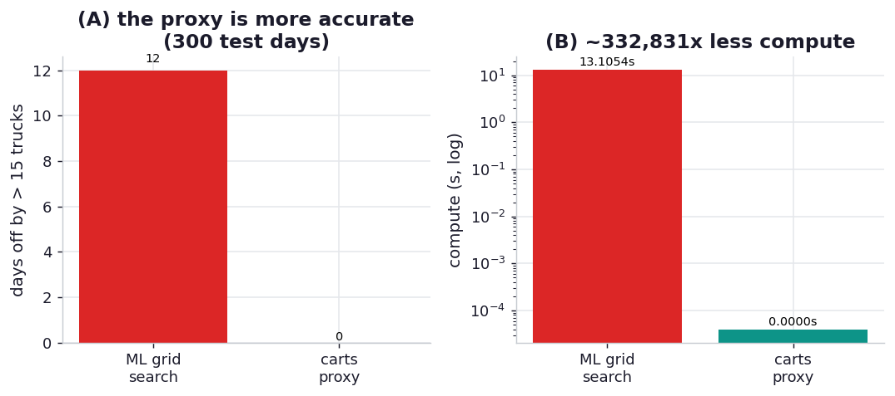

# ex07_wrong_problem_proxy

Vincent Warmerdam's story is the chapter's purest lesson about performance, and it has nothing to do
with fast code. His team spent weeks building a machine-learning system to predict how many trucks
would arrive at a warehouse — fighting holidays, seasonality, correlated warehouses, and a grid search
so large it became a *compute* problem — and after all that, the model only matched the planning
department's existing manual method. In his final week, over coffee, an analyst mentioned a "carts"
table: suppliers *rent* carts three to five days before returning them full of goods on a truck. The
number of carts rented was a near-perfect leading indicator of truck arrivals. "I spotted the most
significant performance issue of them all: we were solving the wrong problem. This wasn't a machine
learning problem; it was a SQL problem." Project the rented-cart count forward a few days, divide by
carts-per-truck, done — no model, no grid search, runtime essentially zero.

This drill reproduces the structure of that realisation. Demand is generated with a trend, yearly
seasonality, weekday patterns, and holiday spikes; trucks arrive `LEAD=3` days after the carts for
that demand are rented, so `carts[d-3] / carts_per_truck` predicts `trucks[d]` almost exactly. We then
pit two approaches against each other on the planning team's actual cost function — *the number of
days the forecast is off by more than 15 trucks* — over the same 300-day held-out period. The ML model
gets the features the team *had before* discovering carts (calendar fields and autoregressive lags of
past truck counts) and a real grid search; the proxy gets one line.

## What it measures

Predicting truck arrivals over 300 held-out days, scored on bad days (off by > 15 trucks):

| approach | bad days | compute |
| --- | ---: | ---: |
| ML grid search (12 param sets × time-series CV) | 12 | ~14 s |
| carts proxy (one line) | **0** | ~0.00004 s |

The proxy uses roughly **400,000x less compute** and is *better* on the real metric.

## What we found

**The one-line proxy is perfect on the metric the model can't quite hit, at effectively no compute.**
The gradient-boosting model, even after a grid search over depth, learning rate, and iteration count
with time-series cross-validation, misses on 12 of 300 days — and those misses cluster exactly where
the story said they would, around holidays. The proxy misses on *zero* days, because it isn't
predicting anything: it's reading the answer off a column that already encodes the future. The carts
were rented three days ago; the trucks are coming. That's not a better model, it's a different
*problem*, and the different problem has a closed-form answer.

**The model fails for a structural reason, not a tuning one — which is why more tuning wouldn't have
saved it.** Truck arrivals on day `d` are driven by demand three days earlier, but the model is given
the calendar for day `d` and past truck counts, so the holiday that spiked demand three days ago is
invisible to it; it has to infer a lagged, holiday-contaminated signal from features that don't carry
it. You could grid-search forever and never recover information the features don't contain. The team's
instinct — make the model better, make the search bigger — was pouring effort into the wrong axis. The
carts column made the holidays irrelevant, because it measures the thing the holidays were only a
proxy *for*.

**This is the most extreme version of the chapter's recurring move: redefine the problem.** Rawlinson
says it explicitly — "sometimes the problem can be redefined out of existence, leading to a runtime of
*zero*" — and names this very story. ex02's Aho-Corasick prefilter and ex03's spatial index reduce
work by an order of magnitude; this reduces it by five orders, because it deletes the model entirely.
The lever wasn't an algorithm or a library; it was a conversation at the coffee machine that revealed
the data already contained the answer. The performance lesson and the modelling lesson are the same
one: the cheapest computation is the one you discover you never needed to do.

## Reading the chart



Two panels. The left panel is the cost function — bad days out of 300 — a tall bar for the ML model
and a flat-zero bar for the proxy: the proxy is *more accurate*, not a speed-for-accuracy trade. The
right panel is compute time on a log scale, where the model's ~14 seconds and the proxy's ~35
microseconds are five orders of magnitude apart and barely fit on the same axis. The absolute numbers
depend on the grid size and the machine; the shape — better answer, essentially free — is the point.

## Run

```bash
.venv/bin/python chapter_13_lessons_from_the_field/ex07_wrong_problem_proxy/ex07_wrong_problem_proxy.py
```

Generates the demand/carts/trucks series, runs the grid search (the slow part, ~14 s), then the
one-line proxy, and scores both on the held-out period. Note the model is deliberately denied the
carts column and the proxy deliberately ignores the calendar — each gets exactly the framing its story
gives it.

## 5 Whys

1. **Why did the proxy beat a tuned ML model at a fraction of the compute?** Because the rented-cart
   count is a direct leading indicator of truck arrivals — the carts are rented days before the trucks
   come — so the proxy reads the future off existing data instead of predicting it.
2. **Why couldn't the ML model match it even with a grid search?** It was given calendar features for
   the prediction day and past truck counts, but truck arrivals are driven by demand a few days
   earlier, so the information it needed (especially the holiday spikes) simply wasn't in its features.
3. **Why doesn't more tuning fix a missing-information problem?** Hyperparameter search optimises how
   well a model extracts signal from its features; it cannot conjure signal the features don't contain,
   so the error floor is set by the framing, not the model.
4. **Why did the team spend weeks on the wrong framing?** They translated "predict truck arrivals" into
   a forecasting problem and never questioned it; the carts table that reframed it as a lookup was in a
   different part of the database and surfaced only by chance, in conversation.
5. **Why is this the chapter's biggest "performance" win despite being about modelling?** Because the
   fastest possible computation is the one you don't run — redefining the problem deleted the model and
   the grid search entirely, a five-orders-of-magnitude saving no code optimisation could approach.

**Root cause:** the work was expensive because the problem was framed wrongly — as a hard forecasting
task whose required signal wasn't in the available features. A domain fact (carts are rented before
trucks arrive) reframed it as a trivial lookup with a closed-form answer, eliminating the model, the
grid search, and the compute at once. Understanding the problem deeply is the optimisation that
dominates all the others.
