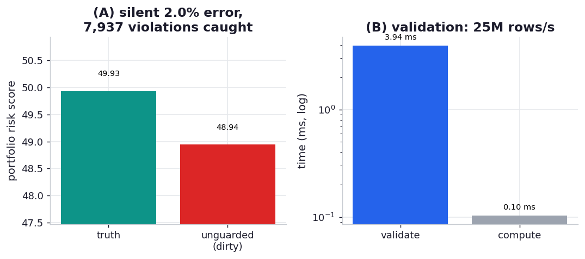

# ex08_defensive_pandera

James Poynter's lesson from cyber-reinsurance is that data is just another input to your program and
deserves the same defensive treatment you'd give any input — validation, assertions, boundary checks.
The threat isn't the malformed row that throws an exception and stops you; you'll notice that. It's
the malformed row that *doesn't* throw — the missing value encoded as a sentinel, the negative premium
from a fat-fingered entry, the score that's off its scale — which flows quietly through the pipeline
and corrupts the number a business decision rests on, with no error and no warning. "Get in the habit
of codifying any ad hoc analysis, assumptions, or checks done during development as an assertion,"
Poynter writes; for dataframes, Pandera turns those checks into a schema you validate at the boundary.

This drill makes the cost of skipping that concrete. The pipeline computes one number an underwriter
might actually use: the premium-weighted average risk score across a portfolio of 100,000 policies.
On clean data it's correct. Then we inject realistic, *non-crashing* impurities — 6% of risk scores
set to `-1` (a CSV's idea of "missing"), 1% of premiums sign-flipped, 1% of scores pushed off the
0–100 scale — and run the pipeline two ways: unguarded, which computes a confident wrong answer, and
guarded, which validates against a Pandera schema first and raises a precise, itemised error before a
single bad value reaches the calculation.

## What it measures

Premium-weighted average risk over 100,000 policies, ~8% of rows quietly corrupted:

| run | result | note |
| --- | --- | --- |
| truth (clean data) | 49.93 | the correct portfolio risk |
| unguarded on dirty data | 48.94 | **2.0% off, and no error raised** |
| guarded on dirty data | `SchemaErrors` | **7,937 violations caught**, itemised by row and check |

Validation cost: **~3.2 ms** for 100,000 rows (~31M rows/s). The bare computation: ~0.09 ms.

## What we found

**The unguarded pipeline returns a wrong answer with complete confidence.** The corrupted portfolio
risk comes out at 48.94 against a true 49.93 — a 2% bias, driven mostly by the `-1` "missing"
sentinels dragging the average down — and crucially *nothing signals that anything is wrong*. No
exception, no NaN, no warning; just a plausible-looking number that's off by enough to matter when
it's pricing risk. This is exactly the failure mode Poynter warns about: in finance a silently wrong
number is far more dangerous than a crash, because the crash you fix and the wrong number you *act on*.

**The schema converts that silent corruption into a loud, specific, actionable failure.** Run with
`lazy=True`, Pandera doesn't stop at the first bad cell — it collects *all* 7,937 violations across
all four columns and reports each with its row index and the check it failed, so you learn the data is
bad, exactly which rows, and exactly why, in one pass. That itemised report is the difference between
"the model's outputs look slightly off this week, let's spend three days bisecting the pipeline" and
"row 41,233's risk_score is -1, here are the other 7,936 like it." The schema is the codified form of
all the one-off sanity checks you'd otherwise run by hand in a notebook and forget to run next time.

**The "insurance premium" is genuinely cheap — measured, not assumed.** Validating 100,000 rows
against four columns of checks takes ~3.2 ms, about 31 million rows a second. It's true that's ~35x
the cost of the trivial weighted-mean itself, and an honest exercise should say so: validation is not
free, and on a hot path you'd validate at ingestion boundaries rather than inside an inner loop. But
3.2 ms to guarantee the inputs to a financial calculation are in-range is nothing against the cost of
shipping a 2%-wrong risk price — and as Poynter notes, the payoff compounds: once the schema exists,
every new data source you ingest is checked the same way, and iteration speeds up because you find
problems at the door instead of three transformations downstream.

## Reading the chart



Two panels. The left panel shows the portfolio-risk number three ways — the true value, the unguarded
dirty value sitting visibly off it (with the gap annotated as the silent error), and a marker that the
guarded run produced no number at all because it raised instead. The right panel puts the validation
cost next to the bare computation on a log scale and annotates the throughput, so the "premium" is a
concrete few milliseconds rather than a hand-wave. The absolute timings are machine-specific; the
lessons are that the silent error is real and unsignalled, and that catching it costs milliseconds.

## Run

```bash
.venv/bin/python chapter_13_lessons_from_the_field/ex08_defensive_pandera/ex08_defensive_pandera.py
```

Builds a clean and a dirty 100,000-row frame, runs the pipeline both ways, counts the violations the
schema catches, and times validation against the bare computation. Well under a second.

## 5 Whys

1. **Why did the unguarded pipeline return a wrong number instead of an error?** Because the
   impurities were valid Python floats — `-1`, a negative premium, `250` — that arithmetic happily
   consumes; nothing about computing a weighted average rejects an out-of-range value.
2. **Why is a silently wrong number worse than a crash?** A crash stops you and points at the problem;
   a wrong number looks fine, gets reported, and gets acted on — in underwriting, that's a mispriced
   risk shipped to a client before anyone notices.
3. **Why does a Pandera schema catch what the computation can't?** It checks the data against explicit
   expectations — types, ranges, allowed categories, uniqueness — at the boundary, so violations are
   detected by *what the values are*, not by whether they happen to break a later operation.
4. **Why validate lazily and collect all failures?** Stopping at the first bad cell would hide the
   scale of the problem; collecting all 7,937 violations in one pass tells you the full extent and
   every offending row at once, which is what makes the report actionable.
5. **Why is paying the validation cost worth it despite being slower than the calculation?** Because
   the few milliseconds are trivial in absolute terms and buy certainty about the inputs, and the
   schema, once written, guards every future dataset — turning a recurring debugging tax into a
   one-time investment.

**Root cause:** bad data that doesn't crash is the expensive kind, because it corrupts results
invisibly and the cost surfaces only after a wrong decision. Treating data as an untrusted input and
validating it against an explicit schema at the boundary converts silent, downstream corruption into
a loud, itemised failure at the door — cheap insurance whose value compounds across every data source
the system ingests.
