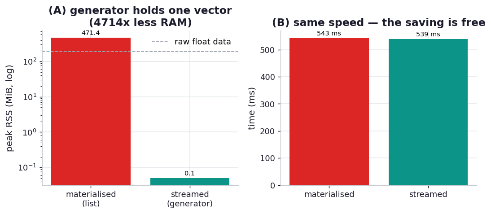

# ex09_streaming_generators

Radim Řehůřek built gensim — and made a Python port of word2vec run faster than Google's C — on one
foundational habit: stream the data. "Let your input be accessed and processed one data point at a
time, for a small, constant memory footprint... The Python language supports this pattern very
naturally and elegantly, with its built-in generators — a truly beautiful problem-tech match. Avoid
committing to algorithms and tools that load everything into RAM, unless you know your data will
always remain small." word2vec trains on roughly 100 billion words; that can't sit in memory, so the
corpus is pulled sentence by sentence and the model updated incrementally.

This drill isolates the memory consequence of that choice on a word2vec-flavoured reduction: compute
the mean of N embedding-sized vectors. The materialised version builds a Python list of all N vectors
and then reduces it; the streamed version pulls one vector at a time into a running accumulator. Both
produce the identical mean (the anchor). We measure peak resident memory in a fresh process for each
(via `_rss.py`, since the vectors live in numpy buffers `tracemalloc` can't see) and the wall-clock,
so we can watch the two memory footprints diverge while the answers stay the same.

## What it measures

Mean of 500,000 vectors of dimension 50 (the raw float data is ~191 MiB):

| approach | peak RSS | time |
| --- | ---: | ---: |
| materialised (list of all N) | ~470 MiB | ~546 ms |
| streamed (one at a time) | ~0 MiB (flat) | ~540 ms |

The generator's peak holds a single vector regardless of N — here **~4700x less** peak RAM than the
list — at no cost in speed.

## What we found

**The streamed version's memory footprint is essentially flat, and it computes the same answer in the
same time.** The accumulator is one 50-element vector, so the peak RSS increment rounds to zero no
matter how many vectors flow through it; the list version peaks at 470 MiB because it holds the entire
corpus live at once. Crucially the two run at the same speed (~540 ms each) — streaming is not a
speed-for-memory trade here, it's a strict improvement: same result, same time, a tiny fraction of the
RAM. This is why Řehůřek treats it as the default rather than an optimisation of last resort. The list
version's footprint grows linearly with N and will eventually hit the machine's ceiling and die; the
generator's never moves, so the same code that handles 500,000 vectors handles 500 billion.

**A bonus finding hiding in the numbers: the list peaks at 470 MiB for only ~191 MiB of actual float
data.** That ~2.5x inflation is the Chapter 12 lesson resurfacing — a Python list of 500,000 small
numpy arrays stores 500,000 *objects*, each with its own header, reference count, and array metadata
on top of its 400 bytes of payload, plus the list's own array of pointers. So materialising doesn't
just cost you the data; it costs you the per-object overhead on every element, making the in-RAM
representation markedly larger than the data it holds. Streaming sidesteps that entirely by never
holding more than one object at a time.

**The real-world version of this is the streamed *API*, not just the loop.** Řehůřek's point isn't
that you should hand-roll an accumulator; it's that a high-level streamed interface — an iterable of
sentences, a generator of records — is "a powerful and flexible abstraction" that keeps memory
constant while letting you batch internally for speed when you want to. The discipline is to design
your code so the data flows *through* it rather than *into* it, which is exactly the difference between
the two functions here.

## Reading the chart



Two panels. The left panel is peak RSS as a function of corpus size: the materialised line climbs
linearly with N while the streamed line stays pinned to the floor — the divergence is the whole story.
A dashed line marks the ~191 MiB of raw float data, sitting *below* the materialised curve to show the
per-object overhead the list adds on top. The right panel confirms the two approaches take essentially
the same time, so the memory saving is free. Absolute MiB depend on the machine and the vector
dimension; the lesson is one line that grows and one that doesn't.

## Run

```bash
.venv/bin/python chapter_13_lessons_from_the_field/ex09_streaming_generators/ex09_streaming_generators.py
```

Each peak-RSS figure is measured in its own spawned process; timings are in-process. A second or two,
including the transient ~470 MiB allocation in the materialised measurement child.

## 5 Whys

1. **Why does the materialised version use so much more memory?** Because it builds a list containing
   all N vectors and keeps every one of them live simultaneously, so its footprint is the whole corpus
   at once.
2. **Why is the streamed version's footprint flat regardless of N?** It pulls one vector at a time into
   a fixed-size accumulator and lets each vector be garbage-collected before the next arrives, so only
   a single vector is ever live.
3. **Why does this matter beyond this toy size?** The list's memory grows linearly with N and will hit
   the machine's RAM ceiling and crash on a large enough corpus; the generator's never grows, so the
   identical code scales to datasets that don't fit in memory at all.
4. **Why is the list bigger (470 MiB) than the raw data (191 MiB)?** Each of the 500,000 small arrays
   is a separate Python object carrying its own header and metadata, plus the list's pointer array, so
   per-object overhead inflates the in-RAM size well beyond the payload.
5. **Why doesn't streaming cost speed?** The arithmetic is identical and the per-item pull is cheap;
   the only thing that changed is that vectors are consumed as they're produced instead of all being
   held first, which adds no work — so it's a strict win, not a trade.

**Root cause:** loading everything into a list makes peak memory scale with the dataset, which caps
the size of problem you can handle and adds per-object overhead on top of the data. Streaming with a
generator keeps a constant, single-item footprint while computing the same result in the same time, so
designing data to flow *through* the program rather than *into* it removes the memory ceiling for free.
