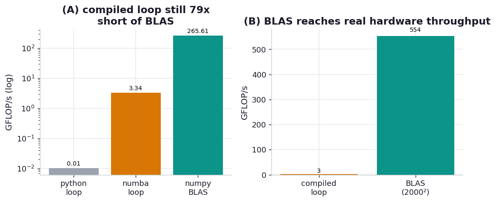

# ex10_know_your_blas

The final trick in Radim Řehůřek's story of making a Python word2vec beat Google's C was "know your
BLAS." numpy internally wraps the Basic Linear Algebra Subprograms — `dot`, `gemm`, `axpy` and friends
— which processor vendors hand-optimise in assembly for each architecture's cache hierarchy, SIMD
width, and core count. "Expressing word2vec training as BLAS operations resulted in another four times
speedup, topping the performance of C word2vec." The lesson cuts against the instinct this chapter
otherwise encourages (compile your hot loop): for the operations BLAS covers, the fast path isn't to
write a loop and compile it — it's to *phrase the work as a BLAS call* and let numpy dispatch to code
that has been tuned for this exact CPU for decades.

This drill makes the gap visible with the canonical BLAS routine, matrix multiply (`gemm`). The same
multiply runs three ways on identical inputs: a textbook pure-Python triple loop, the *identical* loop
compiled with Numba, and `A @ B` which dispatches to the platform BLAS. We report GFLOP/s for each
(matmul is 2·N³ floating-point operations), then a separate large-matrix run to show what fraction of
the hardware the BLAS path actually reaches.

## What it measures

128×128 matrix multiply (4.2M flops), plus a 2000×2000 BLAS run:

| approach | time | throughput |
| --- | ---: | ---: |
| python_loop | ~417 ms | ~0.01 GFLOP/s |
| numba_loop (compiled) | ~1.3 ms | ~3.3 GFLOP/s |
| numpy_blas | ~0.02 ms | ~260 GFLOP/s |
| numpy_blas (2000×2000) | — | **~546 GFLOP/s sustained** |

numpy/BLAS is ~**26,000x** faster than the Python loop and ~**78x** faster than the *compiled* loop.

## What we found

**Compiling the loop is not enough — the compiled loop is still ~78x slower than BLAS.** This is the
result that makes the exercise worth doing. Numba removes the interpreter overhead and takes the
triple loop from 0.01 to 3.3 GFLOP/s, a ~250x jump — exactly the kind of win the rest of the chapter
celebrates. And it's *still two orders of magnitude short of BLAS*, which sustains 546 GFLOP/s on a
large matrix. The difference isn't interpreter overhead, because Numba has none left; it's that a
naive `i,j,k` loop, however well compiled, streams memory in a cache-hostile order and uses one core
and scalar arithmetic, while BLAS blocks the matrices to fit cache, issues vectorised SIMD
instructions, and threads across cores. Those are algorithmic and architectural optimisations that no
amount of compiling a *naive* loop will reproduce.

**The BLAS call reaches a real fraction of the hardware's peak, and it's free to you.** 546 GFLOP/s of
double-precision throughput is a large share of what this Apple Silicon machine can do, achieved by
typing `@`. That's Řehůřek's deeper point: numpy doesn't just make BLAS *available*, it makes the fast
formulation *obvious* — `A @ B`, `np.dot`, `y += a * x` — so you fall into the vendor-tuned path
without thinking about it. The same is true of the `axpy` pattern he names (`vector_y += scalar *
vector_x`): written as a numpy expression it runs as one tight vectorised pass, not a Python loop. He's
careful to note this isn't a Python advantage per se — C could link the same BLAS — but numpy makes it
"stand out and easy to take advantage of."

**The takeaway for where to spend effort.** When your bottleneck is linear algebra, the highest-value
move is to express it in BLAS terms and check which BLAS you're linked against, *before* you reach for
Cython or Numba on a hand-written loop. Compile the parts BLAS doesn't cover; hand the parts it does
straight to it. The 78x gap between the compiled loop and `gemm` is the price of not doing that.

## Reading the chart



Two panels. The left panel shows GFLOP/s for the three 128×128 approaches on a log scale — the Python
loop near the floor, the compiled Numba loop a couple of orders above it, and the BLAS bar towering far
above *that*, so the "compiling isn't enough" gap is the dominant visual feature. The right panel marks
the sustained throughput BLAS reaches on the 2000×2000 multiply, the number that says it's using a real
fraction of the machine. Absolute GFLOP/s are specific to this CPU and its BLAS build; the durable
lessons are the ordering and that the largest single jump is from compiled-loop to BLAS, not from
interpreter to compiled.

## Run

```bash
.venv/bin/python chapter_13_lessons_from_the_field/ex10_know_your_blas/ex10_know_your_blas.py
```

The Numba function compiles on first call (timed warm afterwards); the Python loop runs once because
it's slow. A couple of seconds, most of it the Python loop and the large BLAS multiply.

## 5 Whys

1. **Why is `A @ B` tens of thousands of times faster than the Python loop?** The loop pays CPython
   interpreter overhead on every one of the 2·N³ scalar operations, while `@` dispatches the whole
   multiply to compiled, vectorised BLAS code.
2. **Why is BLAS still ~78x faster than the *compiled* loop, which has no interpreter overhead?**
   Because speed here isn't about interpreter overhead — it's about cache blocking, SIMD vector
   instructions, and multithreading, none of which a naive triple loop has even after compilation.
3. **Why can't a compiled naive loop match those?** Its memory access pattern is cache-hostile and its
   arithmetic is scalar and single-threaded; matching BLAS would mean re-implementing decades of
   architecture-specific tuning (tiling, packing, micro-kernels) by hand.
4. **Why does numpy reach that performance for free?** numpy links the platform BLAS and routes `@`,
   `dot`, and similar operations to it, so the vendor-optimised routine runs without you writing or
   compiling anything.
5. **Why is "phrase it as BLAS" the right instinct for linear algebra?** Because the operation is
   already implemented near hardware peak by people who specialise in exactly that CPU; expressing your
   work in BLAS terms inherits all of it, whereas hand-writing the loop forfeits it.

**Root cause:** the dominant cost in dense linear algebra is memory movement and vector throughput, not
interpreter overhead — so removing the interpreter (compiling the loop) recovers only a fraction of the
performance. Vendor BLAS attacks the real cost with cache blocking, SIMD, and threading tuned to the
specific processor, and numpy hands your `@` straight to it; the fast path is to phrase the work as a
BLAS call rather than to write and compile your own loop.
