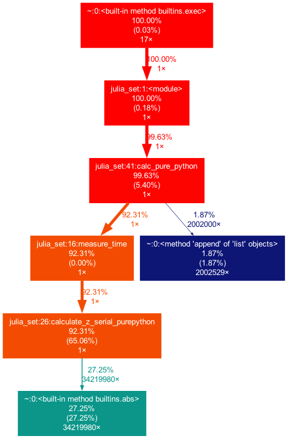
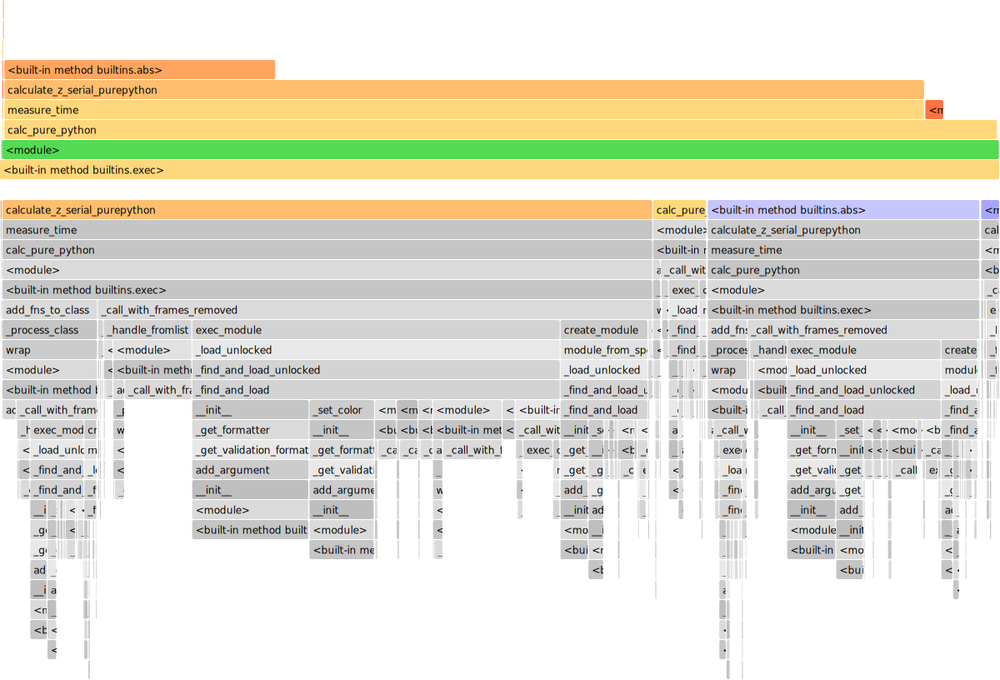
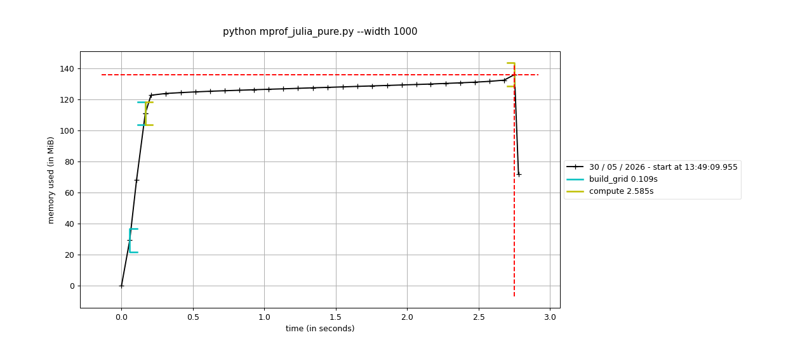
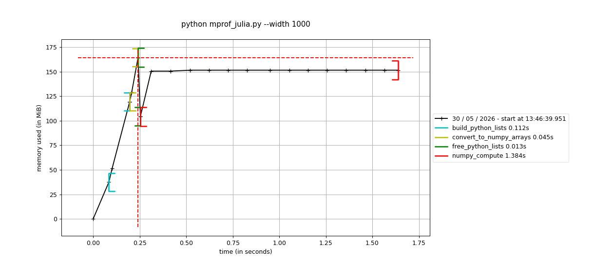
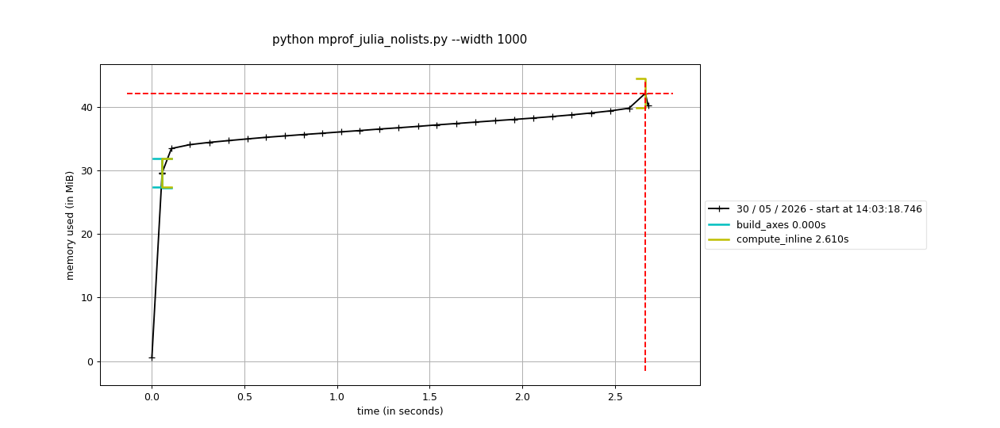

# Chapter 2 — Profiling to Find Bottlenecks

Study notes for the **Julia set** example from *High Performance Python*. The
whole point of this chapter: **measure, don't guess.** Several "obvious"
optimizations in here turn out to be wrong, and only profiling reveals it.

All commands assume the shared uv environment at the repo root:

```bash
uv sync                       # one-time: create .venv with the profiling tools
uv run python chapter_2/julia_set.py
```

The default workload is a `1000 x 1000` grid at `300` iterations, with the book's
fixture checksum `sum(output) == 33219980`.

---

## Files in this folder

| File | What it is |
|---|---|
| `julia_set.py` | The canonical pure-Python version (scalar escape-time loop). |
| `julia_set_expanded.py` | Same, but the compound `while` is split into individual statements so a line profiler can cost each part (book Example 2-10). |
| `julia_set_numpy.py` | Vectorized with numpy — whole-array updates instead of a per-point loop. Identical result. |
| `julia_set_nolists.py` | Simplified: no `zs`/`cs` lists — coordinates computed inline to save ~96 MiB RAM. |
| `julia_set_memory.py` | Pure-Python version with a `memory_profiler` `@profile` decorator on `calc_pure_python`. |
| `julia_set_numpy_memory.py` | numpy memory comparison: list-built+convert vs. direct meshgrid arrays. |
| `mprof_julia_pure.py` | mprof time-series memory of the pure-Python version (labeled phases). |
| `mprof_julia_nolists.py` | mprof time-series of the no-lists version (for the with/without-grid comparison). |
| `mprof_julia.py` | mprof time-series memory of the numpy version with `del` (labeled phases). |
| `bench_swap_order.py` | Wall-clock benchmark: does swapping the `while` condition order help? |
| `lprof_swap_order.py` | Line-profile driver for the swap-order experiment (one call each). |
| `build_flame_html.py` | Converts `julia.prof` into a self-contained interactive flame-graph HTML. |
| `Dockerfile` | Runs the Julia set under GNU `time -v` in a container; includes graphviz + all profiling tools. |
| `Dockerfile.pyspy` | Runs py-spy (needs `SYS_PTRACE`) in a container to flame-graph the run without host root. |
| `pyspy_julia.svg` | py-spy sampling flame graph (interactive). |
| `julia.prof` | Saved `cProfile` stats. |
| `scalene-julia.json` / `scalene-julia.html` | Scalene profile (CPU Python-vs-native + memory) and its HTML report. |
| `viztracer_julia.json` | VizTracer timeline trace (open with `vizviewer`). |
| `escape_demo.c` / `escape_demo.s` | C version of the inner-loop ops + its ARM64 assembly (bytecode-vs-assembly contrast). |
| `leaky_flask.py` | Flask app with a leaky endpoint wrapped in real Dozer middleware (WSGI leak detection). |
| `leaky_api.py` | FastAPI (ASGI) equivalent: a `/_memory` endpoint hand-rolled with gc/objgraph/tracemalloc. |
| `leaky.bin` / `leaky_memray.html` | memray capture of the FastAPI leak + its interactive allocation flame graph. |
| `julia_set.py.lprof`, `julia_set_expanded.py.lprof` | Saved `line_profiler` stats. |
| `julia_profile.png` | gprof2dot call-graph render. |
| `julia_flame.svg` / `julia_flame.html` | Static flame graph (flameprof). |
| `julia_flame_interactive.html` | Interactive d3 flame graph (click-to-zoom, search). |

---

## 1. Timing the whole program — `/usr/bin/time`

macOS ships **BSD** `time` (no `-v`). Use `-l` for the verbose resource block:

```bash
/usr/bin/time -lp python3 julia_set.py
```

For the **GNU** labeled output (`Elapsed`, `Percent of CPU`, ...), install it:

```bash
brew install gnu-time
gtime -v python3 julia_set.py
```

Typical native run (1000x1000 @ 300):

| Metric | Value |
|---|---|
| Elapsed (wall) | ~2.9 s |
| % CPU | 99% (single core, CPU-bound) |
| Max RSS | ~130 MB (every complex number is a heap Python object) |

Note the gap between `@timefn`'s ~2.7 s (the hot function only) and `time`'s
~2.9 s wall — the difference is the grid-building setup the decorator doesn't
cover. `time` sees the whole process; the decorator sees one function.

### In Docker, with resource limits

```bash
docker build -t julia-set chapter_2/
docker run --rm julia-set                       # GNU time -v inside the container
docker run --rm --cpus=0.5 julia-set            # throttle CPU
docker run --rm --memory=48m --memory-swap=48m julia-set   # OOM
```

Findings:

- **CPU throttling scales wall-clock inversely** (single-threaded job): `--cpus=1`
  ≈ unlimited, `--cpus=0.5` ≈ 2× slower, `--cpus=0.25` ≈ 5× slower. User time stays
  constant; only wall-clock stretches.
- **Memory:** survives `--memory=64m` (much of the ~104 MB RSS is reclaimable),
  but `--memory=48m` triggers the OOM killer → **exit code 137** (`128 + SIGKILL`).
  GNU time's own `Exit status: 0` field is misleading here; trust the container
  exit code and the `Command terminated by signal 9` line.

---

## 2. Function-level profiling — `cProfile` + `pstats`

```bash
uv run python -m cProfile -s tottime chapter_2/julia_set.py     # print, sorted
uv run python -m cProfile -o chapter_2/julia.prof chapter_2/julia_set.py   # save
```

Top of the profile (sorted by `tottime`):

```
        1    4.82 s   calculate_z_serial_purepython
 34219980    2.02 s   {built-in method builtins.abs}      <- 34 million calls!
        1    0.41 s   calc_pure_python
  2002529    0.14 s   {method 'append' of list objects}
```

**Reading it:** `tottime` = time in the function's *own* body; `cumtime` = body +
everything it calls. Sort by `tottime` to find hotspots, by `cumtime` to find
which subtree to dig into. Low-tottime / high-cumtime frames (`calc_pure_python`)
are *coordinators*, not hotspots — don't optimize them.

Re-read a saved profile without re-running:

```python
import pstats; p = pstats.Stats('chapter_2/julia.prof').strip_dirs()
p.sort_stats('tottime').print_stats(6)
p.print_callers('abs')   # confirms all 34M abs() calls come from julia_set.py:26
```

---

## 3. Visualizing a profile

| Tool | Output | Interactive? |
|---|---|---|
| `gprof2dot \| dot -Tpng` | `julia_profile.png` static call graph | no |
| `snakeviz julia.prof` | icicle diagram in browser | yes (needs a running server) |
| `flameprof julia.prof` | `julia_flame.svg` | **no** (static — easy to mistake for interactive) |
| `build_flame_html.py` | `julia_flame_interactive.html` | yes (d3, offline, no server) |

```bash
uv run python -m flameprof chapter_2/julia.prof > chapter_2/julia_flame.svg
uv run python chapter_2/build_flame_html.py chapter_2/julia.prof chapter_2/out.html
uv run snakeviz chapter_2/julia.prof          # opens http://127.0.0.1:8080/
```

**How to read a flame/icicle graph:**

- **Width = cumulative time.** Wider = slower. This is the only thing that means
  "expensive."
- **Stacking = call depth.** A box sits on its caller. Flame grows up, icicle
  grows down — same data.
- **The x-axis is NOT a timeline.** Left/right is just grouping, not order.
- **Tall ≠ slow.** Look for the *widest box at the top* (a wide leaf) — that's
  where the CPU actually sits.
- Wide-but-fully-covered boxes (`<module>`, `calc_pure_python`) are plumbing;
  their own time is the thin exposed sliver, usually ~0.

For the Julia set, ~92% of the area is `calculate_z...` + `abs`.

**gprof2dot call graph** — boxes colored by cumulative time; the red spine is the
hot path, ending at the `abs` leaf (34M calls):



**flameprof flame graph** (static) — width = cumulative time; the wide `abs`
block sits on the inner loop:



---

## 4. Line-level profiling — `line_profiler`

Autoprofiling needs **no source edits** (no `@profile` decorator) — keeps
`julia_set.py` pure-stdlib:

```bash
uv run kernprof -l -v -p chapter_2/julia_set.py chapter_2/julia_set.py
uv run python -m line_profiler julia_set.py.lprof   # re-view saved stats
```

`line_profiler` instruments every line, so the run inflates to ~25 s — read the
**% Time** column, not absolute times.

### Compact loop (`julia_set.py`)

```
Line   Hits        % Time   Statement
  34   34219980    35.1     while abs(z) < 2 and n < maxiter:
  35   33219980    32.2         z = z * z + c
  36   33219980    28.4         n += 1
```

### Expanded loop (`julia_set_expanded.py`) — the same line, broken apart

```
Line   Hits        % Time   Statement
  45   34219980    14.5     while True:
  46   34219980    17.7         not_yet_escaped = abs(z) < 2      <- magnitude test
  47   34219980    15.3         iterations_left = n < maxiter     <- counter test
  48   34219980    15.6         if not_yet_escaped and iterations_left:
  49   33219980    18.6             z = z * z + c
  50   33219980    15.4             n += 1
```

**Insight:** the single 35.1% `while` line decomposes into `abs` (17.7%) +
`n < maxiter` (15.3%) + hidden loop/branch overhead (~30%). The trivial integer
comparison `n < maxiter` costs *almost as much as* `abs(z)` — proof that most of
the cost is **per-bytecode interpreter dispatch (~0.2 µs/line)**, not the math.
The expanded version is a *diagnostic*, not an optimization: it's slower.

---

## 5. Memory profiling — `memory_profiler`

Unlike `line_profiler`, `memory_profiler` needs an explicit `@profile` decorator
(it can't autoprofile). Decorated functions are profiled when the module is run
under it:

```bash
uv run python -m memory_profiler chapter_2/julia_set_memory.py --width 1000
```

It samples RSS on **every line** of the decorated function, so it's ~15× slower
(width 1000 → ~90 s). Use a smaller `--width` to iterate. Columns: **Mem usage**
= total RSS after the line; **Increment** = what the line added (the column to
scan); **Occurrences** = times run.

### Pure Python (`julia_set_memory.py`, decorating `calc_pure_python`)

```
Line   Mem usage   Increment   Line Contents
 56    29.5 MiB    29.5 MiB    @profile def calc_pure_python(...)   <- interpreter baseline
 75   110.5 MiB    71.0 MiB        zs.append(complex(...))          ┐ 1M boxed complex,
 76   110.5 MiB     9.8 MiB        cs.append(complex(...))          ┘ ~81 MiB combined
 81   135.5 MiB    25.0 MiB        output = calculate_z_...(...)    <- output list + loop temporaries
```

Peak ~135 MiB matches the RSS `/usr/bin/time` reported. **81 MiB just to hold 2M
numbers** as Python objects (~40 bytes each: 16 B data + type ptr + refcount +
list slot). The 71-vs-9.8 split between `zs`/`cs` is a sampling artifact — memory
grows in chunks as the list reallocates; trust the ~81 MiB combined.

### numpy footprint (`julia_set_numpy_memory.py`)

| Version | Grid storage | Peak RSS |
|---|---|---|
| Pure Python lists | ~81 MiB | 135 MiB |
| numpy, list-built + `np.asarray` | 81 MiB lists **+** 32 MiB arrays | **217 MiB** (worse!) |
| numpy, direct meshgrid arrays | ~32 MiB | 145 MiB |

**numpy does not save memory automatically.** Building Python lists *then*
converting holds both representations at once → 217 MiB peak, worse than pure
Python. Only building arrays **directly** (no intermediate lists) wins: the grid
is two `complex128` arrays = **32 MiB vs 81 MiB (2.5× less)** — exactly the
per-object boxing overhead removed (16 B/element vs ~40 B). Peak stays ~145 MiB
because each `z = z*z + c` pass allocates transient arrays; in-place ops would
shrink that (a separate optimization).

> Run each mode in a **fresh process** — running both in one leaves the second
> starting from the first's retained memory, zeroing its increments.

### Memory over *time* — `mprof` with labeled phases

`memory_profiler`'s per-line table shows *where* memory is allocated; `mprof`
shows it *when*. `mprof run --python` injects a `profile` (a `TimeStamper`) into
builtins, and `profile.timestamp("label")` is a **context manager** that records
a labeled band — drawn as a bracket by `mprof plot`.

```bash
uv run mprof run --python python chapter_2/mprof_julia_pure.py --width 1000
MPLBACKEND=Agg uv run mprof plot --output chapter_2/mprof_julia_pure.png mprofile_*.dat
```

(`mprof run` only *samples* RSS every 0.1 s — it does **not** trace lines, so the
program runs at full speed, unlike `@profile`. Labels must be single tokens; the
`.dat` parser splits `FUNC` lines on whitespace.)

**Pure Python (`mprof_julia_pure.py`)** — memory climbs while building the lists,
then stays high through the 2.6 s compute (nothing is freed):



**numpy with `del` (`mprof_julia.py`)** — same start, but watch the `del zs, cs`
cliff (~163 → 103 MiB) once the lists are converted, and the shorter ~1.4 s
compute:



The time-series view reveals what a static peak number hides: the 163 MiB peak is
*transient* (lists + arrays coexisting for one phase), and `del` reclaims it.

### Don't store what you can compute (`julia_set_nolists.py`)

The biggest memory win needs no numpy at all — just *stop materializing the grid*.
The original stores two 1,000,000-element lists (`zs`, `cs`) of boxed complex
objects (~81 MiB) before computing. Instead, keep only the 1D coordinate **axes**
(`x`, `y` — 1000 floats each, a few KB) and compute `complex(xcoord, ycoord)`
inline in the loop. Same work, same result (checksum 33219980), same ~2.6 s.

```python
# Before: store 1M complex objects in two lists, then compute
for ycoord in y:
    for xcoord in x:
        zs.append(complex(xcoord, ycoord))   # 1M boxed objects ┐ ~81 MiB
        cs.append(complex(C_REAL, C_IMAG))   # 1M more          ┘
output = calculate_z_serial_purepython(maxiter, zs, cs)

# After: create each coordinate inside the loop, store nothing
for ycoord in y:                              # y: 1000 floats
    for xcoord in x:                          # x: 1000 floats
        z = complex(xcoord, ycoord)           # used, then discarded
        ...escape loop...
        output.append(n)
```

| Version | Peak RSS |
|---|---|
| With `zs`/`cs` lists (`mprof_julia_pure.py`) | **136 MiB** |
| No lists, computed inline (`mprof_julia_nolists.py`) | **40 MiB** (≈3.4× less) |



The grid-building wall is gone — the timeline is nearly flat. At any instant only
*one* `z` exists instead of a million; the GC reclaims each before the next. The
remaining ~40 MiB is the interpreter baseline (~29 MiB) plus the `output` list of
1M ints (~11 MiB) — the actual result, which can't be eliminated.

Trade-offs: you lose `len(zs)` (so `output` must `append` instead of being
pre-sized), and the grid can't be reused without recomputing. For a one-shot
calculation, storing it was pure waste. **Lesson: materializing intermediate
collections is an invisible RAM cost — profile memory to see it.**

### Long-running web servers — leak detection with Dozer

Everything above profiles a **single batch run**. A web server is the opposite: a
**long-running process** where the danger is a slow **memory leak** — RAM creeping
up over hours until a worker is OOM-killed. `dozer` is **WSGI middleware** built
for this: it samples the live object graph (`gc`) on a timer and serves a
`/_dozer/` UI showing each type's object count *over time* — a type that only
climbs is a leak.

```python
from flask import Flask
from dozer import Dozer
app = Flask(__name__)
app.wsgi_app = Dozer(app.wsgi_app)          # one line — wraps the WSGI app
# open http://localhost:8000/_dozer/
```

`chapter_2/leaky_flask.py` has a deliberately leaky endpoint (a global list that
grows every request). Drive it and Dozer catches the offender:

```bash
uv run python chapter_2/leaky_flask.py                       # serves on :8000
for i in $(seq 1 30); do curl -s "localhost:8000/leak?n=1000" >/dev/null; done
# Dozer index then reports:
#   __main__.Widget   Min: 0   Cur: 31000   Max: 31000   [TRACE]
```

`Min 0 → Cur 31000 → Max 31000`, monotonically up and never down — the leak
signature. The contrast: a `/healthy` endpoint that creates and *drops* the same
objects shows no accumulation (the GC reclaims them).

**The TRACE view — finding the root cause.** Clicking `TRACE` on a type lists its
live objects; clicking one walks `gc.get_referrers()` up to the root and prints the
chain that keeps it alive (read bottom-up):

```
__main__.Widget (id 4429618864)                         ← the leaked object
  ← builtins.list  "list of len 32000: [<Widget>, ...]"  ← held by a list...
  ← builtins.dict  (via its '_LEAKED' key)               ← ...stored under '_LEAKED'
  ← builtins.module '__main__' (via '__dict__')          ← a module global
```

That spells out the culprit exactly: **`__main__._LEAKED`, a global list**, is
holding all 32,000 Widgets. Type → objects → **referrer chain to root** is what
makes Dozer a leak *locator*, not just a memory graph — in a large codebase this
turns hours of bisecting into a 30-second diagnosis.

Caveats: Dozer is **WSGI-only** (Flask, Pyramid, Bottle) — it can't wrap **ASGI**
apps (FastAPI, Starlette). And it's a **staging** tool — the introspection adds
overhead and exposes internals, so don't leave `/_dozer/` on a public production
server. Lineage: **Dowser** (original, Py2, referenced by the book) → **Dozer**
(maintained Py3 fork).

### FastAPI / ASGI — memray (and a `/_memory` endpoint)

Dozer can't wrap FastAPI (ASGI). Two equivalents, both demonstrated on the same
leaky app (`chapter_2/leaky_api.py`):

**1. A hand-rolled `/_memory` endpoint** — gc object counts (Dozer-style) +
`tracemalloc` allocation sites, embedded in the app:

| | baseline | after 20k leaked |
|---|---|---|
| RSS | 79 MB | 239 MB |
| live `Widget`s | 0 | 20,000 |
| top types | function, dict… | **list (22070), Widget (20000)** |

`tracemalloc` even names the lines: `leaky_api.py:36` (Widget payload) and `:42`
(the `_LEAKED.extend` leak site).

**2. memray** — the production-grade allocator-level profiler (Bloomberg). It
intercepts *every* `malloc`/`calloc`/`mmap` (incl. native C-extension memory) and
makes flame graphs. Works with any Python, including uvicorn:

```bash
uv run memray run --force -o chapter_2/leaky.bin -m uvicorn leaky_api:app --port 8002
# drive the leak with curl, then SIGINT the server to finalize the capture
uv run memray stats     chapter_2/leaky.bin            # CLI summary
uv run memray flamegraph -o chapter_2/leaky_memray.html chapter_2/leaky.bin
uv run memray run --live -m uvicorn leaky_api:app      # live TUI, no file
```

memray's `stats` pinned the leak to one line:

```
📦 Total memory allocated: 495 MB    📈 Peak: 283 MB    📏 854,143 allocations
🥇 Top allocating location (by size):
   __init__  leaky_api.py:36  ->  249 MB    ← Widget.payload = [i]*1000
```

| Tool | Granularity | Native allocs | ASGI |
|---|---|---|---|
| Dozer | gc object counts | ✗ | ✗ (WSGI only) |
| `/_memory` endpoint | gc + tracemalloc snapshots | ✗ | ✓ |
| **memray** | **every malloc/calloc/mmap** | **✓** | ✓ |

For real FastAPI leak-hunting, reach for **memray**; the `/_memory` endpoint is a
lightweight always-on alternative; `tracemalloc.compare_to()` between two
snapshots is the zero-dependency fallback.

---

## 6. Scalene — CPU (Python vs. native) + memory in one pass

`scalene` is a low-overhead sampling profiler that does something the others
can't: it splits each line's CPU time into **Python** (interpreter) vs. **native**
(C) vs. **system**, and captures **memory** in the *same* run.

```bash
uv run scalene run -o chapter_2/scalene-julia.json chapter_2/julia_set.py
uv run scalene view --cli -r chapter_2/scalene-julia.json     # terminal, active lines
uv run scalene view --standalone chapter_2/scalene-julia.json # self-contained HTML
```

Line-level for `calculate_z_serial_purepython`:

```
Line   Python%  Native%  System%  PeakMB   Code
  29      0       0        0        8.3     output = [0] * len(zs)
  34      0      42.1      1.5      0        while abs(z) < 2 and n < maxiter:
  36     50.0     0        2.2      0            n += 1
  58      0       1.5      0.3      3.0         zs.append(complex(...))
  59      0       2.0      0.3      1.4         cs.append(complex(...))
```

Function summary: **50% Python, 42% native.**

**The insight no other tool gives — *what kind* of time, not just where:**

- **Line 34 `while abs(z) < 2` → 42% native.** `abs()` on a complex number and
  the comparison run in CPython's **C** code. This is "fast" time — already
  compiled; you can't speed it up by rewriting Python.
- **Line 36 `n += 1` → 50% Python.** A trivial increment is *pure interpreter
  overhead*. Half the entire function is the Python VM doing `n += 1` and loop
  bookkeeping.

This split is **actionable**: high Python% = interpreter-bound → escape Python
(numpy / Cython / Numba); high native% = already in C → leave it alone. Line 36's
50% is the hard-number proof of the whole chapter's thesis — half the runtime is
interpreter tax on a trivial operation. (Recall numpy got `abs(z) < 2` to 2.7 ns/
element vs. 30 ns scalar by removing exactly this.)

Bonus: the memory column came from the *same* run — no separate `memory_profiler`
pass needed (line 29's `output` list = 8.3 MB; the `zs`/`cs` appends = 3.0 + 1.4
MB sampled).

---

## 7. py-spy — zero-instrumentation sampling (run via Docker)

`py-spy` is an *external* sampling profiler: it reads stack traces from another
process's memory at ~100 Hz, so it needs **no code changes, no imports, and adds
near-zero overhead** to the target. Its superpower is attaching to an
**already-running** process by PID — profiling production code without a restart.

The catch on macOS: reading another process's memory requires root (`sudo`), and
even then Apple's kernel restrictions get in the way. The clean fix is to run it
**inside a Linux container** with the `SYS_PTRACE` capability — no host password:

```bash
docker build -f chapter_2/Dockerfile.pyspy -t julia-pyspy chapter_2/
docker run --rm --cap-add SYS_PTRACE -v "$PWD/chapter_2:/out" julia-pyspy
# -> writes chapter_2/pyspy_julia.svg (an interactive flame graph)
```

- `--cap-add SYS_PTRACE` grants the Linux capability py-spy needs (`process_vm_readv`).
- `-v "$PWD/chapter_2:/out"` brings the SVG back to the host.

Line-level samples (400 total) for the pure-Python run:

| Line | % | Code |
|---|---|---|
| `35` | 44.0 | `z = z * z + c` |
| `34` | 42.5 | `while abs(z) < 2 and n < maxiter:` |
| `36` | 6.75 | `n += 1` |
| `58`/`59` | 1.75 / 3.75 | `zs`/`cs.append(...)` |

**Sampling vs. instrumentation — the same code, a different picture.** Compare
line 36 (`n += 1`): `line_profiler` said **28%**, py-spy says **6.75%**.
`line_profiler` *instruments* every line and its per-line overhead inflates cheap
lines; py-spy *samples* and a fast `n += 1` is rarely the line caught
mid-execution. **py-spy is closer to the truth** — the real work is the complex
arithmetic (line 35) and `abs` (line 34), ~86% together, not the increment.

Other modes (all need `sudo`/`SYS_PTRACE`):

```bash
py-spy top  -- python julia_set.py     # live top-style view, no output file
py-spy dump --pid <PID>                # one-shot stack snapshot of a live process
py-spy record --pid <PID> -o out.svg   # sample a process already running
```

**`top` view** — an `htop`-style live function ranking that updates in real time
(here, the final frame of a 2000×2000 run, 1800 samples):

```
Total Samples 1800
GIL: 100.00%, Active: 100.00%, Threads: 1
  %Own   %Total  OwnTime  TotalTime  Function (filename)
100.00% 100.00%   16.81s    16.81s   calculate_z_serial_purepython (julia_set.py)
  0.00% 100.00%    1.19s    18.00s   calc_pure_python (julia_set.py)
  0.00% 100.00%   0.000s    16.81s   measure_time (julia_set.py)
  0.00% 100.00%   0.000s    18.00s   <module> (julia_set.py)
```

- **%Own** = samples where the function was on *top* of the stack (its own code);
  **%Total** = anywhere on the stack (it or its callees) — the live equivalent of
  cProfile's tottime vs cumtime.
- `calculate_z...` is **100% %Own** (all work); the others are **0% %Own /
  100% %Total** — pure plumbing.
- **GIL: 100%** confirms the GIL was held the whole time → pure CPU-bound, no I/O
  wait or thread contention.

---

## 8. VizTracer — full timeline tracing

The profilers above *aggregate* ("abs took 2 s total") or *sample* ("42% of hits
were on line 34"). `viztracer` is different: it records a **full timeline** —
every function call's entry/exit timestamp — so you see *when* things happened and
how they nest, not just totals. View it as an interactive Perfetto timeline.

```bash
uv run viztracer --ignore_c_function -o chapter_2/viztracer_julia.json chapter_2/julia_set.py
uv run vizviewer chapter_2/viztracer_julia.json    # opens a zoomable timeline in the browser
```

The clean (C-ignored) timeline shows the nested spans and their durations:

```
2862 ms  <module>
2849 ms  └─ calc_pure_python
2730 ms     └─ measure_time (@timefn wrapper)
2730 ms        └─ calculate_z_serial_purepython
```

The nesting reveals what aggregates don't: `calc_pure_python` is 2849 ms but its
child `calculate_z` is 2730 ms → **grid-building ≈ 119 ms, then compute 2730 ms,
sequentially** — you can watch the build phase finish before compute starts.

**The cautionary lesson — tracing doesn't scale to hot loops.** Run *without*
`--ignore_c_function` and VizTracer traces C builtins too:

| Run | Events | Size | What happened |
|---|---|---|---|
| default (traces C) | **1,000,002** | **121 MB** | 999,992 were `builtins.abs`; the 1M-entry buffer **overflowed**, dropping ~33M of the 34M calls |
| `--ignore_c_function` | 602 | 686 KB | Python calls only — complete and tiny |

It records *every* call, so a 34M-iteration loop produces a huge **and incomplete**
trace. Filter to make it usable:

```bash
uv run viztracer --ignore_c_function ...      # skip C builtins (biggest win here)
uv run viztracer --max_stack_depth 5 ...      # cap nesting depth
uv run viztracer --min_duration 10us ...      # drop ultra-fast calls
```

**Three styles, one table:**

| Style | Tools | Detail | Cost on hot loops |
|---|---|---|---|
| Aggregate | cProfile, line_profiler | totals per function/line | moderate |
| Sample | py-spy, scalene | statistical @ ~100 Hz | near-zero, scales fine |
| **Trace** | **VizTracer** | *every* call + timestamp | huge; must filter |

Use VizTracer for **control flow and timing** (async ordering, what blocks what,
pipeline stalls) — not for million-iteration number crunching, where sampling wins.

---

## 9. Microbenchmarking with `timeit`

```bash
uv run python -m timeit -s "z = complex(-0.62772,-0.42193)" "abs(z) < 2"
```

`best of 5` reports the *minimum* of 5 trials (noise only slows runs down, so the
fastest is closest to true cost); loop count is auto-calibrated.

### Scalar (pure Python), per call

| Expression | Time |
|---|---|
| `n < maxiter` | 6.9 ns (the cheap half of the condition) |
| `abs(z)` | 21.1 ns |
| `abs(z) < 2` | 30.1 ns |
| `z.real*z.real + z.imag*z.imag < 4` (squared-magnitude trick) | **97.3 ns — 3.2× SLOWER** |

### numpy (vectorized over a 1,000,000-element array), per element

| Expression | Per element |
|---|---|
| `n < maxiter` (array vs scalar) | 0.05 ns |
| `np.abs(z)` | 2.4 ns |
| `np.abs(z) < 2` | 2.7 ns |
| `z.real*z.real + z.imag*z.imag < 4` (squared trick) | **1.5 ns — 1.8× FASTER** |

**The headline result — the squared-magnitude trick reverses sign:**

- In **pure Python** it is **3× slower** (extra attribute lookups + bytecodes;
  `abs()` is a single fast C call).
- In **numpy** it is **1.8× faster** (no per-element interpreter cost, so avoiding
  the `sqrt` inside `abs` finally pays off).

Same code change, opposite outcome. You cannot optimize by intuition.

---

## 10. Bytecode — the `dis` module

`dis` shows the actual CPython VM operations a function compiles to. It's the
ground truth under every profiler above: the "interpreter overhead" they all hint
at is *literally* these bytecodes being fetched, decoded, and dispatched one at a
time.

```bash
uv run python -c "import dis; from julia_set import calculate_z_serial_purepython as f; dis.dis(f.__wrapped__)"
uv run python -m dis chapter_2/julia_set.py    # whole module
```

**The inner loop, counted:**

| Source line | Bytecode ops | Runs |
|---|---|---|
| 34 `while abs(z) < 2 and n < maxiter:` | 11 | 34.2M |
| 35 `z = z * z + c` | 5 | 33.2M |
| 36 `n += 1` | 5 | 33.2M |
| **body total** | **21 ops/iteration** | |

**21 ops × 33,219,980 iterations ≈ 698 million bytecode dispatches.** That's where
the ~2.7 s goes — not the math, the dispatching. Even `n += 1` is 5 ops
(`LOAD_FAST`, `LOAD_SMALL_INT`, `BINARY_OP +=`, `STORE_FAST`, `JUMP_BACKWARD`),
which is why `line_profiler` clocked that "trivial" line at 28%.

**Bytecode explains the squared-magnitude mystery (§9).** Op count predicts the
timeit result exactly:

| Condition | Bytecode ops | timeit |
|---|---|---|
| `abs(z) < 2` | **6** (one `CALL` into C) | 30 ns |
| `z.real*z.real + z.imag*z.imag < 4` | **13** (4× `LOAD_ATTR`, 3× `BINARY_OP`) | 97 ns |

The "optimized" form more than doubles the bytecode — four attribute lookups plus
three arithmetic ops, all interpreter-dispatched — whereas `abs()` is a single
`CALL` that does the whole magnitude in C. **More bytecode = more dispatch
overhead = slower in pure Python.** (numpy has *no* per-element bytecode, so the
trick's sqrt-avoidance finally wins there.)

**The punchline:** the fix isn't shaving a bytecode here or there — it's to stop
executing 698M of them. numpy collapses the loop to ~300 C-level array ops (zero
per-element bytecode); Cython/Numba compile the 21 ops/iteration to native code.
`dis` is the mechanical proof of why.

### Bytecode vs. assembly — they are NOT the same thing

`dis` shows **bytecode**: instructions for the CPython *virtual machine* (a
software interpreter), e.g. `LOAD_FAST`, `BINARY_OP`. No CPU understands these.
**Assembly** is what the physical CPU runs (`add`, `fmadd`, `mov`). The interpreter
is itself a C program compiled to assembly — so each *one* bytecode op triggers a
*chunk* of assembly inside the interpreter's eval loop.

Compile the C equivalent (`escape_demo.c`) to native ARM64 to see the gap:

```bash
clang -O2 -S chapter_2/escape_demo.c -o chapter_2/escape_demo.s
```

| Operation | Python bytecode | C → ARM64 assembly |
|---|---|---|
| `n += 1` | 5 ops (`LOAD_FAST`, `LOAD_SMALL_INT`, `BINARY_OP +=`, `STORE_FAST`, `JUMP_BACKWARD`) | **1** instruction: `add w0, w0, #1` |
| `z = z*z + c` | 5 ops + type dispatch, boxing, heap alloc | **9** FPU instructions, registers only (uses fused multiply-add `fmadd`) |

```asm
; n += 1                          ; z = z*z + c (real/imag as doubles)
add  w0, w0, #1                   ldr   d2, [x0]        ; load z.real
ret                               ldr   d3, [x1]        ; load z.imag
                                  fnmul d4, d3, d3      ; -(imag*imag)
                                  fmadd d4, d2, d2, d4  ; real*real + that  (fused!)
                                  fadd  d0, d4, d0      ; + c.real
                                  ...                   ; (9 instrs total, no alloc)
```

**The two numbers we measured, reconciled:** `dis` counted ~698M *bytecode*
dispatches in the inner loop; `/usr/bin/time -l` counted ~54 billion *assembly*
instructions retired. **54e9 ÷ 698e6 ≈ 77 machine instructions per bytecode op** —
that ratio *is* the interpreter tax. The C `add` *is* the operation (1 cycle); the
Python `BINARY_OP` is an instruction telling the interpreter to *go find and run*
the operation (~77 instructions of decode / type-check / dispatch / refcount /
allocate to reach the one `add` underneath).

So: `dis` = the VM's instructions, `/usr/bin/time`'s "instructions retired" = the
CPU's instructions. numpy/Cython/Numba win by deleting the interpreter layer so the
    hot loop becomes `fmadd`-style native code with no per-element bytecode at all.

---

## 11. The numpy version — what actually changed

Only the inner calculation function changed; the grid-building and timing code is
identical. The two nested Python loops became one loop over iterations:

```python
# pure Python: loop over 1,000,000 POINTS, inner loop ~300 iters each
for i in range(len(zs)):
    while abs(z) < 2 and n < maxiter:
        z = z * z + c; n += 1

# numpy: loop over ~300 ITERATIONS, each touches all 1,000,000 points at once
for _ in range(maxiter):
    active = np.abs(z) < 2     # test all points in one C call
    output += active           # increment all survivors
    z = z * z + c              # advance ALL points (whole array)
```

The million-point loop didn't vanish — it **moved into numpy's C code**.
Python-level operations dropped from ~34,000,000 to ~900. End-to-end:
**~2.6 s → ~1.5 s**, checksum unchanged.

(The first numpy attempt used per-iteration boolean fancy-indexing and ran ~1.8 s;
switching to whole-array updates got it to ~1.5 s.)

---

## 12. Experiments & verdicts

**Squared-magnitude trick** — pessimization in pure Python, win in numpy
(see §9). Vectorize *first*, then the sqrt-avoiding trick helps.

**Does swapping the `while` condition order help?**
`abs(z) < 2 and n < maxiter`  vs  `n < maxiter and abs(z) < 2`

| Method | Result |
|---|---|
| `line_profiler` (single run) | swapped marginally lower on the `while` line; **identical hit counts** (34,219,980) |
| Wall-clock, best-of-5 | *original* faster by 1.04% |

The two methods **disagree on the sign** → the difference is **within
measurement noise**, not a real optimization. line_profiler confirms the
iteration count is unchanged, so there is no algorithmic difference to exploit.

```bash
uv run python chapter_2/bench_swap_order.py
uv run kernprof -l -v -p chapter_2/lprof_swap_order.py chapter_2/lprof_swap_order.py
```

---

## 13. Key takeaways

1. **Measure, don't guess.** The squared trick and the condition-swap both look
   like wins and aren't (in pure Python).
2. **The bottleneck is the interpreter, not the math.** Every line costs
   ~0.2 µs/hit purely from bytecode dispatch — even `n += 1`. With 34 M
   iterations, that dominates.
3. **`abs()` is fast because it stays in C.** Pulling work *out* of C into Python
   bytecode (the "expanded" form, the squared trick) loses.
4. **The real fix is to leave the interpreter, not micro-tweak lines** —
   vectorize the loop away (numpy), or compile it (Cython/Numba in later
   chapters). That is the through-line of the whole book.
5. **Different tools answer different questions:** `time` (whole process) →
   `cProfile` (which function) → `line_profiler` (which line) → `memory_profiler`/
   `mprof` (which line/phase for RAM) → `scalene` (Python-vs-native CPU + memory
   in one pass) → `py-spy` (zero-overhead sampling, attach to live processes) →
   `viztracer` (full call timeline — control flow & timing) → `timeit` (one
   expression) → `dis` (the bytecode underneath it all). Use the right granularity.
6. **Sampling ≠ instrumentation.** `line_profiler` instruments every line (its own
   overhead inflates cheap lines); `py-spy` samples at 100 Hz (closer to reality,
   near-zero overhead). They disagreed most on the trivial `n += 1` — 28% vs 6.75%.

---

## Reproduce everything

```bash
uv sync

# timing
/usr/bin/time -lp python3 chapter_2/julia_set.py
gtime -v python3 chapter_2/julia_set.py

# function profiling + save + visualize
uv run python -m cProfile -o chapter_2/julia.prof chapter_2/julia_set.py
uv run python -m flameprof chapter_2/julia.prof > chapter_2/julia_flame.svg
uv run python chapter_2/build_flame_html.py chapter_2/julia.prof chapter_2/julia_flame_interactive.html
uv run snakeviz chapter_2/julia.prof

# line profiling
uv run kernprof -l -v -p chapter_2/julia_set.py chapter_2/julia_set.py

# microbenchmarks
uv run python -m timeit -s "z=complex(-0.62772,-0.42193)" "abs(z) < 2"

# numpy + swap-order experiments
uv run python chapter_2/julia_set_numpy.py
uv run python chapter_2/bench_swap_order.py

# docker
docker build -t julia-set chapter_2/ && docker run --rm julia-set
```
