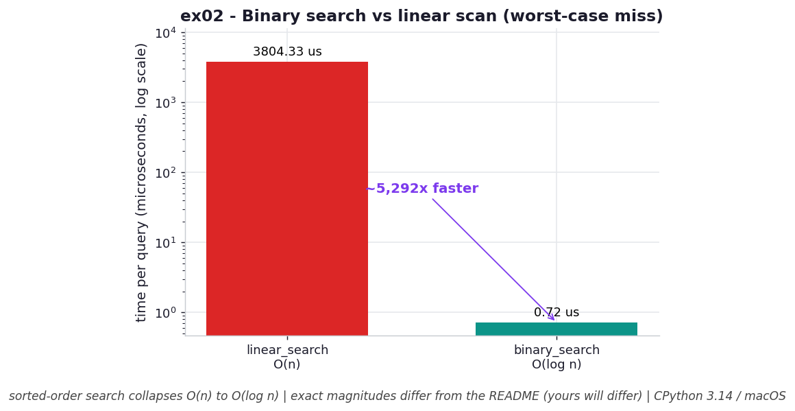

# ex02 — Binary search vs the linear scan that `list.index` runs

This exercise asks a deceptively simple question: when you need to find a value inside a list, how much does it matter whether the list is sorted? To answer it, we time two strategies against the same 1,000,000-element list. The first is a plain `linear_search` that walks the list element by element — the very algorithm `list.index` uses under the hood. The second is a `binary_search` that assumes the list is sorted and repeatedly halves the range it still has to consider. We deliberately search for a value that *isn't* there, because the worst case is the most honest case: it forces each algorithm to do all the work it can before giving up.

This matters in real code because "find a thing in a list" is one of the most common operations there is, and the difference between the two approaches is not a tweak — it is the difference between an operation you can run in a tight loop and one that quietly becomes your bottleneck as the data grows.

```bash
.venv/bin/python chapter_3/ex02_binary_search/ex02_binary_search.py   # run the benchmark
.venv/bin/python chapter_3/ex02_binary_search/plot.py                 # regenerate the chart
```

## What the benchmark measures

The benchmark times a single worst-case lookup (a value guaranteed to be absent) on a 1,000,000-element list, once with the linear scan and once with binary search. The linear scan took about **19,494 µs** — roughly 19 milliseconds — because it had to compare against every one of the million elements before it could conclude the value was missing. The binary search took about **0.79 µs**, because it only ever had to look at around twenty elements: each comparison let it discard half of what remained. That works out to binary search being roughly **24,800× faster** on this input. Both algorithms use only `O(1)` auxiliary memory — neither copies the list — so the entire win is in the number of comparisons performed, not in space.

## Reading the chart



*Log-y bars: the linear scan dwarfs the binary search by thousands of times on a worst-case miss — the win is fewer comparisons, not memory.*

The chart is two bars, one for each algorithm, with time on a logarithmic y-axis. The log scale is essential here: on a linear axis the binary-search bar would be invisible — a single pixel next to a skyscraper — because the two values differ by more than four orders of magnitude. Even compressed by the log scale, the linear-scan bar towers over the binary-search bar, and that visual gap *is* the lesson. These are CPython 3.14 numbers on macOS, so the exact magnitudes will shift from machine to machine, but the shape — one bar dwarfing the other — is what travels.

## What it means

The takeaway is that order is not a cosmetic property of your data; it is information you can spend. A sorted list lets binary search throw away half the search space with every comparison, which is why its cost grows like `O(log n)` instead of `O(n)`. The linear scan has no such structure to exploit, so it has no choice but to look at everything — and that is exactly why `list.index` stays linear no matter how large the list gets.

The tradeoff to keep in mind is that this speedup is conditional on the list already being sorted. If you have to sort an unsorted list first just to run one search, you may pay more for the sort than you save on the lookup. Binary search wins decisively when the data arrives sorted, or when you will run many searches against the same list and can amortize the cost of sorting it once.

## Five whys

1. **Why is the linear scan `O(n)` on a worst-case miss?** Because with no knowledge of where the value might be, the only way to be sure it's absent is to compare against every element and reach the end without a match.
2. **Why must it compare against *every* element to declare a miss?** Because an unsorted list gives no signal that lets you rule out any region — a match could be hiding anywhere, so skipping even one element risks a wrong answer.
3. **Why does sorting let binary search skip whole regions?** Because in a sorted list, comparing against the midpoint tells you which half the target must be in, so the other half can be discarded outright without ever being examined.
4. **Why does discarding half each step give `O(log n)`?** Because repeatedly halving a range of `n` elements reaches a single element in about `log₂(n)` steps — roughly twenty for a million items — so you touch a tiny subset instead of the whole list.
5. **Why does touching fewer elements translate so directly into speed?** Because each comparison is the unit of work, and runtime is essentially the comparison count times a constant; twenty comparisons versus a million is the entire ~24,800× difference.

**Root cause:** Search cost is governed by how much structure the data carries. Sorting encodes an ordering that converts "check everything" into "discard half each step," so the same lookup that costs a million comparisons unsorted costs only about twenty once order is present.
