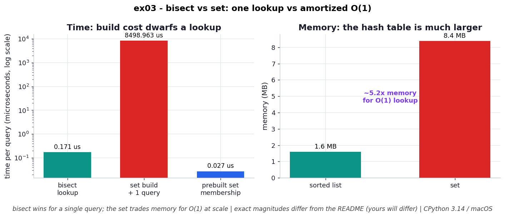

# ex03 — `bisect` on sorted data vs building a `set` for `O(1)` lookups

The textbook advice for fast membership testing is "use a `set` or `dict` — lookups are `O(1)`." This exercise pushes back on that advice by measuring its hidden costs. A hash table really does give you flat constant-time lookups, but only after you have *built* it, and that build is `O(n)`; the table also reserves far more memory than the data strictly needs, because a hash table that is kept too full degrades. So this benchmark compares three things on a million integers: a single `bisect` lookup on an already-sorted list, the full cost of building a `set` and then querying it once, and a query against a `set` that was already built. It measures both time and memory, because the real question isn't "which lookup is faster" but "which approach wins once you account for everything you had to pay to get there."

This matters whenever your data already arrives sorted (timestamps, sorted IDs, log lines) and you're deciding whether converting it into a `set` or `dict` is actually worth it.

```bash
.venv/bin/python chapter_3/ex03_bisect_vs_dict/ex03_bisect_vs_dict.py   # run the benchmark
.venv/bin/python chapter_3/ex03_bisect_vs_dict/plot.py                  # regenerate the chart
```

## What the benchmark measures

On the time side, a single `bisect` lookup on the sorted list took about **0.197 µs**. Building a `set` from the million integers and then running one query took about **57.6 ms** — meaning the build alone costs roughly **293,000×** what a single bisect lookup costs. Once the set already exists, a membership query is genuinely fast: about **0.028 µs**, roughly **7× quicker** than a bisect lookup. On the memory side, the sorted list of a million integers occupies about **7.6 MB**, while the equivalent `set` occupies about **32.0 MB** — the hash table costs roughly **4.2×** the memory, precisely because it is deliberately kept mostly empty so that lookups stay collision-free.

The picture, then, is a tradeoff with two axes. The set's per-lookup speed is excellent, but you pay for it twice up front: once in the `O(n)` build time, and once in a permanent ~4× memory premium.

## Reading the chart



*Left (log-y): one bisect lookup is far cheaper than building a set, while a prebuilt set query is cheapest of all. Right: the set's hash table costs several times the sorted list's memory — the price of O(1).*

The chart has two panels. The left panel shows time on a logarithmic y-axis with three bars: the towering one is the cost of *building* the set, the short one is the single `bisect` lookup, and the shortest of all is the prebuilt-set query. The log scale lets all three sit on one chart despite spanning many orders of magnitude, and it makes the key contrast legible — the set query is cheapest *per lookup*, but the build that gets you there dwarfs everything else. The right panel switches to memory and shows two bars: the sorted list versus the set, with the set several times taller. These are CPython 3.14 figures on macOS; the magnitudes will vary by machine, but the relationships — build cost dominating, set memory dominating — are what generalize.

## What it means

A `set` or `dict` doesn't give you cheap `O(1)` lookups for free; it sells them to you in exchange for an `O(n)` build and a roughly 4× memory premium. That trade is excellent when you will run *many* queries against the same data, because each additional query is nearly free and eventually the accumulated savings pay back the build and the memory. It is a bad trade when you only need a handful of lookups, or when memory is your scarce resource, or when your data is already sorted.

In that last case — already-sorted data — `bisect` is the clear winner on both axes at once. It needs no build step (the order is already there), it allocates nothing extra per lookup, and it sidesteps a structural limitation of hash-based containers: `set` and `dict` cannot hold duplicate keys, whereas a sorted list happily can. The broader rule is the chapter's recurring theme: pick the data structure that fits the questions you'll actually ask, and don't pay to convert into a "faster" structure unless the conversion cost is itself amortized.

## Five whys

1. **Why isn't the `set`'s `O(1)` lookup simply the best choice?** Because the `O(1)` only describes each lookup *after* the table exists; building the table from a million items is a separate `O(n)` cost — about 57.6 ms here — that you pay before any lookup happens.
2. **Why is building the hash table `O(n)` and so expensive?** Because every element must be hashed and inserted into the right slot, and as the table fills it must be resized and everything rehashed into a larger array — work proportional to the number of items.
3. **Why does the table reserve so much extra memory (~4.2× the list)?** Because a hash table only stays collision-free while it's kept sparsely populated, so it intentionally allocates many more slots than it has elements, trading memory for lookup speed.
4. **Why does `bisect` avoid both the build cost and the memory premium?** Because it operates directly on the already-sorted list — the ordering is the structure it exploits — so there is nothing to build and nothing extra to allocate; it just halves the range each step in `O(log n)`.
5. **Why, then, would anyone build the set at all?** Because once it exists each query is ~7× faster than a bisect lookup, so when you run enough queries the per-lookup savings eventually repay the one-time build and the standing memory cost.

**Root cause:** `O(1)` lookups are not free — they're prepaid. A hash table front-loads an `O(n)` build and a permanent memory premium in exchange for cheap repeat lookups, so it only pays off when the query count is high enough to amortize what you spent getting there; on already-sorted data, `bisect` skips that prepayment entirely.
