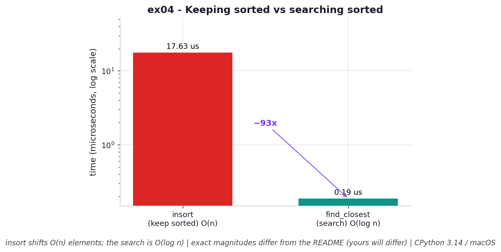

# ex04 — Finding the closest value with `bisect`, and the cost of staying sorted

Sometimes you don't want an exact match — you want the *nearest* value. Given a sorted list of important numbers and a target, which existing entry is closest? `bisect` answers this elegantly: `bisect_left` finds where the target would slot in, and then you only have to compare the one neighbor on each side to pick the closer of the two. This exercise builds that `find_closest` and benchmarks it, but it also benchmarks the other half of the story — `bisect.insort`, the operation that keeps the list sorted as new values arrive. The pairing is deliberate, because it surfaces a tension that's easy to miss: the search is cheap, but the bookkeeping that makes the search possible is not.

This matters whenever you're reconciling two datasets that are similar but not identical — matching a measured timestamp to the nearest sample, snapping a price to the nearest tick — and you're maintaining the sorted list incrementally rather than rebuilding it.

```bash
.venv/bin/python chapter_3/ex04_find_closest/ex04_find_closest.py   # run the benchmark
.venv/bin/python chapter_3/ex04_find_closest/plot.py                # regenerate the chart
```

## What the benchmark measures

On a 1,000,000-element sorted list, the benchmark times the two operations separately. A `find_closest` search took about **0.20 µs**, because it is `O(log n)`: `bisect_left` binary-searches to the insertion point, and then it's just a constant amount of neighbor-comparison work. Inserting a new value with `insort` while keeping the list sorted took about **101.6 µs** — roughly five hundred times longer — because `insort` is `O(n)`: finding the slot is fast, but actually opening it means physically shifting every element after that point one position to the right. Both operations use only `O(1)` auxiliary memory; `insort` mutates the list in place and the search allocates nothing.

So within a single sorted list, the asymmetry is stark: looking things up is nearly free, while keeping the list in sorted order is where almost all the time goes.

## Reading the chart



*Log-y bars: `insort` (keeping the list sorted, O(n) shifts) costs orders of magnitude more than a `find_closest` search (O(log n)) — once sorted, lookups are nearly free.*

The chart is two bars on a logarithmic time axis: `insort` and `find_closest`. The log scale keeps both visible despite the roughly 500× gap, and the height difference is the point — the tall bar is the price of *maintaining* sorted order, the short bar is the price of *exploiting* it. These are CPython 3.14 measurements on macOS, so absolute magnitudes will vary, but the ordering — insertion expensive, lookup cheap — holds anywhere.

## What it means

The lesson is that, on a contiguous array, a sorted list front-loads its cost into insertion. Once the order exists, every nearest-value query is essentially free at `O(log n)`; the expense lives in `insort`, which has to shift elements to carve out a gap and so scales with the list's size. Using `bisect.insort` is still the right tool because it keeps the list sorted *incrementally* — you never pay to re-sort the whole thing from scratch — but you should be clear-eyed that each insertion is `O(n)`.

The practical implication is about the read/write ratio. If you build a sorted list once and then query it many times, this structure is ideal: pay the insertion cost up front, then enjoy near-free lookups forever. If instead you are inserting constantly into a large list in a hot loop, those `O(n)` shifts will dominate, and a structure with cheaper insertion (a balanced tree, a heap, or a `dict` if you don't need ordering) may serve you better.

## Five whys

1. **Why is `insort` (~101.6 µs) so much slower than `find_closest` (~0.20 µs)?** Because finding the insertion point is fast, but actually inserting forces the list to shift every element after that point one slot over to make room.
2. **Why does inserting force a shift of all later elements?** Because a list is a contiguous array, so the only way to free a slot in the middle is to physically move everything beyond it; there is no spare gap waiting between elements.
3. **Why must the array be contiguous in the first place?** Because contiguity is what gives the list `O(1)` indexed access — element `i` lives at a computable address — and that same packed layout is what leaves no room to insert without shifting.
4. **Why is `find_closest`'s search nearly free by comparison?** Because it never moves data; `bisect_left` just binary-searches to the insertion point in `O(log n)` and then compares the two adjacent neighbors, a constant amount of extra work.
5. **Why use `bisect.insort` at all if each insert is `O(n)`?** Because it keeps the list sorted *as you go*, so you never re-sort from scratch — you amortize ordering across individual inserts instead of paying a full `O(n log n)` sort whenever you need to search.

**Root cause:** A sorted list stores its order in the physical arrangement of a contiguous array, so maintaining that order on insertion means shifting elements (`O(n)`), while reading from it just computes positions (`O(log n)`) — the same contiguity that makes lookups cheap is exactly what makes insertions expensive.
