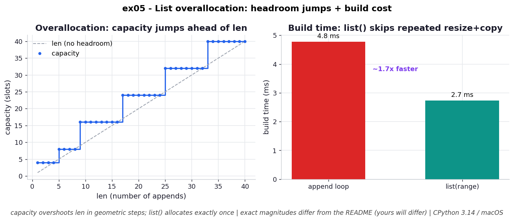

# ex05 — Reverse-engineering CPython's list overallocation

When you `append` to a Python list, the list sometimes has to grow its underlying array — and when it does, it doesn't grow by exactly one slot. It grabs extra headroom, so that the next several appends can land in already-reserved space without touching the allocator again. This exercise reverse-engineers the formula CPython uses for that headroom, `M = (N + (N>>3) + 6) & ~3`, by predicting the capacity a list should have at various sizes and then watching the real reallocation jumps to confirm the prediction. It also pays off the *consequence* of that headroom by comparing a list built with `append` against the same data built directly with `list()`, on both build time and peak memory.

This matters because overallocation is the mechanism that makes `append` cheap, but it is also dead weight — every list built by appending carries some slack — and knowing when that slack appears (and how to reclaim it) is a real lever in memory-tight code.

```bash
.venv/bin/python chapter_3/ex05_overallocation/ex05_overallocation.py   # run the benchmark
.venv/bin/python chapter_3/ex05_overallocation/plot.py                  # regenerate the chart
```

## What the benchmark measures

The formula predicts a capacity `M` of **4** for a 1-element list, **16** for a 9-element list, and **1,125,004** for a million-element list — and the observed reallocation jumps line up with those predictions, confirming that tiny lists over-reserve dramatically (one item already reserves four slots). The cost of that slack shows up directly: the *same* 1,000 integers occupy **8,856 B** when grown by `append` but only **8,056 B** when built with `list()` — about **800 B reclaimed** simply by avoiding the append path. On build performance, constructing a million integers via an append loop took **26.1 ms** and peaked at **38.6 MB**, while `list(range(...))` took **16.3 ms** and peaked at **38.1 MB** — roughly **2× faster** and a touch leaner, because it sizes the array exactly once instead of repeatedly growing and copying.

## Reading the chart



*Left: capacity overshoots `len` in geometric jumps (4, 8, 16, 24, 32…) as appends trigger reallocs. Right: the append loop is meaningfully slower to build than `list(range(..))`, which allocates exactly once.*

The chart has two panels. The left panel plots actual capacity against length: instead of a smooth diagonal, you get a staircase — capacity sits flat while appends fill the current headroom, then jumps in a discrete step (4, 8, 16, 24, 32, …) the moment the array fills and CPython reallocates to a larger block. The flat treads are the appends you got "for free"; the risers are the reallocations. The right panel compares build time: the append-loop bar is visibly taller than the `list(range(...))` bar, which allocates the exact size in a single shot. These are CPython 3.14 numbers on macOS, so magnitudes will differ on your hardware, but the staircase shape and the build-time gap are intrinsic to the algorithm.

## What it means

Overallocation is a deliberate time-for-memory trade. By reserving roughly 12.5% extra headroom on each growth (that's the `N >> 3` term), CPython spreads the expensive copy across many cheap appends, which is what makes `append` *amortized* `O(1)` instead of `O(n)`-per-append. The price is that any list built by appending ends up carrying some unused slack — small for big lists, but proportionally brutal for tiny ones, since the `+6` floor and 4-slot alignment mean a 1-item list reserves 4 slots and a 9-item list reserves 16.

The actionable detail is that this headroom only appears on the `append` path. A list created directly — `list(range(...))`, or recasting a comprehension's result back through `list()` — is sized to exactly what it holds, with no slack. So if you have many lists you're building and not subsequently growing, constructing them directly is both faster to build (one allocation, no repeated copies) and tighter in memory (no dead headroom). Across millions of small lists, reclaiming that slack is a meaningful saving for nearly free.

## Five whys

1. **Why does `append` grow the array by extra slots instead of exactly one?** Because one append usually signals more are coming, so reserving headroom lets the next several appends reuse spare slots without calling the allocator each time.
2. **Why does reserving headroom make `append` amortized `O(1)`?** Because the expensive part — allocating a bigger block and copying everything into it — now happens only occasionally, and its cost is spread across all the cheap appends that fill the reserved space.
3. **Why is the growth step geometric (a staircase), not a fixed amount?** Because the formula adds `N >> 3` (~12.5% of the current size), so larger lists reserve proportionally more — which keeps the *number* of reallocations logarithmic in the final length rather than linear.
4. **Why do tiny lists over-reserve so badly (1→4, 9→16)?** Because the `+6` constant and the `& ~3` 4-slot alignment act as a floor that dominates when `N` is small, so the relative slack is far larger for tiny lists than the ~12.5% big lists see.
5. **Why does building with `list()` avoid all of this?** Because the overallocation logic only fires on `append`; a direct construction knows the final size in advance, allocates exactly once, and so carries no headroom and pays no repeated-copy cost.

**Root cause:** Lists buy fast appends with memory — geometric overallocation amortizes the grow-and-copy so each `append` is `O(1)` — but that reserved headroom is dead weight that only the append path creates, which is why a direct `list()` build is both faster and leaner.
