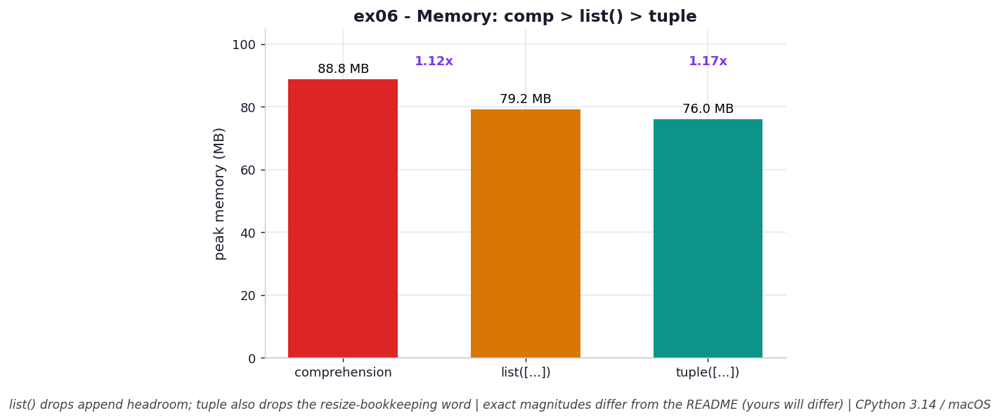

# ex06 — Where the memory goes: comprehension vs `list()` vs `tuple()`

This is a scaled-down version of the book's famous "48 MB" experiment, and its job is to make an abstract savings concrete. We create 200,000 small collections, each holding 9 random integers, in three different ways — a list comprehension, the same data recast through `list()`, and the same data frozen into a `tuple()` — and we measure the total recursive memory each approach consumes. The same nine numbers, stored three ways, end up at three different sizes. The point is to see *where* the difference comes from, because it isn't one thing: it's two independent savings that stack on top of each other.

This matters precisely in the "many small collections" pattern, which is everywhere in real data processing — a list of records, the last few links each user clicked, the files in each of thousands of directories. The per-collection overhead looks negligible until you multiply it by a few hundred thousand.

```bash
.venv/bin/python chapter_3/ex06_memory_comp_list_tuple/ex06_memory_comp_list_tuple.py   # run the benchmark
.venv/bin/python chapter_3/ex06_memory_comp_list_tuple/plot.py                          # regenerate the chart
```

## What the benchmark measures

The headline is memory, measured as the total recursive size of all 200,000 collections together. The list comprehension came in at **88.82 MB**. Recasting that same data through `list([...])` dropped it to **79.22 MB** — about **1.12×** smaller — because the cast rebuilds each list sized exactly to its contents, shedding the append-style overallocation headroom the comprehension carried. Freezing the data into `tuple([...])` dropped it further to **76.02 MB** — about **1.17×** smaller than the comprehension — because a tuple additionally drops the resize-bookkeeping word that even a tightly-sized list still keeps.

Crucially, the time side is a non-story: building each sample took **1,309 ns** as a comprehension, **1,338 ns** via `list()`, and **1,356 ns** via `tuple()` — all within measurement noise. Here the entire interesting signal is memory; the three approaches are effectively the same speed to construct.

## Reading the chart



*Bars of total recursive memory: comprehension > `list([...])` > `tuple([...])`. The two savings stack — dropping append headroom, then the resize-bookkeeping word.*

The chart is three memory bars in descending order: comprehension is tallest, `list([...])` is shorter, and `tuple([...])` is shortest. Read left to right, each step down corresponds to peeling away one source of overhead — first the overallocation headroom (comprehension → list), then the bookkeeping word a list needs in order to be resizable at all (list → tuple). The two reductions are independent, which is why they stack into a larger combined saving than either alone. These are CPython 3.14 figures on macOS; absolute megabytes will vary by machine, but the staircase ordering of the three bars is structural.

## What it means

The lesson is that immutability has a measurable memory dividend, and it comes from two distinct places that compound. The first saving is about *growth*: a comprehension builds its lists by appending, so each carries overallocation slack; recasting through `list()` rebuilds them sized exactly to contents and reclaims that slack. The second saving is about *capability*: even a perfectly-sized list still has to store the bookkeeping it would need to resize later, and a tuple — which has promised never to resize — simply doesn't carry that word.

Individually each saving is tiny, on the order of a few percent. But multiplied across hundreds of thousands or millions of small collections, "a few percent" becomes tens of megabytes, and the construction cost to capture it is essentially zero. So when your data is static — it won't grow or change after creation — reaching for a tuple is close to a free win in exactly the situation where memory tends to be your scarcest resource. The only thing you give up is mutability, which by assumption you weren't using.

## Five whys

1. **Why does the comprehension use the most memory of the three?** Because it builds each list by appending, so every one carries overallocation headroom — reserved-but-unused slots — on top of the data it actually holds.
2. **Why does recasting through `list([...])` shrink it?** Because passing the data to `list()` rebuilds each list sized exactly to its contents, so the overallocation headroom the append-built version reserved is simply not allocated.
3. **Why does a `tuple()` shrink it *further still*, below even the exact-sized list?** Because a list, even when perfectly sized, must keep a bookkeeping word recording its capacity so it can resize later — and a tuple, being immutable, drops that word entirely.
4. **Why do these two savings stack instead of overlapping?** Because they address different overheads — one is reserved growth space, the other is resize bookkeeping — so removing both yields the sum of the two reductions, which is why tuple beats comprehension by more than list does.
5. **Why does any of this matter when each saving is just a few percent?** Because the pattern is *many small collections*; a few percent per object, multiplied across 200,000 (or millions) of them, compounds into tens of megabytes for essentially no extra construction cost.

**Root cause:** Immutability lets a tuple shed two independent kinds of overhead a list must carry to stay growable — overallocation headroom and a resize-bookkeeping word — and because those savings stack and the data set is huge in count, freezing static data into tuples turns a per-object rounding error into a real memory win.
