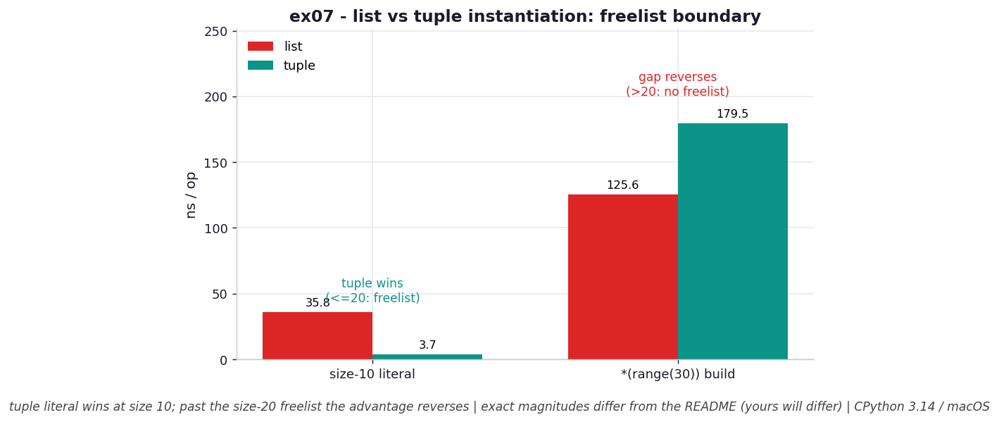

# ex07 — How fast (and how large) is a list vs a tuple?

It's often repeated that "tuples are faster than lists," and this exercise tests exactly how true that is — and discovers it has a sharp boundary. We time creating a ten-element container as a literal, list versus tuple, and we also measure their sizes. Then we deliberately step *past* the magic size by building containers from `range(30)`, where the result is surprising enough to be worth seeing: the advantage doesn't just shrink, it reverses. The reason is CPython's tuple freelist, a cache of pre-reserved tuple objects that exists only for small sizes, and this exercise is built to expose both its benefit and its edge.

This matters in any hot path that creates lots of small fixed-size containers — packing coordinate pairs, returning multiple values, building keys — where "use a tuple" is good advice right up until the size where it silently stops being true.

```bash
.venv/bin/python chapter_3/ex07_instantiation_timing/ex07_instantiation_timing.py   # run the benchmark
.venv/bin/python chapter_3/ex07_instantiation_timing/plot.py                        # regenerate the chart
```

## What the benchmark measures

For a ten-element literal, the tuple was built in about **4.32 ns** versus the list's **38.29 ns** — roughly **8.9× faster**. That's the textbook result, and it holds because a size-10 tuple comes straight off CPython's freelist with no allocator involvement. But step past the freelist's range and the result flips: `tuple(range(30))` took about **190 ns** while `list(range(30))` took about **134 ns**, so for size-30 containers the *list* is now faster. On memory, the size-10 tuple occupies **128 B** against the list's **136 B**, a steady **8 B** saved per object — the bookkeeping word a list keeps for resizing.

So "tuple is faster" turns out to be conditional. Below the freelist boundary it's emphatically true; above it, the freelist no longer applies and the comparison can invert.

## Reading the chart



*Grouped bars: at a size-10 literal the tuple wins big (freelist, no syscall), but building from `range(30)` the gap reverses — past size 20 there's no tuple freelist.*

The chart is two groups of paired bars. In the left group — the size-10 literal — the tuple bar is dramatically shorter than the list bar, the ~8.9× freelist win made visible. In the right group — built from `range(30)` — the bars have swapped order, with the tuple now the *taller* (slower) of the two. Reading the two groups together tells the whole story: the tuple's advantage isn't a universal property, it's a freelist effect that switches off once the size exceeds 20. These are CPython 3.14 numbers on macOS, so the magnitudes will shift per machine, but the reversal across the boundary is the durable observation.

## What it means

The takeaway is that the tuple-instantiation speedup is a *freelist* phenomenon, not a blanket consequence of immutability. For tuples of size 0–20, CPython keeps up to 2,000 pre-reserved objects of each size, so creating one just plucks a ready block from the cache and skips the kernel round-trip a fresh allocation would need — hence the order-of-magnitude win at size 10. The slight memory edge (8 B per object) is a separate, always-present benefit: a tuple never resizes, so it omits the capacity-tracking word a list must carry.

The practical caution is the boundary. Past size 20 there is no tuple freelist, so a fresh tuple pays the same allocator cost as anything else, and the literal-time advantage can vanish or invert — exactly what `tuple(range(30))` shows. The honest rule is to measure near the sizes you actually use rather than assuming "tuple is always faster." For a deeper, point-by-point map of exactly where the cliff sits, see [hypothesis/h01_tuple_freelist_cliff/](../hypothesis/h01_tuple_freelist_cliff/), which traces the 20→21 step directly.

## Five whys

1. **Why is a size-10 tuple ~8.9× faster to build than a list?** Because CPython keeps a freelist of pre-reserved tuple objects for sizes 0–20, so making one reuses a cached block instead of allocating fresh memory.
2. **Why does reusing a cached block make it so much faster?** Because a fresh allocation needs a round-trip to the kernel to find and reserve a region of memory, and pulling from the freelist skips that syscall entirely.
3. **Why can tuples be cached this way when lists can't?** Because tuples are immutable — their size and contents never change after creation — so a freed tuple's block is safe to hand straight to the next request for a same-size tuple.
4. **Why does the advantage reverse at `range(30)`?** Because the freelist only covers sizes 0–20; a size-30 tuple falls outside it and must allocate fresh, so it loses the cache shortcut and ends up paying full allocator cost like everything else.
5. **Why is the tuple still 8 B smaller even when it's slower?** Because that saving is unrelated to the freelist — it comes from immutability dropping the resize-bookkeeping word a list must always carry, and that holds at every size.

**Root cause:** The instantiation speedup is a bounded freelist effect: immutability lets CPython cache small tuples (sizes 0–20) so they skip the kernel allocation a list can't avoid — but the cache has a hard edge at 20, past which a tuple pays the same allocator cost and the advantage can invert.
