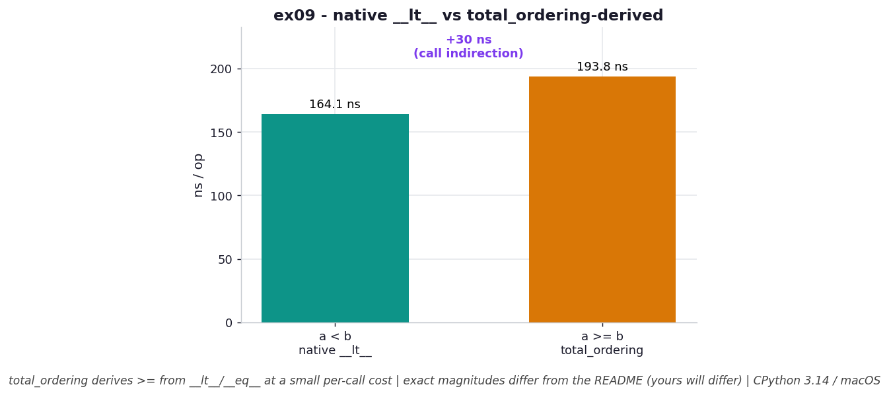

# ex09 — Making a custom object sortable and binary-searchable

Binary search and `bisect` only work on data that can be ordered, and for your own classes that ordering doesn't exist until you define it. By default, a custom object has no meaningful notion of "less than" — Python falls back to comparing instances by their memory address, which is arbitrary and useless for sorting. This exercise defines `__eq__` and `__lt__` on a custom object so it sorts by a real key, then uses `functools.total_ordering` to derive the remaining comparison operators (`<=`, `>`, `>=`) automatically. It then benchmarks the difference between calling a comparison you wrote directly (`__lt__`) and one that `total_ordering` synthesized, to see what that convenience costs.

This matters whenever you want to plug your own objects into `sorted`, `bisect`, or a heap — you need a *total* ordering, and `total_ordering` lets you supply just two methods instead of six, at a price worth knowing.

```bash
.venv/bin/python chapter_3/ex09_custom_ordering/ex09_custom_ordering.py   # run the benchmark
.venv/bin/python chapter_3/ex09_custom_ordering/plot.py                   # regenerate the chart
```

## What the benchmark measures

The benchmark times two comparisons on the same objects. The native `a < b`, which calls the `__lt__` you wrote directly, took about **164.8 ns**. The `a >= b`, which `total_ordering` synthesizes by combining your `__lt__` and `__eq__`, took about **193.6 ns** — a modest premium for the derived operator. There's no memory story here: defining an ordering adds *methods* to the class, not state to each instance, so the per-object footprint is unchanged (`O(1)`).

The gap is small but real, and it has a clear cause: the derived comparator isn't a hand-written single check, it's a small wrapper that calls back into your primitive methods and inverts or combines their results, and that extra indirection shows up as a few tens of nanoseconds per call.

## Reading the chart



*Bars (ns/op): the native `a < b` (`__lt__`) is a touch faster than the `total_ordering`-derived `a >= b`, which pays a little extra call indirection.*

The chart is two bars in nanoseconds per operation: the native `__lt__` comparison and the `total_ordering`-derived `>=`. The derived bar is slightly taller, and that small difference is the whole point — it's the visible cost of letting the standard library fill in operators for you rather than writing each by hand. Because the difference is modest, the bars are close in height, which is itself the message: `total_ordering` is cheap, not free. These are CPython 3.14 figures on macOS; magnitudes vary by machine, but the direction (derived slightly slower) is consistent.

## What it means

The lesson is twofold. First, ordering is something you have to *grant* a custom object — without `__eq__` and `__lt__`, comparisons fall back to memory addresses, so sorting and binary search produce meaningless results. Once you define those two methods, your object slots cleanly into `sorted`, `bisect`, and anything else that relies on comparison. Second, `total_ordering` is a genuine convenience that trades a little speed for a lot of boilerplate avoided: you write two methods and get all six, at the cost of a small per-call indirection because the derived operators delegate back to your primitives.

In practice that trade is almost always worth it — clarity and correctness over a handful of nanoseconds. The exception is a genuinely hot comparison loop, where those nanoseconds multiply; there, hand-writing the specific operators you actually call can claw back the indirection. As elsewhere in this chapter, the right move is to default to the readable option and only hand-optimize the comparisons that profiling proves are hot.

## Five whys

1. **Why does a custom object need `__eq__` and `__lt__` before it can be sorted or binary-searched?** Because without them Python has no defined ordering and falls back to comparing instances by memory address, which is arbitrary and carries no meaningful sort order.
2. **Why is a memory-address comparison useless for sorting?** Because an object's address reflects where it happened to be allocated, not anything about its value, so "sorting" by it produces an order unrelated to the data you care about.
3. **Why use `total_ordering` instead of writing all six comparison operators by hand?** Because it derives `<=`, `>`, and `>=` from just your `__lt__` and `__eq__`, eliminating boilerplate and the risk of the operators disagreeing with each other.
4. **Why is the `total_ordering`-derived `>=` (~193.6 ns) slower than the native `<` (~164.8 ns)?** Because the derived operator isn't a direct check — it's a wrapper that calls back into your `__lt__`/`__eq__` and combines their results, and that extra layer of calls costs a few tens of nanoseconds.
5. **Why does that indirection cost matter only sometimes?** Because a few tens of nanoseconds is negligible for occasional comparisons but compounds inside a hot sort or search loop running millions of times, where hand-written operators can recover the overhead.

**Root cause:** Ordering is a behavior you must define, not a built-in property; `total_ordering` synthesizes the missing operators by delegating to the two primitives you wrote, and that delegation — a function call instead of an inline check — is precisely the small, predictable cost it trades for the boilerplate it saves.
